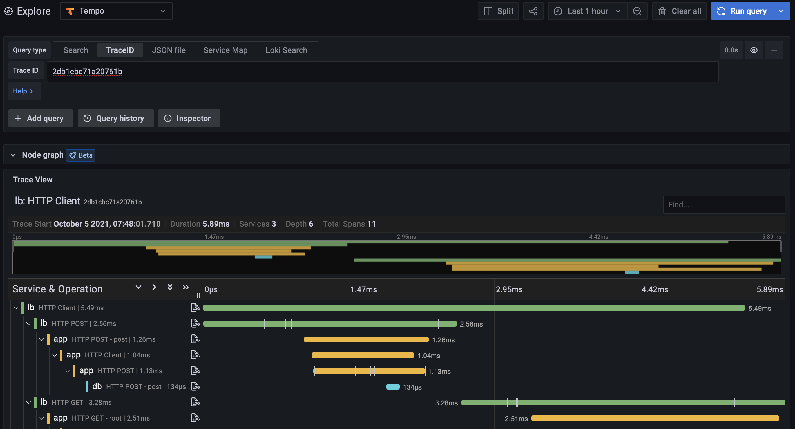

  
  
  <a href="https://hub.docker.com/r/grafana/tempo/tags"><image src="https://img.shields.io/docker/pulls/grafana/tempo" alt="Docker Pulls"/></a>
  
  
  
  

Grafana Tempo is an open source, easy-to-use and high-scale distributed tracing backend. Tempo is cost-efficient, requiring only object storage to operate, and is deeply integrated with Grafana, Prometheus, and Loki. Tempo can be used with any of the open source tracing protocols, including Jaeger, Zipkin, OpenCensus, Kafka, and OpenTelemetry.  It supports key/value lookup only and is designed to work in concert with logs and metrics (exemplars) for discovery.

Tempo is Jaeger, Zipkin, Kafka, OpenCensus and OpenTelemetry compatible.  It ingests batches in any of the mentioned formats, buffers them and then writes them to Azure, GCS, S3 or local disk.  As such it is robust, cheap and easy to operate!

## Getting Started

- [Documentation](https://grafana.com/docs/tempo/latest/)
- [Deployment Examples](./example)
  - Deployment and log discovery Examples
- [What is Distributed Tracing?](https://opentracing.io/docs/overview/what-is-tracing/)

## Further Reading

To learn more about Tempo, consult the following documents & talks:

- October 2020 Launch blog post: "[Announcing Grafana Tempo, a massively scalable distributed tracing system][tempo-launch-post]"
- October 2020 Motivations and tradeoffs blog post: "[Tempo: A game of trade-offs][tempo-tradeoffs-post]"
- October 2020 Grafana ObservabilityCON Keynote Tempo announcement: "[Keynote: What is observability?][tempo-o11ycon-keynote]"
- October 2020 Grafana ObservabilityCON Tempo Deep Dive: "[Tracing made simple with Grafana][tempo-o11ycon-deep-dive]"

[tempo-launch-post]: https://grafana.com/blog/2020/10/27/announcing-grafana-tempo-a-massively-scalable-distributed-tracing-system/
[tempo-tradeoffs-post]: https://gouthamve.dev/tempo-a-game-of-trade-offs/
[tempo-o11ycon-keynote]: https://grafana.com/go/observabilitycon/keynote-what-is-observability/
[tempo-o11ycon-deep-dive]: https://grafana.com/go/observabilitycon/tracing-made-simple-with-grafana/

## Getting Help

If you have any questions or feedback regarding Tempo:

- Search existing thread in the Grafana Labs community forum for Tempo: [https://community.grafana.com](https://community.grafana.com/c/grafana-tempo/40)
- Ask a question on the Tempo Slack channel. To invite yourself to the Grafana Slack, visit [https://slack.grafana.com/](https://slack.grafana.com/) and join the #tempo channel.
- [File an issue](https://github.com/grafana/tempo/issues/new/choose) for bugs, issues and feature suggestions.
- UI issues should be filed with [Grafana](https://github.com/grafana/grafana/issues/new/choose).

## OpenTelemetry

Tempo's receiver layer, wire format and storage format are all based directly on [standards](https://github.com/open-telemetry/opentelemetry-proto) and [code](https://github.com/open-telemetry/opentelemetry-collector) established by [OpenTelemetry](https://opentelemetry.io/).  We support open standards at Grafana!

Check out the [Integration Guides](https://grafana.com/docs/tempo/latest/guides/instrumentation/) to see examples of OpenTelemetry instrumentation with Tempo.

## Other Components

### tempo-vulture
tempo-vulture is tempo's bird themed consistency checking tool.  It pushes traces and queries Tempo.  It metrics 404s and traces with missing spans.

### tempo-cli
tempo-cli is the place to put any utility functionality related to tempo.  See [Documentation](https://grafana.com/docs/tempo/latest/operations/tempo_cli/) for more info.

## TempoDB

[TempoDB](https://github.com/grafana/tempo/tree/main/tempodb) is included in the this repository but is meant to be a stand alone key value database built on top of cloud object storage (azure/gcs/s3).  It is a natively multitenant, supports a WAL and is the storage engine for Tempo.

## License

Grafana Tempo is distributed under [AGPL-3.0-only](LICENSE). For Apache-2.0 exceptions, see [LICENSING.md](LICENSING.md).
