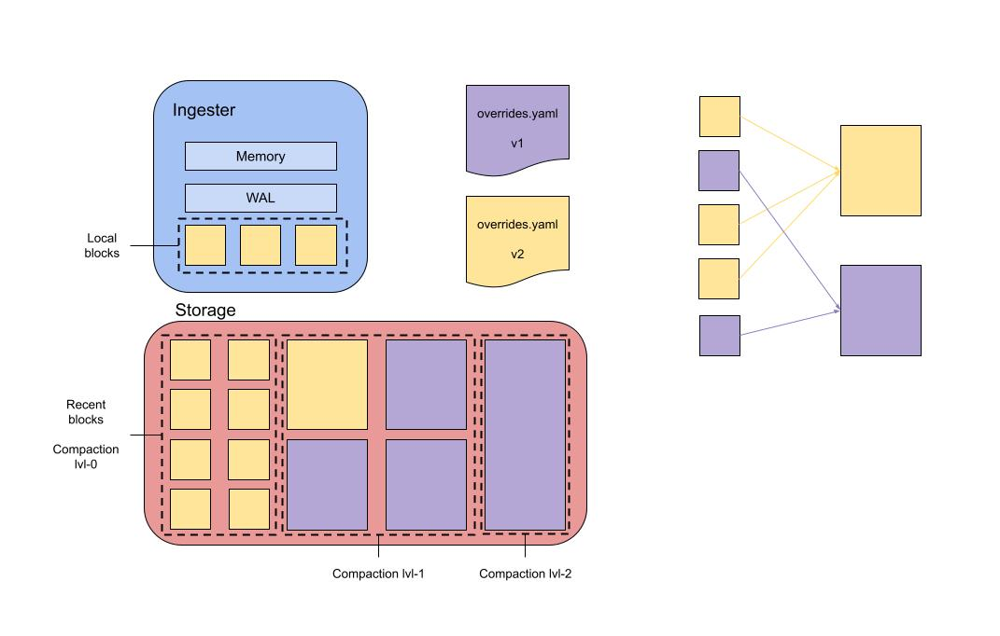

# vParquet3

## Summary

This document describes how to extend Tempo’s Parquet based block format such that a configurable subset of span attributes can be stored in dedicated columns.
The goal is to improve the search performance of TraceQL in Tempo.

### Table of Contents

* [Context](#context)
* [Goals and requirements](#goals-and-requirements)
* [Implementation](#implementation)
  * [Schema with spare columns](#schema-with-spare-columns)
  * [Configuration and overrides](#configuration-and-overrides)
  * [Compaction](#compaction)
  * [Tooling](#tooling)

## Context
The current Parquet schema stores span attributes in the repeated group `Attrs`.
The group contains a single column for all attribute keys and separate columns for the corresponding values (depending on the value type).
The size of the span attribute columns combined contribute to 30-70% of the overall block size.
To search for a specific attribute, it is necessary to access this large chunk of data.
The analysis of Tempo blocks from different use cases has further revealed that the 10 most frequently used span attributes are responsible for over 50% of the overall attribute size.

A benchmark with a schema that stores the 5 most frequently occurring attributes in dedicated columns showed significant performance improvements:

* The block size decreased by ~10%
* Compressed size of the generic attribute columns was reduced by ~40%
* The search speed for queries without matches improved by ~80% for attributes with dedicated columns and ~70% for generic attributes columns
* The search speed for queries returning matches improved by ~50% for attributes with dedicated columns and ~30% for generic attribute columns

The amount and kind of span attributes varies a lot between use cases and the above benchmark was conducted with tracing data that captured a lot of span attributes.
Therefore, the search speed improvements that can be achieved by storing span attributes in dedicated columns,
can deviate from the above results.
However, the data still shows that dedicated columns for span attributes that can be tuned to a specific use case can improve Tempo’s search performance significantly.
This document describes how dedicated columns for span attributes will be implemented in Tempo.

## Goals and requirements

The main goal for the next iteration of the block format `vParquet3` is to be able to manually configure dedicated attribute columns for very heavy workloads.
To keep the scope small only the following features are implemented for now:

* Only attributes with string values can be promoted to dedicated columns on resource and span level
* Attributes promoted to dedicated columns can be manually configured per tenant
* Support for changing dedicated column configurations
  * Compactor treats different configs as different encodings
  * Queriers read blocks with different configured columns
* Provide tooling and documentation that enables tenants to find good attributes to promote to dedicated columns
  * Find attributes that contribute the most to block size
  * (Stretch) Find the most common used attributes in search

Future iterations may support additional features:

* Workload analysis to determine suitable dedicated column configurations which can be used to make suggestions or to automate the configuration
* Fully dynamic schema that allows to add dedicated columns for different data types and encodings (e.g. delta or run length encoding)
* Apply config dynamically to old blocks during compaction

## Implementation

### Schema with spare columns

There are two approaches for storing span attributes in dedicated columns in Tempo.
One possibility is to extend the Parquet schema dynamically and add the required extra columns at runtime.
This approach would allow to configure the number, type, and encoding of dedicated attribute columns and therefore allow Tempo to optimize the block layout specifically for every use case.
Ultimately this is what Tempo should be capable of in the future.
However, handling dynamically changing Parquet schemata correctly adds a lot of complexity.

The alternative approach is to keep a set of spare columns in the schema and dynamically assign them to the respective span attributes.
The downside here is that the number, type, and encoding for dedicated span attributes is very restricted.
To keep the added complexity manageable, dedicated columns for span attributes are implemented using the spare columns approach for now.

In the analyzed use cases, the 20 span attributes that contributed most to the overall attribute size,
were almost exclusively attributes with string values.
Given that the benchmark achieved good results with 5 dedicated columns,
it can be expected that extending the schema by 10 spare columns for string values is sufficient to achieve good performance improvements for most use cases.

The following code outlines the schema changes:

```go
type DedicatedAttrs struct {
    String01 *string `parquet:",snappy,optional,dict"`
    String02 *string `parquet:",snappy,optional,dict"`
    ...
    String10 *string `parquet:",snappy,optional,dict"`
}

type Span struct {
    ...
    DedicatedAttrs DedicatedAttrs `parquet:""`
}
```

To execute TraceQL queries it is necessary to know which attribute is assigned to which spare column.
Since the assignment of spare columns to specific attributes changes over time, it is necessary to store this information for each block.

Tempo stores metadata about each Block in the `meta.json` file.
The schema of this file will be extended such that it contains the assignment information:

```go
{
    ...
    "dedicatedColumns": [
        {"scope": "span", "name": "attrA", "type": "string"},
        {"scope": "span", "name": "attrB", "type": "string"},
        {"scope": "span", "name": "attrC", "type": "string"},
    ]
}
```

## Configuration and overrides

Dedicated columns have been part of the Parquet-based formats since the first version.
As we gained operational knowledge, it became clear that the hardcoded set of attributes selected for dedicated columns didn’t work for all workloads.

The biggest improvement of vParquet3 compared to older block formats is that the attributes that can be stored in dedicated columns are partially configurable.
And, it only makes sense that they’re configured per tenant.
Another important consideration is that dedicated columns need to be configured at runtime.
It is expected that selected attributes will change over time, as more data is ingested, new query patterns appear,new attributes are used, etc.
This would also allow for smoother operations, as a change in configuration doesn’t require a restart of Tempo.

For these reasons, the configuration will be added to the storage / block section of Tempo’s yaml configuration file as well as to the override’s configuration:

```go
type Limits struct {
    ...
    DedicatedColumns []sharedconfig.DedicatedColumn `yaml:"dedicated_columns"`
}
```

Dedicated columns will be configured as an array of definitions of columns,
where basic information about the selected attribute that is defined.
Required configurations are the scope of the attribute, its name and its type.

```go
type DedicatedColumn struct {
    Scope     string   `yaml:"scope"` // can be 'span' or 'resource'
    Attribute string   `yaml:"attribute"`
    Type      string   `yaml:"type"`  // for now only 'string' is supported
}
```

Additional config options can be added later to configure extra parameters such as encodings (e.g. dictionaries, lists, delta encoding), compression format (e.g. snappy).

## Compaction

When blocks are compacted the spare column assignment has to be taken into consideration: In cases where blocks have different column assignments, values need to be transferred from one column into another.
Although it is possible to implement compaction across different column assignments, this is not strictly necessary:
The assignment of span attributes to spare columns is not expected to change frequently therefore not compacting blocks with different assignments does not have a large impact on the compaction result.

To handle compaction correctly the compaction block selector is adjusted such that blocks with different spare column assignments are not selected for compaction.



## Tooling

A key factor in the performance of dedicated columns is the attributes that are used for them.
We want to include tools that help operators find good candidates for dedicated columns.
What makes an attribute a good candidate will most likely vary from user to user, but there are some basic rules that can help us find them.

From our analysis of Tempo blocks, we’ve found that attributes that occupy the most space in a block usually have the biggest impact on performance when promoted to dedicated columns.
Even when queries don’t search by those attributes.

A lot of work to help analyze parquet blocks has already been done in [parquet-cli](https://github.com/stoewer/parquet-cli).
With this tool, we can inspect individual blocks and get aggregated data for the attributes present in a block,
and the size that each represents in the generic `attr` columns.
We can combine the capabilities of this tool with tempo-cli, which has better integration with Tempo backends.
This way, we could get aggregated data for all the blocks of a tenant present in a Tempo backend storage.

(Stretch) Another method of finding good candidates for dedicated columns is by analyzing the read path.
An attribute that is queried by significantly more than the rest is a potential good candidate.
_Hot_ attributes can be found by extending metrics in the read path to record query patterns and extract frequently queried attributes.

