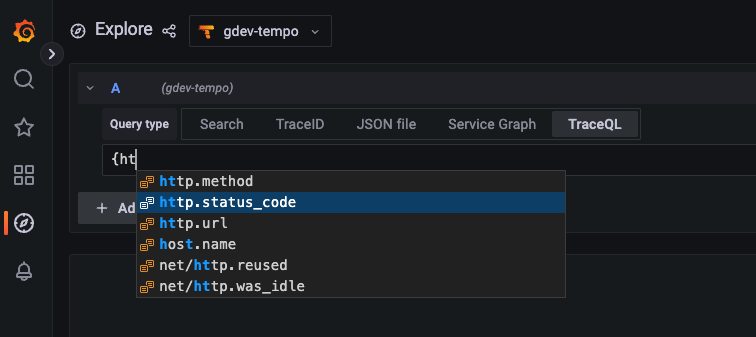

# Version 2.0 release notes

The Tempo team is pleased to announce the newest major release of Tempo: version 2.0!

Tempo 2.0’s headline feature is the introduction of TraceQL. TraceQL is a query language modeled on PromQL and LogQL that allows you to interactively extract insights from your trace data. It provides a powerful, flexible way to pinpoint the traces you need to answer questions about your systems and analyze traces based on their structure.

Continuing in the tradition of Tempo’s close integration with Grafana as a visualization layer, we’ve also added a TraceQL query editor to Grafana’s Tempo data source. The editor is available in Grafana Cloud and for open source users in Grafana 9.3.2. We encourage open source users to upgrade to Grafana 9.4 as soon as it is released to take advantage of some additional enhancements and bug fixes.

In addition to TraceQL, Tempo 2.0 also marks the promotion of the Apache Parquet block format to the new default storage format. With this change, the Tempo maintainers are signaling that this new format has received enough testing to be ready for broad adoption.

These two changes actually go hand-in-hand: without the increased search speed enabled by the Apache Parquet block format, it would be impossible to pull off the sophisticated queries made possible by TraceQL.

>**Note**: For a complete list of changes and enhancements, refer to the [Tempo 2.0 changelog](https://github.com/grafana/tempo/releases).

## Features and enhancements

Some of the most important features and enhancements in Tempo 2.0 are highlighted below.

### TraceQL, the trace query language

Inspired by PromQL and LogQL, TraceQL is a query language designed for selecting traces in Tempo. TraceQL makes it possible to find traces that otherwise would have been difficult or even impossible to identify with Tempo's existing search. It also makes it possible for you to understand the broad context for an event sequence.
To understand more about why we built TraceQL and the use cases we think it unlocks, see [our blog post](https://grafana.com/blog/2022/11/30/traceql-a-first-of-its-kind-query-language-to-accelerate-trace-analysis-in-tempo-2.0/).

With this release, we’ve implemented a subset of the full TraceQL language we envision. Users can select traces based on the following:

- Span and resource attributes, timing, and duration
- Basic aggregates: `count()` and `avg()`

To learn more about the TraceQL syntax, see the [TraceQL documentation]().
For information on how we plan to extend the TraceQL language, see [future work]().

You can run a TraceQL query either by issuing it to Tempo’s [`search_tag_values_v2` API endpoint](https://grafana.com/docs/tempo/latest/api_docs/#search-tag-values-v2), or, for those using Tempo in conjunction with Grafana, by using Grafana’s TraceQL query editor, described below.

TraceQL requires Tempo’s Parquet columnar format, which is the default block format in Tempo 2.0. For more information, refer to the Tempo [Apache Parquet block format](https://grafana.com/docs/tempo/latest/configuration/parquet/) documentation.

### TraceQL query editor in Grafana

To make it easier to run and visualize the results of TraceQL queries, we’ve added a TraceQL query editor to Grafana’s Tempo data source. The editor is available in Grafana’s Explore interface.

<p align="center"></p>

The query editor helps you learn TraceQL by offering autocomplete.

<p align="center"></p>

For more information, refer to the [TraceQL query editor documentation](https://grafana.com/docs/tempo/latest/traceql/query-editor.md).

### Apache Parquet block format is the new default

The experimental Apache Parquet columnar block format introduced in Tempo v1.5 has been promoted to stable and is now the default trace storage for Tempo 2.0. This format enables increased speed and efficiency for Tempo search.
In our own environments, we’re seeing that it allows us to scan trace data at rates of 1 TB/s (with some bursts as high as 4 TB/s). Previously, we capped out around 40 to 50 GB/s searched on the old format. With Parquet, we are currently seeing closer to 300 GB/s searched on common queries with fewer resources used. Switching to the Parquet block format also allows users to leverage the large ecosystem of existing Parquet tools and libraries to process and transform their trace data.

The Parquet block format can be used as a drop-in replacement for Tempo’s existing block format. No data conversion or upgrade process is necessary. As soon as the Parquet format is enabled, Tempo starts writing data in that format, leaving existing data as-is.

Tempo search will return results from both the legacy and Parquet block formats. However, TraceQL will only search Parquet. Search on legacy blocks is deprecated and will be removed in Tempo 2.1.
For more information, refer to the Parquet documentation.

Refer to the [Parquet documentation]().

### Search and metrics-generator enabled by default

Search and [metrics-generator]() are now enabled by default in Tempo 2.0, and their corresponding configuration parameters (search_enabled and metrics_generator_enabled ) have been removed).

We’ve been excited by the feedback we’ve gotten on both features and are satisfied with their stability so we want all newcomers to Tempo to have access to them from day 1.

The metrics-generator component is now enabled by default, however, you still still need to tell it to derive metrics for a tenant by using tenant-specific configurations. For more information, refer to the [metrics-generator configuration documentation]). 

>**NOTE:** Grafana Cloud customer need to contact Grafana Support to enable metrics generation. 

These enhancements have been added to the metrics-generator:

- The metrics-generator now handles collisions between user-defined and default dimensions [PR 1794](https://github.com/grafana/tempo/pull/1794).
- Metrics-generator now makes intrinsic dimensions configurable and disables `status_message` by default [PR 1960](https://github.com/grafana/tempo/pull/1960).
- Span sizes can be exposed as a metric [PR 1662](https://github.com/grafana/tempo/pull/1662).
- Older spans are now filtered out before metrics are aggregated [PR 1612](https://github.com/grafana/tempo/pull/1612).
- Label names and values that exceed a configurable length are truncated [PR 1897](https://github.com/grafana/tempo/pull/1897).

In addition to the updates to search and metrics-generators, ingesters now have zone awareness replication.

```yaml
# use the following fields in _config field of jsonnet config, to enable zone aware ingesters.
    multi_zone_ingester_enabled: false,
    multi_zone_ingester_migration_enabled: false,
    multi_zone_ingester_replicas: 0,
    multi_zone_ingester_max_unavailable: 25,
```

## Upgrade considerations

When upgrading to Tempo 2.0, be aware of these breaking changes.

### Defaults updated

The following configuration parameters have been updated with new default values. These defaults were changed to work better with the new Parquet block format. [PR 1978](https://github.com/grafana/tempo/pull/1978)

If you used the Parquet format with Tempo 1.5, consider updating your configuration to use these default values. 

```yaml
query_frontend:
    max_oustanding_per_tenant: 2000
    search:
        concurrent_jobs: 1000
        target_bytes_per_job: 104857600
        max_duration: 168h
        query_ingesters_until: 30m
    trace_by_id:
        query_shards: 50
querier:
    max_concurrent_queries: 20
    search:
        prefer_self: 10
ingester:
    concurrent_flushes: 4
    max_block_duration: 30m
    max_block_bytes: 524288000
storage:
    trace:
        pool:
            max_workers: 400
            queue_depth: 20000
        search:
            read_buffer_count: 32
            read_buffer_size_bytes: 1048576

```

### Removed and renamed configuration parameters

The following tables describe the parameters that have been removed or renamed. (PR#1978)

#### Removed

| Parameter | Comments |
| :-- | :-- |
| query_frontend:<br/>  query_shards: |   |
| querier:<br/>  query_timeout: | Use `trace_by_id.query_shards` |
| ingester:<br/>  use_flatbuffer_search: | Automatically set based on block type |
| storage:<br/>  wal:<br/>    version: | Removed and pinned to `block.version` |

#### Renamed

| Parameter | Comments |
| --- | --- |
| `compactor` section |  |
| compaction:<br/>  chunk_size_bytes: | Renamed to `v2_in_buffer_bytes` |
| compaction:<br/>  flush_size_bytes: | Renamed to `v2_out_buffer_bytes` |
| compaction:<br/>  iterator_buffer_size: | Renamed to `v2_prefetch_traces_count` |
| `storage` section |  |
| wal:<br/>  encoding: | Renamed to `v2_encoding` |
| block:<br/>  index_downsample_bytes: | Renamed to `v2_index_downsample_bytes` |
| block:<br/>  index_page_size_bytes: | Renamed to `v2_index_page_size_bytes` |
| block:<br/>  encoding: | Renamed to `v2_encoding` |
| block:<br/>  row_group_size_bytes: | Renamed to `parquet_row_group_size_bytes` |


### Other upgrade considerations

[PR 2004](https://github.com/grafana/tempo/pull/2004) The  `search_enabled` and `metrics_generator_enabled` configuration parameters have been removed. Both default to true.

[PR 1879](https://github.com/grafana/tempo/pull/1879). Use snake case on Azure Storage config. Here is an example of using snake case on Azure Storage config:

```yaml
# config.yaml
storage:
  trace:
    azure:
      storage_account_name:
      storage_account_key:
      container_name:
```

[PR 1678](https://github.com/grafana/tempo/pull/1678). Parquet is the new default block version. To continue using the v2 backend set, see the [Parquet configuration documentation](https://grafana.com/docs/tempo/latest/configuration/parquet/).

[PR 1810](https://github.com/grafana/tempo/pull/1810). Delete `TempoRequestErrors` alert from mixin. Any Jsonnet users relying on this alert should copy this into their own environment.

[PR 1794](https://github.com/grafana/tempo/pull/1794). metrics-generator: Handle collisions between user defined and default dimensions. Custom dimensions colliding with intrinsic dimensions will be prefixed with `__`.

[PR 1874](https://github.com/grafana/tempo/pull/1874). Add TLS support to the vulture. Internal types are updated to use `scope` instead of `instrumentation_library`. This is a breaking change in trace by ID queries if JSON is requested.


## Bug fixes

### 2.0 bug fixes

Version 2.0 includes the following fixes:

- [PR 1887](https://github.com/grafana/tempo/pull/1887) Stop distributors on OTel receiver fatal error.
- [PR 1700](https://github.com/grafana/tempo/pull/1700) New wal file separator `+` for the NTFS filesystem and backward compatibility with the old separator `:`.
- [PR 1697](https://github.com/grafana/tempo/pull/1697) Honor caching and buffering settings when finding traces by ID.
- [PR 1723](https://github.com/grafana/tempo/pull/1723) Correctly propagate errors from the iterator layer up through the queriers.
- [PR 1781](https://github.com/grafana/tempo/pull/1781) Make multitenancy work with HTTP.
- [PR 1799](https://github.com/grafana/tempo/pull/1799) Fix parquet search bug fix on `http.status_code` that may cause incorrect results to be returned.
- [PR 1813](https://github.com/grafana/tempo/pull/1813) Fix failing `SearchTagValues` endpoint after startup.
- [PR 1913](https://github.com/grafana/tempo/pull/913) tempo-mixin: tweak dashboards to support metrics without cluster label present.
- [PR 1920](https://github.com/grafana/tempo/pull/1920) Fix docker-compose examples not running on Apple M1 hardware.
- [PR 1939](https://github.com/grafana/tempo/pull/1939) Fix TraceQL parsing of most binary operations to not require spacing.
- [PR 1947](https://github.com/grafana/tempo/pull/1947) Don't persist tenants without blocks in the ingester.
- [PR 1948](https://github.com/grafana/tempo/pull/1948) TraceQL: span scope not working with ranges.
- [PR 1997](https://github.com/grafana/tempo/pull/1997) TraceQL: skip live traces search.
- [PR 2003](https://github.com/grafana/tempo/pull/2003) Return more consistent search results by combining partial traces.
