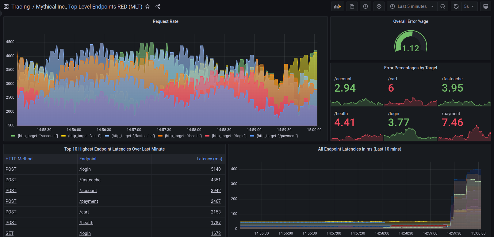



---

## Overview

Distributed tracing visualizes the lifecycle of a request as it passes through a set of applications.

Tempo is cost-efficient and only requires an object storage to operate.
Tempo is deeply integrated with Grafana, Mimir, Prometheus, and Loki.
You can use Tempo with open source tracing protocols, including Jaeger, Zipkin, or OpenTelemetry.

Tempo integrates well with a number of open source tools:

- **Grafana** ships with native support using the built-in [Tempo data source](/docs/grafana/latest/datasources/tempo/).
- **Grafana Loki**, with its powerful query language LogQL v2 lets you filter requests that you care about, and jump to traces using the [Derived fields support in Grafana](/docs/grafana/latest/datasources/loki/#derived-fields).
- **Prometheus exemplars** let you jump from Prometheus metrics to Tempo traces by clicking on recorded exemplars.

## Explore



