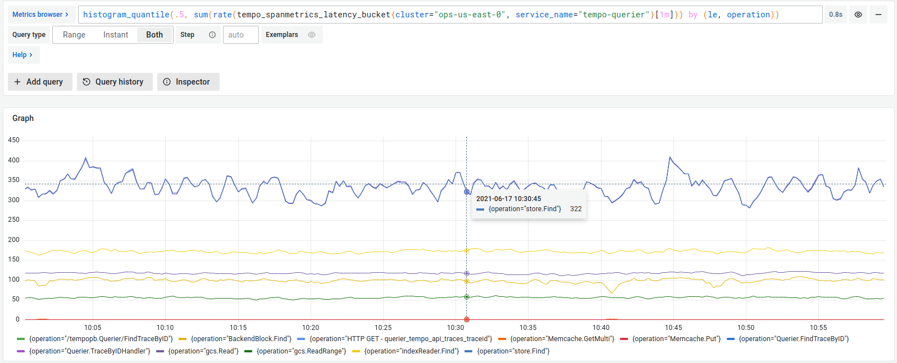

# Generate metrics from spans



Span metrics allow you to generate metrics from your tracing data automatically.
Span metrics aggregates request, error and duration (RED) metrics from span data.
Metrics are exported in Prometheus format.

There are two options available for exporting metrics: using remote write to a Prometheus compatible backend or serving the metrics locally and scraping them.

Span metrics generate two metrics: a counter that computes requests, and a histogram that computes operation’s durations.

Span metrics are of particular interest if your system is not monitored with metrics,
but it has distributed tracing implemented.
You get out-of-the-box metrics from your tracing pipeline.

Even if you already have metrics, span metrics can provide in-depth monitoring of your system.
The generated metrics show application-level insight into your monitoring,
as far as tracing gets propagated through your applications.

Span metrics are also used in the service graph view.
For more information, refer to the [service graph view]().


Grafana Alloy provides tooling to convert your Agent Static or Flow configuration files into a format that can be used by Alloy.

For more information, refer to [Migrate to Alloy]().


## Server-side metrics

The same span metrics can also be generated by Tempo.
This is more efficient and recommended for larger installations.
For a deep look into span metrics, visit [this section]().

## Example

