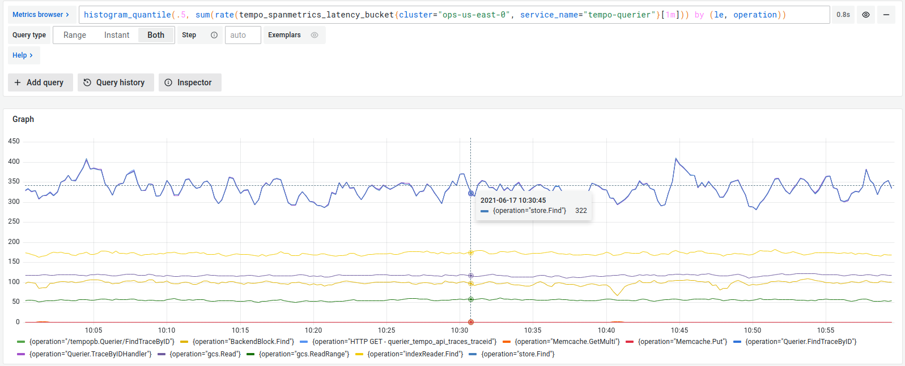

# Generate metrics from spans

Span metrics allow you to generate metrics from your tracing data automatically.
Span metrics aggregates request, error and duration (RED) metrics from span data.
Metrics are exported in Prometheus format.

There are two options available for exporting metrics: using remote write to a Prometheus compatible backend or serving the metrics locally and scraping them.

Span metrics generate two metrics: a counter that computes requests, and a histogram that computes operation’s durations.

Span metrics are of particular interest if your system isn't monitored with metrics,
but it has distributed tracing implemented.
You get out-of-the-box metrics from your tracing pipeline.

Even if you already have metrics, span metrics can provide in-depth monitoring of your system.
The generated metrics show application-level insight into your monitoring,
as far as tracing gets propagated through your applications.

To generate span metrics within Grafana Alloy, you can use the `otelcol.connector.spanmetrics` component.
The following example:
* Adds the `http.method` (with a default value of `GET`) and `http.target` span attributes as Prometheus labels
    to the generated span metrics
* Sets an explicit set of histogram buckets intervals.
* Specifies a metrics flush period of 15 seconds.
* Uses the `traces_spanmetrics` namespace to prefix all generated metrics with.
before writing the metrics to the Grafana OTLP gateway.
Received trace spans are immediately written to the OTLP gateway.

```alloy
otelcol.receiver.otlp "default" {
  http {}
  grpc {}

  output {
    traces  = [
        otelcol.connector.spanmetrics.default.input,
        otelcol.exporter.otlp.default.input
    ]
  }
}

otelcol.connector.spanmetrics "default" {
  dimension {
    name = "http.method"
    default = "GET"
  }

  dimension {
    name = "http.target"
  }

  aggregation_temporality = "DELTA"

  histogram {
    explicit {
      buckets = ["50ms", "100ms", "250ms", "1s", "5s", "10s"]
    }
  }

  metrics_flush_interval = "15s"

  namespace = "traces_spanmetrics"

  output {
    metrics = [otelcol.exporter.otlp.default.input]
  }
}

otelcol.exporter.otlp "default" {
  client {
    endpoint = env("OTLP_ENDPOINT")
  }
}
```

Span metrics are also used in the service graph view.
For more information, refer to the [service graph view]().

To see all the available configuration options, refer to the [component reference](https://grafana.com/docs/alloy/latest/reference/components/otelcol.connector.spanmetrics/).

## Server-side metrics

The same span metrics can also be generated by the metrics-generator within Tempo.
This is more efficient and recommended for larger installations.
For more information, refer to the [span metrics]() documentation.

## Example

<p align="center"></p>
