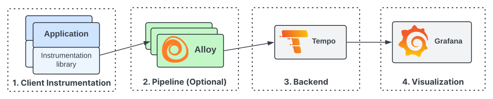

# Get started with Grafana Tempo

Grafana Tempo is an open source, easy-to-use, and high-scale distributed tracing backend. Tempo lets you search for traces, generate metrics from spans, and link your tracing data with logs and metrics.

Distributed tracing visualizes the lifecycle of a request as it passes through a set of applications.
For more information about traces, refer to [Introduction to traces](https://grafana.com/docs/tempo/<TEMPO_VERSION>/introduction/).

Getting started with Tempo is follows these basic steps.

First, check out the [examples](https://grafana.com/docs/tempo/<TEMPO_VERSION>/getting-started/example-demo-app/) for ideas on how to get started with Tempo.

Next, review the [Setup documentation](https://grafana.com/docs/tempo/<TEMPO_VERSION>/setup/) for step-by-step instructions for setting up Tempo and creating a test application.

Tempo offers different deployment options, depending on your needs. Refer to the [plan your deployment](https://grafana.com/docs/tempo/<TEMPO_VERSION>/setup/deployment/) section for more information.


Grafana Alloy is already set up to use Tempo.
Refer to [Grafana Alloy configuration for tracing](https://grafana.com/docs/tempo/<TEMPO_VERSION>/configuration/grafana-alloy/).


<!-- how to get started with distributed tracing -->


## Tracing pipeline components

To build a tracing pipeline, you need four major components:
client instrumentation, pipeline, backend, and visualization.

This diagram illustrates a tracing system configuration:

### Client instrumentation

Client instrumentation (1 in the diagram) is the first building block to a functioning distributed tracing visualization pipeline.
Client instrumentation is the process of adding instrumentation points in the application that
create and offload spans.


To learn more about instrumentation, read the [Instrument for tracing](https://grafana.com/docs/tempo/<TEMPO_VERSION>/getting-started/instrumentation/) documentation to learn how to instrument your favorite language for distributed tracing.


### Pipeline (Grafana Alloy)

After you instrument your application for tracing, the traces are sent
to a backend for storage and visualization. You can build a tracing pipeline that
offloads spans from your application, buffers them, and forwards them to a backend.
Tracing pipelines are optional since most clients can send directly to Tempo.
The pipelines become more critical the larger and more robust your tracing system is.

Grafana Alloy is a service that is deployed close to the application, either on the same node or
within the same cluster (in Kubernetes) to quickly offload traces from the application and forward them to
a storage backend.
Alloy also abstracts features like trace batching to a remote trace backend store, including retries on write failures.

To learn more about Grafana Alloy and how to set it up for tracing with Tempo,
refer to [Grafana Alloy configuration for tracing](https://grafana.com/docs/tempo/<TEMPO_VERSION>/configuration/grafana-alloy/).


The [OpenTelemetry Collector](https://github.com/open-telemetry/opentelemetry-collector) / [Jaeger Agent](https://www.jaegertracing.io/docs/latest/deployment/) can also be used at the agent layer.
Refer to [this blog post](/blog/2021/04/13/how-to-send-traces-to-grafana-clouds-tempo-service-with-opentelemetry-collector/)
to see how to use the OpenTelemetry Collector with Tempo.


### Backend (Tempo)

Grafana Tempo is an easy-to-use and high-scale distributed tracing backend used to store and query traces.
The tracing backend stores and retrieves traces on demand.

## Visualize tracing data with Grafana

Grafana and Grafana Cloud have a built-in Tempo data source that you can use to query Tempo and visualize traces.
For more information, refer to the [Tempo data source](https://grafana.com/docs/grafana/<GRAFANA_VERSION>/datasources/tempo/) and the [Tempo in Grafana](https://grafana.com/docs/tempo/<TEMPO_VERSION>/getting-started/tempo-in-grafana) topics.
