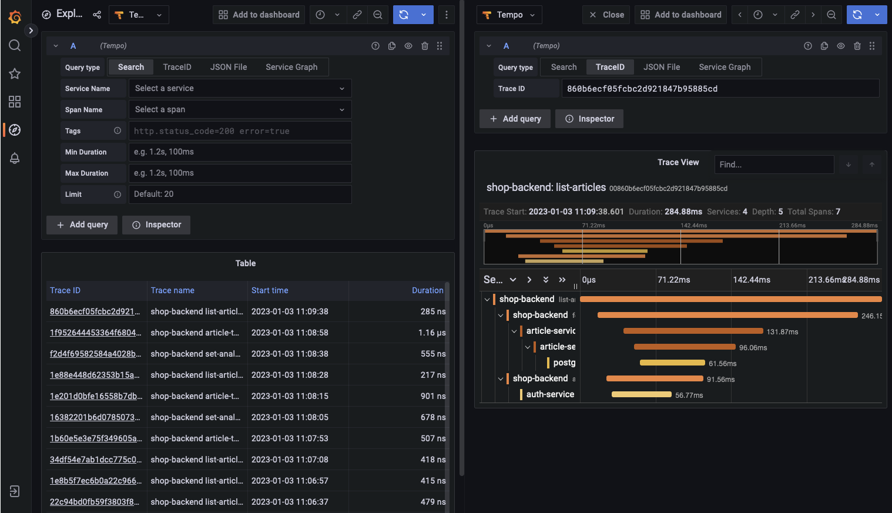
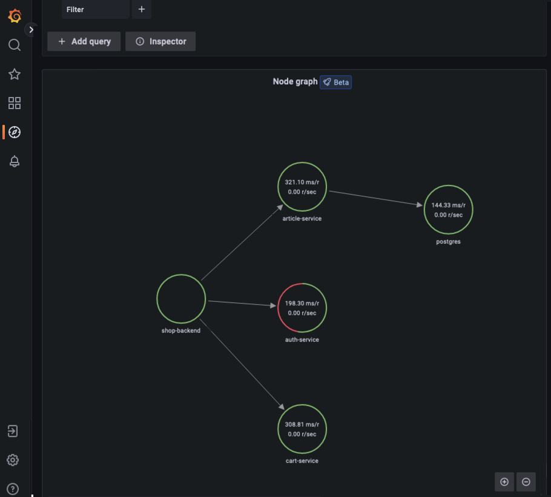

# Quick start for Tempo

The Tempo repository provides [multiple examples](https://github.com/grafana/tempo/tree/main/example/docker-compose) to help you quickly get started using Tempo and distributed tracing data.

Every example has a `docker-compose.yaml` manifest that includes all of the options needed to explore trace data in Grafana, including resource configuration and trace data generation.

The Tempo examples running with Docker using docker-compose include a version of Tempo and a storage configuration like Amazon S3 and GCS.

This quick start guide uses the `local` example running Tempo as a single binary (monolithic). Any data is stored locally in the `tempo-data` folder.
To learn more, read the [local storage example README](https://github.com/grafana/tempo/blob/main/example/docker-compose/local).

## Alternative: Complete MLTP example

If you would like to use a demo with Tempo, Mimir, Loki, and Grafana, then try the [Introduction to Metrics, Logs, Traces, and Profiling in Grafana](https://github.com/grafana/intro-to-mlt).
`Intro-to-mltp` provides a self-contained environment for learning about Mimir, Loki, Tempo, and Grafana.
The project includes detailed explanations of each component and annotated configurations for a single-instance deployment.
Data from `intro-to-mltp` can also be pushed to Grafana Cloud.

## Before you begin

To follow this guide, you need:

- Git
- Docker
- The docker-compose plugin

## Clone the Tempo repository and start Docker

1. Clone the Tempo repository:
   ```bash
   git clone https://github.com/grafana/tempo.git
   ```

1. Go into the examples directory:
   ```bash
   cd tempo/example/docker-compose/local
   ```

1. Start the services defined in the docker-compose file:
   ```bash
   docker compose up -d
   ```

1. Verify that the services are running using `docker compose ps`. You should see something like:
   ```console
   docker compose ps
   NAME                 COMMAND                  SERVICE             STATUS              PORTS
   local-grafana-1      "/run.sh"                grafana             running             0.0.0.0:3000->3000/tcp
   local-k6-tracing-1   "/k6-tracing run /ex…"   k6-tracing          running
   local-prometheus-1   "/bin/prometheus --c…"   prometheus          running             0.0.0.0:9090->9090/tcp
   local-tempo-1        "/tempo -config.file…"   tempo               running             0.0.0.0:3200->3200/tcp, 0.0.0.0:4317-4318->4317-4318/tcp, 0.0.0.0:9411->9411/tcp, 0.0.0.0:14268->14268/tcp
   ```

1. As part of the docker compose manifest, Grafana is now accessible on port 3000. Open a browser to localhost:3000 and sign in to Grafana.

1. Once logged in, navigate to the **Explore** page, select the **Tempo** data source and select the **Search** tab. Select **Run query** to list the recent traces stored in Tempo. Select one to view the trace diagram:
    <p align="center"></p>

1. A couple of minutes after Tempo has started up successfully, select the **Service graph** tab for the Tempo data source in the **Explore** page. Select **Run query** to view a service graph, generated by Tempo’s metrics-generator.
    <p align="center"></p>

1. To stop the services:
    ```
    docker compose down -v
    ```
    
