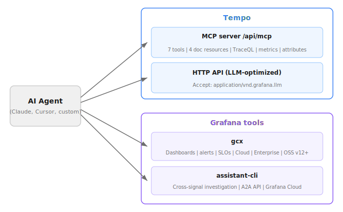

# Tempo and AI

Tempo exposes a Model Context Protocol (MCP) server and LLM-optimized API endpoints that let AI agents query traces, compute metrics, and discover attributes directly.
Grafana also provides command-line tools that connect agents to the broader observability platform.

## Model Context Protocol server

The [MCP server](https://grafana.com/docs/tempo/<TEMPO_VERSION>/api_docs/mcp-server/) at `/api/mcp` gives agents access to tools and documentation resources.
Agents can search for traces with TraceQL, retrieve a trace by ID, compute metrics from span data, and discover available attributes, all without manual query construction.
The server also serves TraceQL documentation as MCP resources, so agents can look up query syntax on demand instead of relying on training data.

The MCP server uses the `streamable-http` transport and supports the same authentication and [multi-tenancy](https://grafana.com/docs/tempo/<TEMPO_VERSION>/operations/manage-advanced-systems/multitenancy/) as other Tempo API endpoints.

To try it locally, refer to the [MCP server quick start](https://grafana.com/docs/tempo/<TEMPO_VERSION>/api_docs/mcp-server/#quick-start).

## LLM-optimized API responses

The [trace by ID v2](https://grafana.com/docs/tempo/<TEMPO_VERSION>/api_docs/#query-v2) and [tag values v2](https://grafana.com/docs/tempo/<TEMPO_VERSION>/api_docs/#search-tag-values-v2) endpoints accept an `Accept: application/vnd.grafana.llm` header.
This returns a simplified JSON format that strips unnecessary detail and reduces token usage, so agents can process larger traces within their context window.

Use this header when calling Tempo APIs directly rather than through the MCP server.

## Tempo 3.0 features relevant to AI workflows

These Tempo 3.0 features aren't AI-specific, but they directly improve what agents can do with tracing data.

### TraceQL metrics at general availability

[TraceQL metrics](https://grafana.com/docs/tempo/<TEMPO_VERSION>/metrics-from-traces/metrics-queries/) moved from experimental to GA in Tempo 3.0.
The MCP server's `traceql-metrics-instant` and `traceql-metrics-range` tools now query a GA engine, so agents can compute rate, error, and duration metrics directly from trace data and use the results with confidence.

### Or conditions for tag autocomplete

The [search tags v2](https://grafana.com/docs/tempo/<TEMPO_VERSION>/api_docs/#search-tags-v2) and [search tag values v2](https://grafana.com/docs/tempo/<TEMPO_VERSION>/api_docs/#search-tag-values-v2) APIs now support OR conditions, so autocomplete requests can match multiple values in a single call instead of making separate requests.

### Trace redaction

[Trace redaction](https://grafana.com/docs/tempo/<TEMPO_VERSION>/operations/tempo_cli/#redact-traces) removes traces containing sensitive data from object storage.
If your traces contain personally identifiable information or security tokens, redact them before enabling agent access through the MCP server or API endpoints.

## Grafana tools for AI workflows

Grafana provides additional tools that connect agents to the broader observability platform.

For additional information about AI capabilities in Grafana, refer to the [AI and machine learning](https://grafana.com/docs/grafana-cloud/machine-learning/) documentation.

### `gcx`

[`gcx`](https://github.com/grafana/gcx) is a CLI for managing Grafana resources, including dashboards, data sources, alerting rules, and Grafana Cloud products like Synthetic Monitoring, SLO, and Adaptive Telemetry.
It works with Grafana Cloud, Grafana Enterprise, and Grafana OSS (v12 or later).

An agent can use `gcx` alongside the Tempo MCP server to act on what it finds in traces.
For example, after identifying a latency issue, the agent could query related Prometheus metrics or inspect alerting rules through `gcx` without leaving the terminal.

### Grafana Assistant CLI

[Grafana Assistant](https://grafana.com/docs/grafana-cloud/machine-learning/assistant/) is an LLM-powered tool built into Grafana Cloud that queries data, builds dashboards, and helps you understand errors using natural language.
It requires a Grafana Cloud stack, including when used with self-hosted Grafana (v13 or later).

The [assistant-cli](https://github.com/grafana/assistant-cli) connects agents to Grafana Assistant through the Agent-to-Agent (A2A) API.
This lets an agent chain investigations across observability signals from the terminal.
For example, an agent could find a failing trace in Tempo, then use the `assistant-cli` to correlate the failure with error logs or query related metrics.

### Documentation as Markdown

Grafana documentation is [available as Markdown](https://grafana.com/whats-new/2026-05-15-grafana-documentation-now-ships-as-markdown/), so agents can fetch current reference material on demand instead of relying on training data that may be outdated.

## Next steps

- [Set up the MCP server](https://grafana.com/docs/tempo/<TEMPO_VERSION>/api_docs/mcp-server/) to give agents access to your tracing data.
- [Install gcx](https://github.com/grafana/gcx) to manage Grafana resources from the terminal or an agent workflow.
- [Install the assistant-cli](https://github.com/grafana/assistant-cli) to connect agents to Grafana Assistant.
