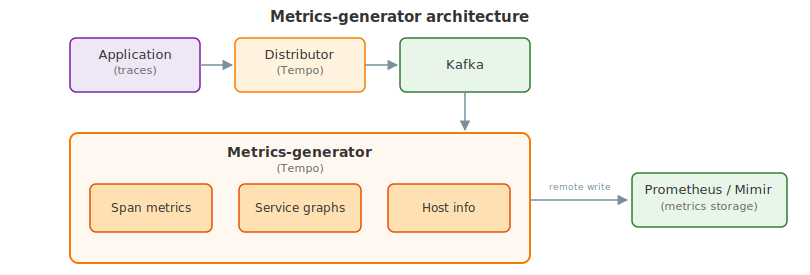

---
aliases:
  - ../operations/server_side_metrics # https://grafana.com/docs/tempo/<TEMPO_VERSION>/operations/server_side_metrics/
  - ../metrics-generator/ # /docs/tempo/next/metrics-generator/
title: Metrics-generator
description: Metrics-generator is an optional Tempo component that derives metrics from ingested traces.
weight: 300
---

# Metrics-generator

Metrics-generator is an optional Tempo component that derives metrics from ingested traces.
The metrics-generator consumes trace data from Kafka and writes metrics to a Prometheus data source using the Prometheus remote-write protocol.

## Architecture

Metrics-generator consumes trace data from Kafka to generate metrics from traces.

The metrics-generator internally runs a set of **processors**.
Each processor ingests spans and produces metrics.
Every processor derives different metrics. Currently, the following processors are available:

- Service graphs
- Span metrics
- Host info


Tempo 3.0 removed the `local-blocks` processor. Remove any `local-blocks` entries from your `metrics_generator.processors` configuration. The live-store component handles TraceQL metrics queries on recent data.


Instrumented applications send traces to the distributor, which writes them to Kafka.
The metrics-generator consumes trace data from Kafka and runs it through its configured processors (span metrics, service graphs, and host info).
Each processor derives a different set of metrics, which the metrics-generator then remote-writes to a Prometheus-compatible backend such as Prometheus or Grafana Mimir.

<p align="center"></p>

### Service graphs

Service graphs are the representations of the relationships between services within a distributed system.

This service graphs processor builds a map of services by analyzing traces, with the objective to find _edges_.
Edges are spans with a parent-child relationship, that represent a jump (for example, a request) between two services.
The processor records the request count and duration as metrics and uses them to represent the graph.

To learn more about this processor, refer to the [service graph](/docs/tempo/<TEMPO_VERSION>/metrics-from-traces/service_graphs/) documentation.

### Span metrics

The span metrics processor derives RED (Request, Error, and Duration) metrics from spans.

The span metrics processor computes the total count and the duration of spans for every unique combination of dimensions.
Dimensions can be the service name, the operation, the span kind, the status code and any tag or attribute present in the span.
The more dimensions you enable, the higher the cardinality of the generated metrics.

To learn more about this processor, refer to the [span metrics](/docs/tempo/<TEMPO_VERSION>/metrics-from-traces/span-metrics/) documentation.

### Host info

The host info processor emits a `traces_host_info` gauge metric derived from resource attributes on incoming spans.
It identifies hosts sending traces using configurable identifiers (by default, `k8s.node.name` and `host.id`) and produces labels `grafana_host_id` and `host_source`.
This processor is useful for correlating trace data with host-level infrastructure metrics.

To learn more about the configuration, refer to the [Metrics-generator](/docs/tempo/<TEMPO_VERSION>/configuration/#metrics-generator) section of the Tempo Configuration documentation.

## Remote writing metrics

The metrics-generator runs a Prometheus Agent that periodically sends metrics to a `remote_write` endpoint.
The `remote_write` endpoint is configurable and can be any [Prometheus-compatible endpoint](https://prometheus.io/docs/prometheus/latest/configuration/configuration/#remote_write).
To learn more about the endpoint configuration, refer to the [Metrics-generator](http://grafana.com/docs/tempo/<TEMPO_VERSION>/configuration/#metrics-generator) section of the Tempo Configuration documentation.
Use `metrics_generator.registry.collection_interval` to control the writing interval.

When you enable multi-tenancy, the metrics-generator forwards the `X-Scope-OrgID` header of the original request to the `remote_write` endpoint. To disable this behavior, set `remote_write_add_org_id_header` to false.

## Native histograms

[Native histograms](https://grafana.com/docs/mimir/<MIMIR_VERSION>/visualize/native-histograms/) are a data type in Prometheus that can produce, store, and query high-resolution histograms of observations.
It usually offers higher resolution and more straightforward instrumentation than classic histograms.

The metrics-generator supports the ability to produce native histograms for
high-resolution data. Users must [update the receiving endpoint](https://grafana.com/docs/mimir/<MIMIR_VERSION>/configure/configure-native-histograms-ingestion/) to ingest native
histograms, and [update histogram queries](https://grafana.com/docs/mimir/<MIMIR_VERSION>/visualize/native-histograms/) in their dashboards.

To learn more about the configuration, refer to the [Metrics-generator](/docs/tempo/<TEMPO_VERSION>/configuration/#metrics-generator) section of the Tempo Configuration documentation.

## Use metrics-generator in Grafana Cloud

If you want to enable metrics-generator for your Grafana Cloud account, refer to the [Metrics-generator in Grafana Cloud](https://grafana.com/docs/grafana-cloud/send-data/traces/metrics-generator/) documentation.

Enabling metrics generation and remote writing them to Grafana Cloud Metrics produces extra active series that could impact your billing.
For more information on billing, refer to [Understand your invoice](/docs/grafana-cloud/cost-management-and-billing/understand-your-invoice/).

## Partition handoff during rollouts

The metrics-generator uses Kafka static membership (`instance_id`) so that a pod restarting
with the same identity can rejoin the consumer group immediately (without waiting for the
session timeout) and reclaim its previously held partitions.
This is the right behaviour for **StatefulSet** deployments, where pod names are stable across
restarts (for example, `metrics-generator-0`).

For **Deployment** deployments, pod names change on every restart (for example,
`metrics-generator-7f9d4b6c5-xk2pj`).
Because the new pod has a different name, it registers as a new static member, and the old
member slot holds its partitions until the session timeout expires (typically several minutes).
During that window the partitions are idle and no metrics are generated from the corresponding
trace data.

To avoid this delay, set `leave_consumer_group_on_shutdown: true` on the metrics-generator.
When enabled, the shutting-down pod explicitly sends a `LeaveGroup` request to the Kafka
coordinator before closing.
The coordinator can then reassign the partitions immediately to the new pod, rather than waiting
for the session timeout.

```yaml
metrics_generator:
  leave_consumer_group_on_shutdown: true  # recommended for Deployment rollouts
```

Set `leave_consumer_group_on_shutdown: false` (the default) for StatefulSet deployments.
With a stable `instance_id`, sending `LeaveGroup` on shutdown would cause an unnecessary
leave-and-rejoin rebalance on every restart, briefly interrupting metrics generation for all
tenants sharing the same consumer group.


`leave_consumer_group_on_shutdown` requires Kafka 2.4 or later, which introduced the
per-member `InstanceID` field in the `LeaveGroup` request (KIP-345).


## Multitenancy

Tempo supports multitenancy in the metrics-generator through the use of environment variables and per-tenant overrides.
Refer to the [Multitenant Support for Metrics-Generator](multitenancy/) documentation for more information.
