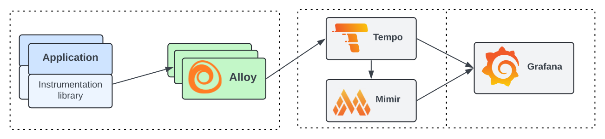

---
aliases:
- /docs/tempo/latest/server_side_metrics/
- /docs/tempo/latest/metrics-generator/
title: Metrics-generator
description: Metrics-generator is an optional Tempo component that derives metrics from ingested traces.
weight: 500
---

# Metrics-generator

Metrics-generator is an optional Tempo component that derives metrics from ingested traces.
If present, the distributor will write received spans to both the ingester and the metrics-generator.
The metrics-generator processes spans and writes metrics to a Prometheus data source using the Prometheus remote write protocol.


Enabling metrics generation and remote writing them to Grafana Cloud Metrics produces extra active series that could impact your billing. For more information on billing, refer to [Billing and usage](/docs/grafana-cloud/billing-and-usage/).
{}

## Overview

Metrics-generator leverages the data available in the ingest path in Tempo to provide additional value by generating metrics from traces.

The metrics-generator internally runs a set of **processors**.
Each processor ingests spans and produces metrics.
Every processor derives different metrics. Currently, the following processors are available:

- Service graphs
- Span metrics
- Local blocks

## Service graphs

Service graphs are the representations of the relationships between services within a distributed system.

This service graphs processor builds a map of services by analyzing traces, with the objective to find _edges_.
Edges are spans with a parent-child relationship, that represent a jump (e.g. a request) between two services.
The amount of request and their duration are recorded as metrics, which are used to represent the graph.

To learn more about this processor, refer to the [service graph]() documentation.

## Span metrics

The span metrics processor derives RED (Request, Error, and Duration) metrics from spans.

The span metrics processor computes the total count and the duration of spans for every unique combination of dimensions.
Dimensions can be the service name, the operation, the span kind, the status code and any tag or attribute present in the span.
The more dimensions are enabled, the higher the cardinality of the generated metrics.

To learn more about this processor, refer to the [span metrics]().

## Local blocks

The local blocks processor stores spans for a set period of time and
enables more complex APIs to perform calculations on the data. The processor must be
enabled for certain metrics APIs to function.

## Remote writing metrics

The metrics-generator runs a Prometheus Agent that periodically sends metrics to a `remote_write` endpoint.
The `remote_write` endpoint is configurable and can be any [Prometheus-compatible endpoint](https://prometheus.io/docs/prometheus/latest/configuration/configuration/#remote_write).
To learn more about the endpoint configuration, refer to the [Metrics-generator]() section of the Tempo Configuration documentation.
Writing interval can be controlled via `metrics_generator.registry.collection_interval`.

When multi-tenancy is enabled, the metrics-generator forwards the `X-Scope-OrgID` header of the original request to the `remote_write` endpoint. This feature can be disabled by setting `remote_write_add_org_id_header` to false.

## Native histograms

The metrics-generator supports the ability to produce [native histograms](https://grafana.com/docs/grafana-cloud/whats-new/native-histograms/), for
high-resolution data. Users must [update the receiving endpoint](https://grafana.com/docs/mimir/latest/configure/configure-native-histograms-ingestion/) to ingest native
histograms, and [update histogram queries](https://grafana.com/docs/mimir/latest/visualize/native-histograms/) in their dashboards.

To learn more about the configuration, refer to the [Metrics-generator]() section of the Tempo Configuration documentation.
