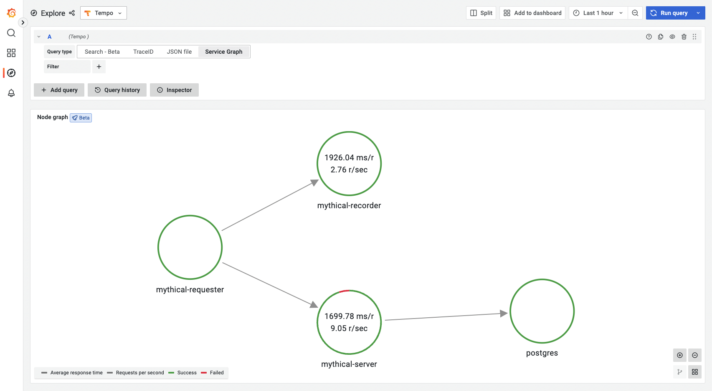

---
aliases:
- /docs/tempo/latest/server_side_metrics/service_graphs/
- /docs/tempo/latest/metrics-generator/service_graphs/
title: Service graphs
description: Service graphs help you understand the structure of a distributed system and the connections and dependencies between its components.
weight: 300
---

# Service graphs

A service graph is a visual representation of the interrelationships between various services.
Service graphs help you to understand the structure of a distributed system,
and the connections and dependencies between its components:

- **Infer the topology of a distributed system.**
  As distributed systems grow, they become more complex.
  Service graphs help you to understand the structure of the system.
- **Provide a high-level overview of the health of your system.**
  Service graphs display error rates, latencies, as well as other relevant data.
- **Provide an historic view of a system’s topology.**
  Distributed systems change very frequently,
  and service graphs offer a way of seeing how these systems have evolved over time.

<p align="center"></p>

## How they work

The metrics-generator processes traces and generates service graphs in the form of Prometheus metrics.

Service graphs work by inspecting traces and looking for spans with parent-children relationship that represent a request.
The processor uses the [OpenTelemetry semantic conventions](https://github.com/open-telemetry/opentelemetry-specification/blob/main/specification/trace/semantic_conventions/README.md) to detect a myriad of requests.
It currently supports the following requests:
- A direct request between two services where the outgoing and the incoming span must have [`span.kind`](https://github.com/open-telemetry/opentelemetry-specification/blob/main/specification/trace/api.md#spankind), `client`, and `server`, respectively.
- A request across a messaging system where the outgoing and the incoming span must have `span.kind`, `producer`, and `consumer` respectively.
- A database request; in this case the processor looks for spans containing attributes `span.kind`=`client` as well as `db.name`.

Every span that can be paired up to form a request is kept in an in-memory store, until its corresponding pair span is received or the maximum waiting time has passed.
When either of these conditions are reached, the request is recorded and removed from the local store.

Each emitted metrics series have the `client` and `server` label corresponding with the service doing the request and the service receiving the request.

```
  tempo_service_graph_request_total{client="app", server="db", connection_type="database"} 20
```

### Virtual nodes

Virtual nodes are nodes that form part of the lifecycle of a trace,
but spans for them are not being collected because they're outside the user's reach (for example, an external service for payment processing) or are not instrumented (for example, a frontend application).

Virtual nodes can be detected in two different ways:

- The root span has `span.kind` set to `server`. This indicates that the request has initiated by an external system that's not instrumented, like a frontend application or an engineer via `curl`.
- A `client` span does not have its matching `server` span, but has a peer attribute present. In this case, we make the assumption that a call was made to an external service, for which Tempo won't receive spans.
   - The default peer attributes are `peer.service`, `db.name` and `db.system`.
   - The order of the attributes is important, as the first one that is present will be used as the virtual node name.

### Metrics

The following metrics are exported:

| Metric                                      | Type      | Labels                          | Description                                                  |
|---------------------------------------------|-----------|---------------------------------|--------------------------------------------------------------|
| traces_service_graph_request_total          | Counter   | client, server, connection_type | Total count of requests between two nodes                    |
| traces_service_graph_request_failed_total   | Counter   | client, server, connection_type | Total count of failed requests between two nodes             |
| traces_service_graph_request_server_seconds | Histogram | client, server, connection_type | Time for a request between two nodes as seen from the server |
| traces_service_graph_request_client_seconds | Histogram | client, server, connection_type | Time for a request between two nodes as seen from the client |
| traces_service_graph_unpaired_spans_total   | Counter   | client, server, connection_type | Total count of unpaired spans                                |
| traces_service_graph_dropped_spans_total    | Counter   | client, server, connection_type | Total count of dropped spans                                 |

Duration is measured both from the client and the server sides.

Possible values for `connection_type`: unset, `messaging_system`, or `database`.

Additional labels can be included using the `dimensions` configuration option.

Since the service graph processor has to process both sides of an edge,
it needs to process all spans of a trace to function properly.
If spans of a trace are spread out over multiple instances, spans are not paired up reliably.
