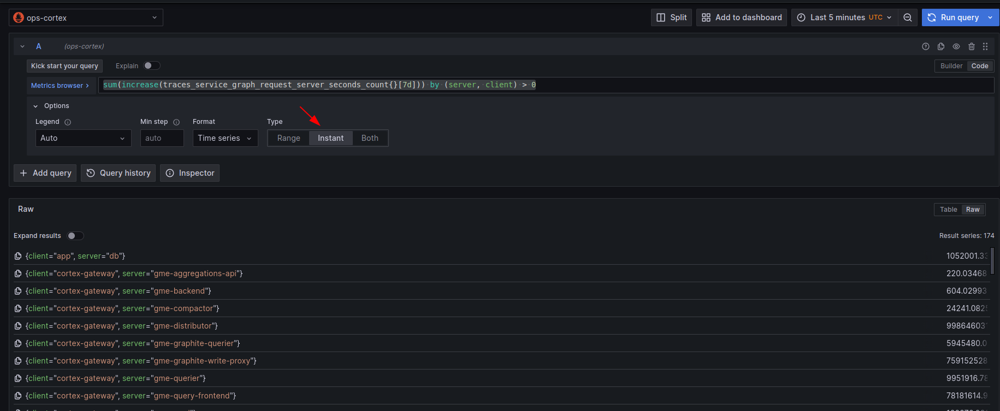
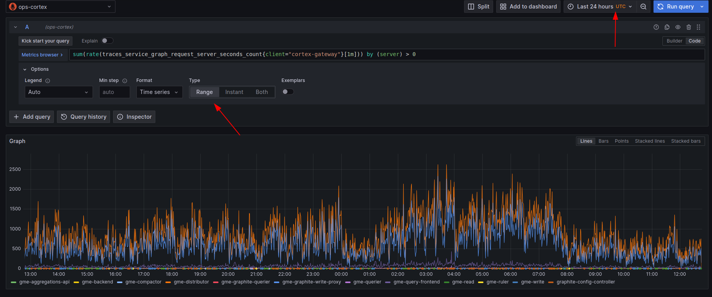

# Service graph metrics queries

A collection of useful PromQL queries for service graphs.

## Instant Queries

An instant query will give a single value at the end of the selected time range.
[Instant queries](https://prometheus.io/docs/prometheus/latest/querying/api/#instant-queries) are quicker to execute and easier to parse the results. We will prefer them in some scenarios:



### Connectivity between services

Show me the total calls in the last 7 days for every client/server pair:

```promql
sum(increase(traces_service_graph_request_server_seconds_count{}[7d])) by (server, client) > 0
```

If you'd like to only see when a single service is the server:

```promql
sum(increase(traces_service_graph_request_server_seconds_count{server="foo"}[7d])) by (client) > 0
```

If you'd like to only see when a single service is the client:

```promql
sum(increase(traces_service_graph_request_server_seconds_count{client="foo"}[7d])) by (server) > 0
```


In all of the above queries, you can adjust the interval to change the amount of time this is calculated for. So if you wanted the same analysis done over 1d:


```promql
sum(increase(traces_service_graph_request_server_seconds_count{}[1d])) by (server, client) > 0
```

## Range queries

Range queries are nice for calculating service graph info over a time range instead of a single point in time.



### Rates over time between services

Taking two of the queries above, we can request the rate over time that any given service acted as the client or server:

```promql
sum(rate(traces_service_graph_request_server_seconds_count{server="foo"}[5m])) by (client) > 0

sum(rate(traces_service_graph_request_server_seconds_count{client="foo"}[5m])) by (server) > 0
```

Notice that our interval dropped to 1 5m. This is so we only calculate the rate over the past 5 minutes which creates a more responsive graph.

### Latency percentiles over time between services

The final queries will give us latency quantiles for the above rate. If we were interested in how the latency changed over time between any two services we could use these. In the following query the .9 will calculate the 90th percentile. Adjust this to get a p50, p99, etc.

```promql
histogram_quantile(.9, sum(rate(traces_service_graph_request_server_seconds_bucket{client="foo"}[5m])) by (server, le))
```