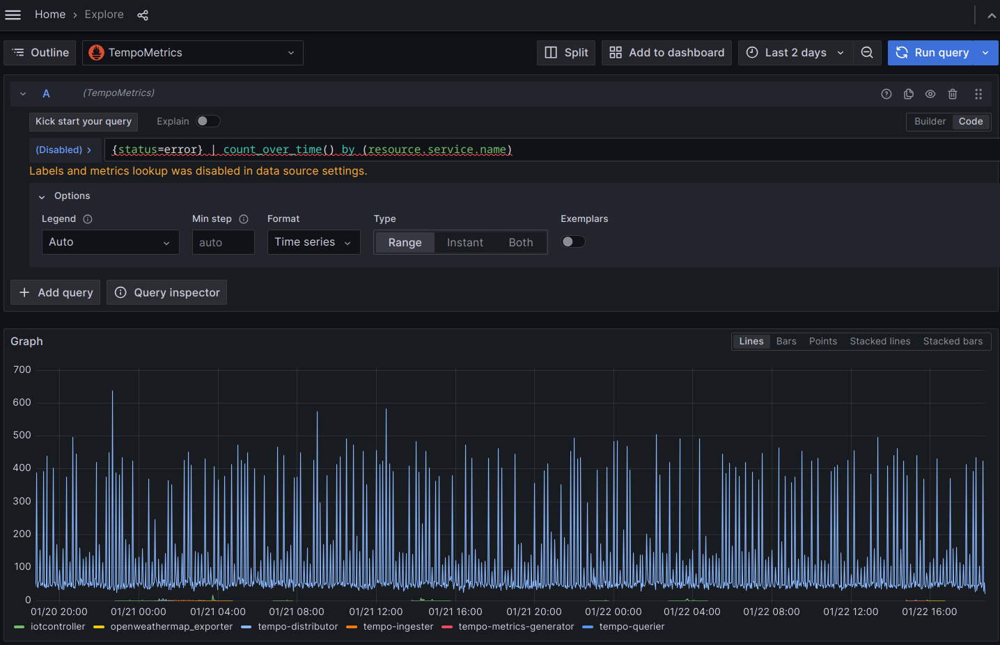

---
aliases:
- /docs/tempo/latest/metrics-generator/prometheus-compatibility
title: Prometheus compatibility
menuTitle: Prometheus compatibility
description: Learn about using tempo as a Prometheus data source.
weight: 550
keywords:
  - Prometheus
  - TraceQL
---

# Prometheus compatibility



This experimental Prometheus-compatible API provides a way to visualize metrics out of traces using TraceQL.  Additionally, the only implemented endpoint is `/query_range`, to allow a Prometheus data source in Grafana to be used.

The API will have native support in a future Grafana release, possibly using an internal API, deprecating the need for
this compatibility layer.

## Configure a Grafana datasource

Once the `local-blocks` processor is enabled in your `metrics-generator`
configuration, you can add a new Prometheus data source in Grafana to use the
`query-frontend` at the `/prom` endpoint for this.  Set the data source URL
parameter to `http://<HOST>:<PORT>/prom`.  For example:

    ```
    http://query-frontend.trace.svc.cluster.local:3200/prom
    ```


The data source test will fail with a `404` status code, but this is accepted
for the experimental feature.

### Query timeouts

Because of the expensive nature, these queries can take a long time to run in different systems. 
As such, consider increasing the timeouts in various places of
the system to allow enough time for the data to be returned.

Consider these areas when raising timeouts: 

  - Any proxy in front of Grafana
  - Grafana data source for Prometheus pointing at Tempo
  - Tempo configuration
    - `querier.search.query_timeout`
    - `server.http_server_read_timeout`
    - `server.http_server_write_timeout`

Additionally, a new `query_frontend.metrics` config has been added.  The config
here will depend on the environment.

For example, in a cloud environment, smaller jobs with more concurrency may be
desired due to the nature of scale on the backend.

```yaml
query_frontend:
    metrics:
        concurrent_jobs: 1000
        target_bytes_per_job: 2.25e+08 # ~225MB
        interval: 30m0s
```

For an on-prem backend, you can improve query times by lowering the concurrency,
while increasing the job size.

```yaml
query_frontend:
    metrics:
        concurrent_jobs: 8
        target_bytes_per_job: 1.25e+09 # ~1.25GB
```

## Visualize traces with TraceQL

Next, use Grafana `explore` to query the data source.

{}
Even though we are using a Prometheus data source, we are not using PromQL. Grafana will have no way to parse, validate or provide completion options for the query.
{}

Adjust the query `type` so only `range` is selected.

Here is an example query:

```
{status=error} | count_over_time() by (resource.service.name)
```

<!-- TODO: Point to supporting traceql docs. -->

This query has several parts to consider.

First, the query begins with the TraceQL `{status=error}`, to find spans who's `status` has been set to `error`.

Next, the `| count_over_time()` passes the spans matched to a new function,
introduced with this API.  There is also a `rate()` function.

Finally, the `by (resource.service.name)` groups the results into each series.

<p align="center"></p>

