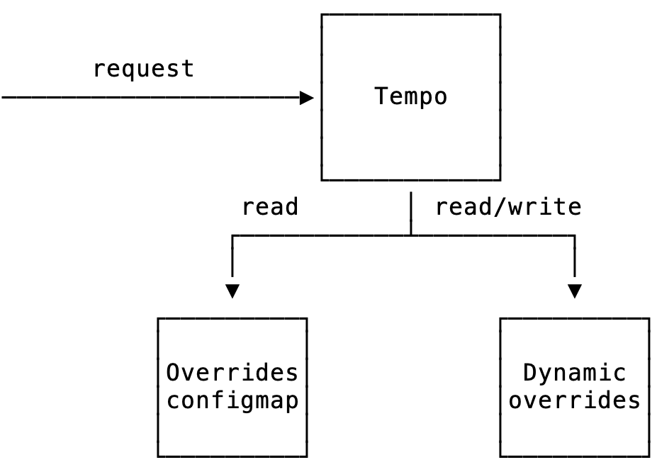

# Configure Tempo overrides through the user-configurable overrides API

User-configurable overrides in Tempo let you change overrides for your tenant using an API.
Instead of modifying a file or Kubernetes configmap, you (and other services relying on Tempo) can use this API to modify the overrides directly.

### Architecture



User-configurable are stored in an object store bucket. We recommend using a different bucket for overrides and traces storage, but they can share a bucket if needed.

Overrides of every tenant are stored at `/{tenant name}/overrides.json`:

```
overrides/
├── 1/
│   └── overrides.json
└── 2/
└── overrides.json
```

This bucket is regularly polled and a copy of the limits is kept in-memory. When requesting the overrides for a tenant, the overrides module will now:

1. check this override is set in the user-configurable overrides, if so return that value
2. check if this override is set in the runtime config (configmap), if so return that value
3. return the default value

### Supported fields

User-configurable overrides are designed to be a subset of the runtime overrides. See [Overrides](../configuration/_index.md#overrides) for all overrides.

{}
When a field is set in both the user-configurable overrides and the runtime overrides, the value from the user-configurable overrides will be returned. The only exception is `processors` which will merge values from both sources.
{}

```yaml
[forwarders: <list of strings>]

metrics_generator:

  [processors: <list of strings>]
  [collection_interval: <duration>]
  [disable_collection: <bool> | default = false]

  processor:

    service_graphs:
      [histogram_buckets: <list of float>]
      [dimensions: <list of string>]
      [peer_attributes: <list of string>]
      [enable_client_server_prefix: <bool>]

    span_metrics:
      [histogram_buckets: <list of float>]
      [dimensions: <list of string>]
      [intrinsic_dimensions: <map string to bool>]
      [filter_policies: [
        [
          include/exclude:
            match_type: <string> # options: strict, regexp
            attributes:
              - key: <string>
                value: <any>
        ]
      ]
      [enable_target_info: <bool>]
      [target_info_excluded_dimensions: <list of string>]
```

### API

All API requests are handled on the `/api/overrides` endpoint, the module supports `GET`, `POST`, `PATCH` and `DELETE` requests.

This endpoint is tenant-specific, if Tempo is run in multitenant mode all requests should have an appropriate `X-Scope-OrgID` header.

If tenant is run in distributed mode, only the query-frontend will accept API requests.

#### Operations

```
GET /api/overrides
```

Returns the current overrides and it's version.

Query-parameters:
- `scope`: whether to return overrides from the API only `api` or merge it with the runtime overrides `merged`. Defaults to `api`.

Example: `curl -X GET -v -H "X-Scope-OrgID: 3" http://localhost:3100/tempo/api/overrides\?scope=merged`

```
POST /api/overrides
```

Update the overrides with the given payload. Note this will overwrite any existing overrides.

Example: `curl -X POST -v -H "X-Scope-OrgID: 3" -H "If-Match: 1697726795401423" http://localhost:3100/api/overrides --data "{}"

```
PATCH /api/overrides
```

Update the existing overrides by patching it with the payload. It follows the JSON merge patch protocol ([RFC 7386](https://datatracker.ietf.org/doc/html/rfc7386)).

Example: `curl -X PUT -v -H "X-Scope-OrgID: 3" -H "If-Match: 1697726795401423" http://localhost:3100/api/overrides --data "{\"forwarders\":null}"

```
DELETE /api/overrides
```

Delete the existing overrides.

Example: `➜ curl -X DELETE -H "X-Scope-OrgID: 3" -H "If-Match: 1697726795401423" http://localhost:3100/api/overrides`

#### Versioning

To handle concurrent read and write operations, overrides are stored with a version in the backend.
Whenever the overrides are returned, the response will have an Etag header with the current version.

```
$ curl -v http://localhost:3100/api/overrides
...
< HTTP/1.1 200 OK
< Content-Type: application/json
< Etag: 1697726795401423
< Date: Wed, 07 Feb 2024 17:49:04 GMT
< Content-Length: 118
...
```

Requests that modify or delete overrides need to pass the current version using the `If-Match` header:

```
$ curl -X POST -H "If-Match: 1697726795401423" http://localhost:3100/api/overrides --data "..."
```

If the version does not match the version in the backend the request will be rejected with HTTP error 412.

#### Conflicting runtime overrides check

This is an optional check that will block update requests if:

1. there are no user-configurable overrides yet for this tenant
2. there are runtime overrides set 

This prevents callers 

Explain how the check works, how to configure and how to bypass.

This check can be bypassed by setting the query parameter `skip-conflicting-overrides-check=true`
