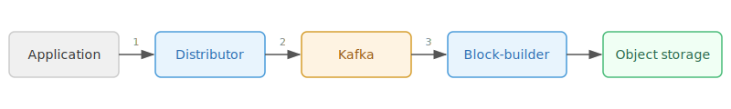
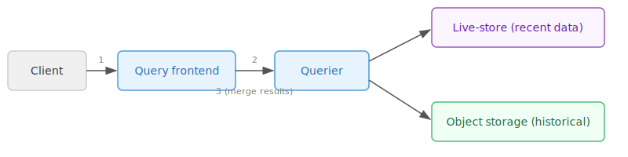

# About the Tempo architecture

Grafana Tempo is a distributed tracing backend designed for high-volume trace ingestion and querying at scale.
Tempo 3.0 introduces a new architecture that decouples the write and read paths.
In [microservices mode](/docs/tempo/<TEMPO_VERSION>/reference-tempo-architecture/deployment-modes/), a Kafka-compatible message queue serves as a durable intermediary between the distributor and downstream consumers.
In [monolithic mode](/docs/tempo/<TEMPO_VERSION>/reference-tempo-architecture/deployment-modes/), the distributor pushes data directly to the live-store in-process without Kafka.

## Design philosophy

The Tempo architecture is built around several key principles.

Separate components handle writing trace data to storage and serving queries.
You can scale writes and reads independently, and a failure in one path doesn't affect the other.

In microservices mode, Kafka serves as a durable write-ahead log (WAL) between distributors and downstream consumers.
Once Kafka acknowledges a write, the data is safe.
This replaces the previous in-process ingestion WAL that lived on local disks.
Because Kafka provides durability on the write path, Tempo doesn't need to replicate data across multiple instances.
This replication factor of 1 significantly reduces cost and query complexity.

In monolithic mode, no Kafka is required. The distributor pushes trace data in-process directly to the live-store and metrics-generator. Live-stores still use a local WAL for quickly available search.

Tempo uses Apache Parquet as the default columnar block format, storing trace data in a columnar layout that enables efficient querying of specific attributes without reading entire traces.

Refer to [Apache Parquet block format configuration](/docs/tempo/<TEMPO_VERSION>/configuration/parquet/) and [Apache Parquet schema](/docs/tempo/<TEMPO_VERSION>/operations/schema/) to learn more.

## Write path

The write path gets trace data from instrumented applications into long-term object storage. How data flows through the write path depends on the [deployment mode](/docs/tempo/<TEMPO_VERSION>/reference-tempo-architecture/deployment-modes/).

### Microservices write path

1. Distributors receive trace data over OTLP or other supported protocols,
validate it against rate limits, shard traces by trace ID, and write records to Kafka partitions.
1. Kafka durably stores the records.
The write is acknowledged to the client as soon as Kafka confirms receipt.
1. Block-builders consume records from Kafka, organize spans into blocks in Apache Parquet format,
and flush those blocks to object storage.

The block-builder operates on a consumption cycle: it reads a batch of records from Kafka,
builds blocks from them, flushes the blocks to object storage, and commits the offset back to Kafka.
Each cycle produces a clean cut of data.
Traces that span multiple cycles have their spans split across blocks, which the query path handles at query time.

### Monolithic write path

In monolithic mode, no Kafka or block-builder is involved. The distributor pushes trace data in-process directly to the live-store and metrics-generator. The live-store holds traces in memory, flushes them to a local WAL, cuts them into completed blocks, and flushes those completed blocks to the configured storage backend.

## Read path

The read path serves queries by combining recent data from live-stores with historical data from object storage.

1. The query frontend receives a query, shards it into parallel jobs, and distributes them to queriers.
1. Queriers execute jobs by fetching data from two sources:
live-stores for recent data, typically the last 30 minutes to 1 hour, and object storage for historical data,
using bloom filters and indexes for efficient block lookups.
1. The query frontend merges results from all queriers and returns the response.

## Live-stores and the recent data window

Live-stores are the read-path component responsible for serving recent trace data.
They hold traces in memory and write them to temporary on-disk blocks, making data available for queries within seconds of ingestion.

In microservices mode, live-stores consume from Kafka independently of block-builders.
There's a gap between when trace data is written to Kafka and when the block-builder flushes it to object storage.
During this window, the only way to query that data is through the live-store.

In monolithic mode, live-stores receive trace data directly from the distributor in-process. There is no Kafka consumption or block-builder involved.

In microservices mode, live-stores own the partition lifecycle within Tempo.
They manage a partition ring that tracks which partitions are active and which live-stores own them.
This is separate from Kafka's internal partition management.
Refer to the [partition ring](../partition-ring/) documentation for details.

## How the paths connect

The write and read paths connect through object storage. In microservices mode, block-builders write blocks there; in monolithic mode, live-stores write blocks there. Queriers read from object storage in both modes.

In microservices mode, Kafka also connects the paths. Both block-builders and live-stores consume from the same Kafka partitions, but they track their own consumer offsets independently. Even if a block-builder is down or slow, live-stores continue serving recent data. If a live-store restarts, it replays from Kafka to rebuild its in-memory state.

In monolithic mode, the connection is simpler. The distributor pushes data directly to the live-store, which flushes blocks to object storage. The querier reads from both the live-store and object storage within the same process.

## Component summary

| Component | Path | Microservices mode | Monolithic mode |
|---|---|---|---|
| [Distributor](../components/distributor/) | Write | Receives traces, validates limits, writes to Kafka | Receives traces, validates limits, pushes in-process to live-store |
| [Kafka](../components/kafka/) | Write | Durable message queue between distributor and consumers | Not used |
| [Block-builder](../components/block-builder/) | Write | Consumes from Kafka, builds Parquet blocks, flushes to object storage | Not used |
| [Live-store](../components/live-store/) | Read | Consumes from Kafka, serves recent data to queriers | Receives data from distributor, serves recent data to queriers |
| [Query frontend](../components/query-frontend/) | Read | Shards queries into jobs, distributes to queriers, merges results | Same |
| [Querier](../components/querier/) | Read | Executes query jobs against live-stores and object storage | Same |
| [Backend scheduler/worker](../components/compaction/) | Maintenance | Compacts and deduplicates blocks, enforces retention | Same |
| [Metrics-generator](../components/metrics-generator/) | Optional | Consumes from Kafka, derives metrics from traces | Receives data from distributor, derives metrics from traces |
