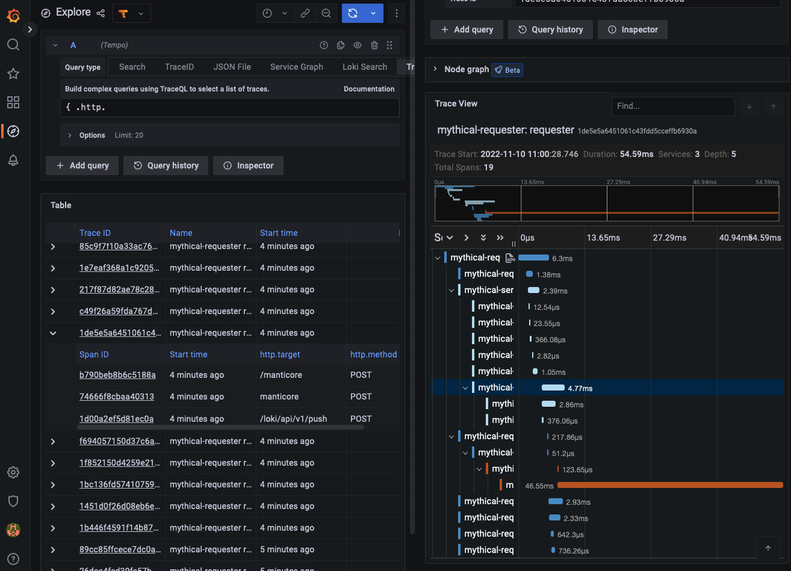
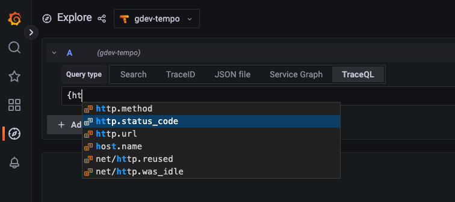

# Version 2.0 release notes

The Tempo team is pleased to announce the newest major release of Tempo: version 2.0!

Tempo 2.0’s headline feature is the introduction of TraceQL. TraceQL is a query language modeled on PromQL and LogQL that allows you to interactively extract insights from your trace data. It provides a powerful, flexible way to pinpoint the traces you need to answer questions about your systems and analyze traces based on their structure.

Continuing in the tradition of Tempo’s close integration with Grafana as a visualization layer, we’ve also added a TraceQL query editor to Grafana’s Tempo data source. The editor is available in Grafana Cloud and for open source users in Grafana 9.3.2. We encourage open source users to upgrade to Grafana 9.4 as soon as it is released to take advantage of some additional enhancements and bug fixes.

In addition to TraceQL, Tempo 2.0 also marks the promotion of the Apache Parquet block format to the new default storage format. With this change, the Tempo maintainers are signaling that this new format has received enough testing to be ready for broad adoption.

These two changes actually go hand-in-hand: without the increased search speed enabled by the Apache Parquet block format, it would be impossible to pull off the sophisticated queries made possible by TraceQL.

>**Note**: For a complete list of changes and enhancements, refer to the [Tempo 2.0 changelog](https://github.com/grafana/tempo/releases).

## Features and enhancements

Some of the most important features and enhancements in Tempo 2.0 are highlighted below.

### TraceQL, the trace query language

Inspired by PromQL and LogQL, TraceQL is a query language designed for selecting traces in Tempo. TraceQL makes it possible to find traces that otherwise would have been difficult or even impossible to identify with Tempo's existing search. It also makes it possible for you to understand the broad context for an event sequence.
To understand more about why we built TraceQL and the use cases we think it unlocks, see [our blog post](https://grafana.com/blog/2022/11/30/traceql-a-first-of-its-kind-query-language-to-accelerate-trace-analysis-in-tempo-2.0/).

With this release, we’ve implemented a subset of the full TraceQL language we envision. Users can select traces based on the following:

- Span and resource attributes, timing, and duration
- Basic aggregates: `count()` and `avg()`

To learn more about the TraceQL syntax, see the [TraceQL documentation]().
For information on how we plan to extend the TraceQL language, see [future work]().

You can run a TraceQL query either by issuing it to Tempo’s `q` parameter of the [`search` API endpoint](), or, for those using Tempo in conjunction with Grafana, by using Grafana’s TraceQL query editor, described below.

TraceQL requires Tempo’s Parquet columnar format, which is the default block format in Tempo 2.0. For more information, refer to the Tempo [Apache Parquet block format]() documentation.

### TraceQL query editor in Grafana

To make it easier to run and visualize the results of TraceQL queries, we’ve added a TraceQL query editor to Grafana’s Tempo data source. The editor is available in Grafana’s Explore interface starting in Grafana version 9.3.2.

<p align="center"></p>

The query editor helps you learn TraceQL by offering autocomplete.

<p align="center"></p>

For more information, refer to the [TraceQL query editor documentation]().

### Apache Parquet block format is the new default

The experimental Apache Parquet columnar block format introduced in Tempo v1.5 has been promoted to stable and is now the default trace storage for Tempo 2.0. We're excited to switch to it because of the increased speed and efficiency it provides for search.

With our previous block format, we'd seen our ability to search trace data cap out at a rate of ~40-50 GB per second. Since switching to Parquet, we're now hitting search speeds of 300 GB/s on common queries and doing so with less compute. If we define the bytes processed as the total trace bytes that are scanned, then this example query resulted in ~1.2 TB/s:

```yaml
{ resource.cluster ="foo" }
```

and this query resulted in ~550 GB/s:

```yaml
{ span.foo ="bar" }
```

Another benefit of the Parquet block format relative to our previous format is that users can now leverage the large ecosystem of existing Parquet tools and libraries to process and transform their trace data. We look forward to see what downstream applications people create with this ability.

The Parquet block format can be used as a drop-in replacement for Tempo’s existing block format. No data conversion or upgrade process is necessary. As soon as the Parquet format is enabled, Tempo starts writing data in that format, leaving existing data as-is.

Tempo search will return results from both the legacy and Parquet block formats. However, search on legacy blocks has been marked as deprecated and will be removed in Tempo 2.1.

TraceQL queries will only search trace data stored in Parquet blocks.
For more information, refer to the [Parquet documentation]().

>**Note**: There is a potential issue loading Tempo 1.5's experimental Parquet storage blocks. You may see errors or even panics in the compactors. We have only been able to reproduce this with interim commits between 1.5 and 2.0, but if you experience any issues please [report them](https://github.com/grafana/tempo/issues/new?assignees=&labels=&template=bug_report.md&title=) so we can isolate and fix this issue.

### Search and metrics-generator enabled by default

Search and [metrics-generator]() are now enabled by default in Tempo 2.0, and their corresponding configuration parameters (`search_enabled` and `metrics_generator_enabled`) have been removed.

We’ve been excited by the feedback we’ve gotten on both features and are satisfied with their stability so we want all newcomers to Tempo to have access to them from day 1.

Although the metrics-generator component is now enabled by default, no actual metrics will be generated until certain tenant-specific configuration parameters have been set. For more information, refer to the [metrics-generator configuration documentation]().

>**NOTE:** Grafana Cloud customers need to contact Grafana Support to enable metrics generation.

As part of promoting the metrics-generator to default on, we've made the following improvements to it:

- The metrics-generator now handles collisions between user-defined and default dimensions. User-defined dimensions colliding with default dimensions will be prefixed with `__`. [PR 1794](https://github.com/grafana/tempo/pull/1794)
- The metrics-generator now makes intrinsic dimensions configurable and disables `status_message` by default [PR 1960](https://github.com/grafana/tempo/pull/1960).
- The metrics-generator now computes a metric that tells you the size (in bytes) of spans received broken down by team, service, or other relevant labels. Since span volume roughly correlates with the cost to operate Tempo, this metric is helpful for cost attribution and chargeback purposes. [PR 1662](https://github.com/grafana/tempo/pull/1662).
- Older spans are now filtered out before metrics are aggregated. This is helpful since including these older span in metric computation can lead to misleading or incorrect results. [PR 1612](https://github.com/grafana/tempo/pull/1612).
- Label names and values that exceed a configurable length are truncated. In this way, the Tempo metrics-generator sanitizes metrics before sending them to a receiving time-series-database (which usually has its own limits around maximum label length). [PR 1897](https://github.com/grafana/tempo/pull/1897).

### Zone-aware replication for ingesters

Zone awareness is a feature that ensures data is replicated across failure domains (which we refer to as "zones") to provide greater reliability. A failure domain is whatever you define it to be, but commonly may be an availability zone, data center, or server rack.

When zone awareness is enabled for ingesters, incoming trace data is guaranteed to be replicated to ingesters in different zones. This allows the system to withstand the loss of one or more zones (depending on the replication factor).

Thank you to community member manohar-koukuntla for making this contribution!

```yaml
# use the following fields in _config field of jsonnet config, to enable zone aware ingesters.
    multi_zone_ingester_enabled: false,
    multi_zone_ingester_migration_enabled: false,
    multi_zone_ingester_replicas: 0,
    multi_zone_ingester_max_unavailable: 25,
```

## Upgrade considerations

When [upgrading]() to Tempo 2.0, be aware of these breaking changes.

### Defaults updated

The following configuration parameters have been updated with new default values. These defaults were changed to work better with the new Parquet block format. [PR 1978](https://github.com/grafana/tempo/pull/1978)

If you are sticking with the `v2` format you may prefer the old values.

```yaml
query_frontend:
    max_oustanding_per_tenant: 2000
    search:
        concurrent_jobs: 1000
        target_bytes_per_job: 104857600
        max_duration: 168h
        query_ingesters_until: 30m
    trace_by_id:
        query_shards: 50
querier:
    max_concurrent_queries: 20
    search:
        prefer_self: 10
ingester:
    concurrent_flushes: 4
    max_block_duration: 30m
    max_block_bytes: 524288000
storage:
    trace:
        pool:
            max_workers: 400
            queue_depth: 20000
        search:
            read_buffer_count: 32
            read_buffer_size_bytes: 1048576

```

### Removed and renamed configuration parameters

The following tables describe the parameters that have been removed or renamed. (PR#1978)

#### Removed

| Parameter | Comments |
| :-- | :-- |
| <pre>query_frontend:<br/>&nbsp;&nbsp;query_shards:</pre> | Replaced by `trace_by_id.query_shards` |
| <pre>querier:<br>&nbsp;&nbsp;query_timeout:</pre> | Replaced by two different settings:  `search.query_timeout` and `trace_by_id.query_timeout` |
| <pre>ingester:<br>&nbsp;&nbsp;use_flatbuffer_search:</pre> | Removed and automatically determined based on block format |
| `search_enabled` | Removed. Now defaults to true. |
| `metrics_generator_enabled` | Removed. Now defaults to true. |
| <pre>storage:<br>&nbsp;&nbsp;wal:<br>&nbsp;&nbsp;&nbsp;&nbsp;version:</pre> | Removed and pinned to `block.version` |

#### Renamed

| Parameter | Comments |
| --- | --- |
| <pre>query_frontend:<br>&nbsp;&nbsp;query_shards:</pre> | Renamed `query_frontend.trace_by_id.query_shards` |
| <pre>querier:<br>&nbsp;&nbsp;query_timeout:</pre> | Renamed `querier.trace_by_id.query_timeout` |

The following `compactor` configuration parameters were renamed.

| Parameter | Comments |
| --- | --- |
| <pre>compaction:<br>&nbsp;&nbsp;chunk_size_bytes:</pre> | Renamed to `v2_in_buffer_bytes` |
| <pre>compaction:<br>&nbsp;&nbsp;flush_size_bytes:</pre> | Renamed to `v2_out_buffer_bytes` |
| <pre>compaction:<br>&nbsp;&nbsp;iterator_buffer_size:</pre> | Renamed to `v2_prefetch_traces_count` |

The following `storage` configuration parameters were renamed.

| Parameter | Comments |
| --- | --- |
| <pre>wal:<br>&nbsp;&nbsp;encoding:</pre> | Renamed to `v2_encoding` |
| <pre>block:<br>&nbsp;&nbsp;index_downsample_bytes:</pre> | Renamed to `v2_index_downsample_bytes` |
| <pre>block:<br>&nbsp;&nbsp;index_page_size_bytes:</pre> | Renamed to `v2_index_page_size_bytes` |
| <pre>block:<br>&nbsp;&nbsp;encoding:</pre> | Renamed to `v2_encoding` |
| <pre>block:<br>&nbsp;&nbsp;row_group_size_bytes:</pre> | Renamed to `parquet_row_group_size_bytes` |

### Other upgrade considerations


[PR 1879](https://github.com/grafana/tempo/pull/1879). The Azure Storage configuration now uses snake case with underscores (`_`) instead of dashes (`-`)Use snake case on Azure Storage config. Here is an example of using snake case on Azure Storage config:

```yaml
# config.yaml
storage:
  trace:
    azure:
      storage_account_name:
      storage_account_key:
      container_name:
```

[PR 1678](https://github.com/grafana/tempo/pull/1678). Parquet is the new default block version. To continue using the v2 block format, see the [Parquet configuration documentation](https://grafana.com/docs/tempo/latest/configuration/parquet/).

[PR 1810](https://github.com/grafana/tempo/pull/1810). We've deleted the `TempoRequestErrors` alert from mixin. Any Jsonnet users relying on this alert should copy this into their own environment.


[PR 1754](https://github.com/grafana/tempo/pull/1754). We've added TLS support to the vulture. Internal types are updated to use `scope` instead of `instrumentation_library`. This is a breaking change in "trace by ID" type queries if JSON is requested.


## Bug fixes

### 2.0.1

#### Enhancements

* [PR 2059](https://github.com/grafana/tempo/issues/2059) No longer return `status.code` from `/api/search/tags` unless it is an attribute present in the data,
* [PR 2062](https://github.com/grafana/tempo/pull/2062) Pad leading zeroes in span id to always be 16 characters.

#### Bug fixes

* [PR 2058](https://github.com/grafana/tempo/pull/2058) Suppress logspam in single binary mode when metrics generator is disabled.
* [PR 2055](https://github.com/grafana/tempo/pull/2055) Error more gracefully while reading some blocks written by an interim commit between 1.5 and 2.0.
* [PR 2095](https://github.com/grafana/tempo/pull/2095) Correctly coalesce trace level data when combining Parquet traces.
* [PR 2114](https://github.com/grafana/tempo/issues/2114) Unescape query parameters in AWS Lambda to allow TraceQL queries to work.

### 2.0 bug fixes

Version 2.0 includes the following fixes:

- [PR 1887](https://github.com/grafana/tempo/pull/1887) Stop distributors on OTel receiver fatal error.
- [PR 1700](https://github.com/grafana/tempo/pull/1700) New wal file separator `+` for the NTFS filesystem and backward compatibility with the old separator `:`.
- [PR 1697](https://github.com/grafana/tempo/pull/1697) Honor caching and buffering settings when finding traces by ID.
- [PR 1723](https://github.com/grafana/tempo/pull/1723) Correctly propagate errors from the iterator layer up through the queriers.
- [PR 1781](https://github.com/grafana/tempo/pull/1781) Make multitenancy work with HTTP.
- [PR 1799](https://github.com/grafana/tempo/pull/1799) Fix parquet search bug fix on `http.status_code` that may cause incorrect results to be returned.
- [PR 1813](https://github.com/grafana/tempo/pull/1813) Fix failing `SearchTagValues` endpoint after startup.
- [PR 1913](https://github.com/grafana/tempo/pull/913) tempo-mixin: tweak dashboards to support metrics without cluster label present.
- [PR 1920](https://github.com/grafana/tempo/pull/1920) Fix docker-compose examples not running on Apple M1 hardware.
- [PR 1939](https://github.com/grafana/tempo/pull/1939) Fix TraceQL parsing of most binary operations to not require spacing.
- [PR 1947](https://github.com/grafana/tempo/pull/1947) Don't persist tenants without blocks in the ingester.
- [PR 1948](https://github.com/grafana/tempo/pull/1948) TraceQL: span scope not working with ranges.
- [PR 1997](https://github.com/grafana/tempo/pull/1997) TraceQL: skip live traces search.
- [PR 2003](https://github.com/grafana/tempo/pull/2003) Return more consistent search results by combining partial traces.
