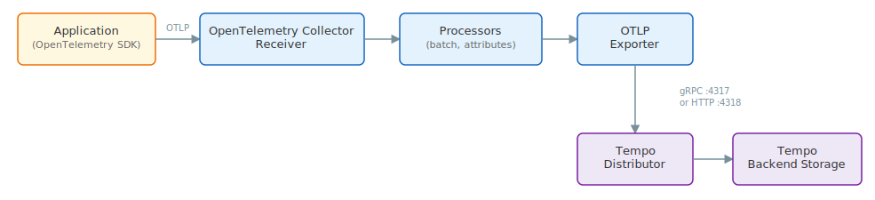
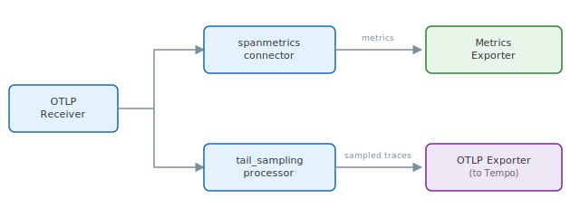

# OpenTelemetry Collector

The [OpenTelemetry Collector](https://opentelemetry.io/docs/collector/) is a vendor-agnostic component for receiving, processing, and exporting telemetry data.
It's maintained by the OpenTelemetry project and the Cloud Native Computing Foundation (CNCF).

You can use the OpenTelemetry Collector to collect and forward traces to Tempo.
Using a collector provides a centralized tracing pipeline, especially when dealing with multiple applications or microservices. This lets you manage trace processing without changing your application's codebase.

You can deploy the OpenTelemetry Collector anywhere within your infrastructure and pair it with a self-managed Tempo instance or Grafana Cloud Traces.

For installation instructions, refer to the [Install the OpenTelemetry Collector](https://opentelemetry.io/docs/collector/installation/) documentation.

For information about using the OpenTelemetry Collector with Grafana products, refer to the [Grafana OpenTelemetry Collector documentation](https://grafana.com/docs/opentelemetry/collector/opentelemetry-collector/).

## Architecture

The OpenTelemetry Collector runs tracing pipelines that collect data from your applications and write it to Tempo.
Pipelines consist of `receivers`, `processors`, and `exporters`, all configured in a single YAML file.



{{/* Mermaid source (not rendered by Hugo):
flowchart LR
    App["Application\n(OpenTelemetry SDK)"] -->|"OTLP"| Receiver["OpenTelemetry Collector\nReceiver"]
    Receiver --> Processor["Processors\n(batch, attributes)"]
    Processor --> Exporter["OTLP Exporter"]
    Exporter -->|"gRPC :4317\nor HTTP :4318"| Distributor["Tempo\nDistributor"]
    Distributor --> Storage["Tempo\nBackend Storage"]
*/}}

This architecture lets you configure multiple distinct tracing pipelines, each of which collects separate spans and sends them to different backends.

For more information, refer to the [OpenTelemetry Collector configuration documentation](https://opentelemetry.io/docs/collector/configuration/).

## Before you begin

Before you set up the OpenTelemetry Collector to send traces to Tempo, you need:

- The OpenTelemetry Collector [installed](https://opentelemetry.io/docs/collector/installation/).
  The [contrib distribution](https://github.com/open-telemetry/opentelemetry-collector-contrib) is recommended because it includes additional processors and exporters such as `k8sattributes`, `tail_sampling`, and the `spanmetrics` connector.
- A running Tempo instance with the distributor OTLP endpoints accessible.
  By default, Tempo accepts OTLP traces on port `4317` (gRPC) and port `4318` (HTTP).

## Set up the OpenTelemetry Collector to receive traces

<!-- vale Grafana.Parentheses = NO -->

The OpenTelemetry Collector supports multiple ingestion receivers, including OTLP (OpenTelemetry Protocol), Jaeger, Zipkin, and Kafka.
OTLP is the recommended protocol for forwarding traces to Tempo.

<!-- vale Grafana.Parentheses = YES -->

Each tracing pipeline can be configured to receive traces in any of these formats.
Traces that arrive to a pipeline go through the receivers, processors, and exporters defined in that pipeline.

### Minimal configuration

The following example configures the OpenTelemetry Collector to receive OTLP traces over both gRPC and HTTP, batch them, and export to Tempo using the OTLP gRPC exporter:

```yaml
receivers:
  otlp:
    protocols:
      grpc:
        endpoint: 0.0.0.0:4317
      http:
        endpoint: 0.0.0.0:4318

processors:
  batch:

exporters:
  otlp:
    endpoint: <TEMPO_HOST>:4317
    tls:
      insecure: true

service:
  pipelines:
    traces:
      receivers: [otlp]
      processors: [batch]
      exporters: [otlp]
```

Replace _TEMPO_HOST_ with the hostname or address of your Tempo distributor.
Set `tls.insecure: true` only for development or non-production environments.
For production TLS configuration, refer to [TLS configuration](#tls-configuration).

### Use OTLP/HTTP instead of gRPC

To export traces over HTTP instead of gRPC, use the `otlphttp` exporter:

```yaml
exporters:
  otlphttp:
    endpoint: http://<TEMPO_HOST>:4318

service:
  pipelines:
    traces:
      receivers: [otlp]
      processors: [batch]
      exporters: [otlphttp]
```

## Set up pipeline processing

The OpenTelemetry Collector processes tracing data as it flows through the pipeline to make the distributed tracing system more reliable and to leverage the data for other purposes such as tail-based sampling and generating metrics.

### Batching

The OpenTelemetry Collector supports batching of traces.
Batching helps better compress the data, reduces the number of outgoing connections, and is a recommended best practice.
To configure batching, add the `batch` processor to your pipeline.

Refer to the [`batch` processor documentation](https://github.com/open-telemetry/opentelemetry-collector/tree/main/processor/batchprocessor) for all available configuration options.

### Attribute manipulation

The OpenTelemetry Collector allows for general manipulation of attributes on spans that pass through it.
A common use case is to add environment or cluster labels.

Several processors can manipulate attributes:

- The [`attributes` processor](https://github.com/open-telemetry/opentelemetry-collector-contrib/tree/main/processor/attributesprocessor) inserts, updates, deletes, or hashes span attributes.
- The [`transform` processor](https://github.com/open-telemetry/opentelemetry-collector-contrib/tree/main/processor/transformprocessor) applies transformations using the OpenTelemetry Transformation Language (OTTL).

### Attach metadata with Kubernetes attributes

The `k8sattributes` processor enriches traces with Kubernetes metadata, allowing you to attach the same metadata to your traces as your metrics.
For Kubernetes users, this means you can dynamically attach metadata for namespace, Pod, and container name.

```yaml
receivers:
  otlp:
    protocols:
      grpc:
        endpoint: 0.0.0.0:4317

processors:
  k8sattributes:
    extract:
      metadata:
        - k8s.namespace.name
        - k8s.pod.name
        - k8s.container.name
  batch:

exporters:
  otlp:
    endpoint: <TEMPO_HOST>:4317
    tls:
      insecure: true

service:
  pipelines:
    traces:
      receivers: [otlp]
      processors: [k8sattributes, batch]
      exporters: [otlp]
```

Refer to the [`k8sattributes` processor documentation](https://github.com/open-telemetry/opentelemetry-collector-contrib/tree/main/processor/k8sattributesprocessor) for all available configuration options.


The `k8sattributes` processor is only available in the [contrib distribution](https://github.com/open-telemetry/opentelemetry-collector-contrib) of the OpenTelemetry Collector.


### Tail-based sampling

The OpenTelemetry Collector supports tail-based sampling, where sampling decisions are made after considering all or most of the spans in a trace.
This lets you make sampling decisions based on trace data, rather than exclusively with probabilistic methods.
You can, for example, sample only traces that contain errors or traces with high request durations.

Refer to the [`tail_sampling` processor documentation](https://github.com/open-telemetry/opentelemetry-collector-contrib/tree/main/processor/tailsamplingprocessor) for configuration details.

For a detailed description of sampling strategies, refer to the [Sampling](/docs/tempo/<TEMPO_VERSION>/set-up-for-tracing/instrument-send/set-up-collector/tail-sampling) documentation.

### Generate metrics from spans

The `spanmetrics` connector generates RED (Rate, Error, Duration) metrics from trace spans flowing through the pipeline.

Tempo also generates these metrics server-side through the [metrics-generator](/docs/tempo/<TEMPO_VERSION>/metrics-from-traces/span-metrics/).
However, collector-side generation is useful when tail sampling is active, because tail sampling can discard traces before they reach Tempo.
By generating metrics in the collector, you ensure complete metrics coverage regardless of which traces are ultimately stored.



{{/* Mermaid source (not rendered by Hugo):
flowchart LR
    Receiver["OTLP\nReceiver"] --> SpanMetrics["spanmetrics\nconnector"]
    SpanMetrics -->|"metrics"| MetricsExporter["Prometheus\nRemote Write"]
    Receiver --> TailSampling["tail_sampling\nprocessor"]
    TailSampling -->|"sampled traces"| OTLPExporter["OTLP Exporter\n(to Tempo)"]
*/}}

Metrics are generated from all traces before tail sampling discards any, ensuring complete metrics coverage even when not all traces are stored in Tempo.

Refer to the [`spanmetrics` connector documentation](https://github.com/open-telemetry/opentelemetry-collector-contrib/tree/main/connector/spanmetricsconnector) for configuration details.

### Service graph metrics

Service graph metrics represent the relationships between services within a distributed system.
The OpenTelemetry Collector contrib distribution includes a service graph connector that builds a map of services by analyzing traces, with the objective of finding edges, which are spans with a parent-child relationship that represent a request between two services.

Refer to [Service graphs](/docs/tempo/<TEMPO_VERSION>/metrics-from-traces/service_graphs/) for more information.

## Export traces to Tempo

The OpenTelemetry Collector can export traces to Tempo using either the OTLP gRPC or OTLP HTTP exporter.
Both exporters provide mechanisms for retrying on failure and implement a queue buffering mechanism for transient failures, such as networking issues.

To see all available options, refer to:

- [`otlp` exporter documentation](https://github.com/open-telemetry/opentelemetry-collector/tree/main/exporter/otlpexporter) for gRPC export
- [`otlphttp` exporter documentation](https://github.com/open-telemetry/opentelemetry-collector/tree/main/exporter/otlphttpexporter) for HTTP export

## Multi-tenancy

Tempo supports multi-tenancy through the `X-Scope-OrgID` HTTP header.
To send traces for a specific tenant from the OpenTelemetry Collector, set the `x-scope-orgid` header in the exporter configuration:

```yaml
exporters:
  otlp:
    endpoint: <TEMPO_HOST>:4317
    tls:
      insecure: true
    headers:
      x-scope-orgid: <TENANT_ID>
```

Replace _TENANT_ID_ with the identifier for your tenant.

Refer to [Enable multi-tenancy](/docs/tempo/<TEMPO_VERSION>/operations/manage-advanced-systems/multitenancy/) for more information about configuring multi-tenancy in Tempo.

## TLS configuration

For production deployments, configure TLS on the exporter to encrypt communication between the OpenTelemetry Collector and Tempo:

```yaml
exporters:
  otlp:
    endpoint: <TEMPO_HOST>:4317
    tls:
      cert_file: /certs/client.crt
      key_file: /certs/client.key
      ca_file: /certs/ca.crt
```

Refer to [Configure TLS communication](/docs/tempo/<TEMPO_VERSION>/configuration/network/tls/) for details on configuring TLS on the Tempo receiver side.

## Tempo 3.0 considerations

When using the OpenTelemetry Collector with Tempo 3.0, be aware of the following changes.

### OpenCensus removal

Tempo 3.0 removes the OpenCensus receiver.
If your OpenTelemetry Collector previously used the `opencensus` exporter to send traces to Tempo, switch to the `otlp` or `otlphttp` exporter.

### No collector configuration changes required

Tempo 3.0 introduces a new internal architecture (Kafka-based ingestion, live store), but the distributor OTLP endpoints on ports `4317` and `4318` are unchanged.
Your existing OpenTelemetry Collector configuration continues to work without modification.

### Verify the Tempo receiver binding address

Since Tempo 2.7, the OTLP receiver defaults to `localhost` instead of `0.0.0.0`.
When running Tempo in Docker or Kubernetes, ensure the Tempo configuration explicitly binds to an accessible address, for example, `endpoint: "0.0.0.0:4317"`.
Refer to [Upgrade to Tempo 2.7](/docs/tempo/<TEMPO_VERSION>/set-up-for-tracing/setup-tempo/upgrade/#upgrade-to-tempo-27) for details.
