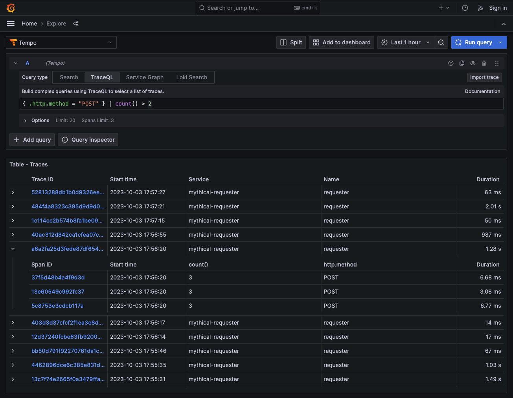
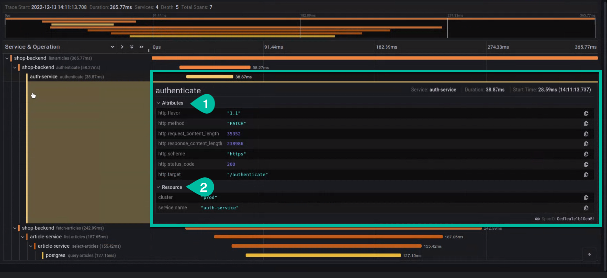

# Query with TraceQL

Inspired by PromQL and LogQL, TraceQL is a query language designed for selecting traces in Tempo. Currently, TraceQL query can select traces based on the following:

- Span and resource attributes, timing, and duration
- Basic aggregates: `count()`, `avg()`, `min()`, `max()`, and `sum()`

Read the blog post, "[Get to know TraceQL](/blog/2023/02/07/get-to-know-traceql-a-powerful-new-query-language-for-distributed-tracing/)," for an introduction to TraceQL and its capabilities.



For information on where the language is headed, see [future work]().
The TraceQL language uses similar syntax and semantics as [PromQL](/blog/2020/02/04/introduction-to-promql-the-prometheus-query-language/) and [LogQL](/docs/loki/latest/logql/), where possible.

Check the [release notes]() for the latest updates to TraceQL.

TraceQL requires Tempo’s Parquet columnar format to be enabled. For information on enabling Parquet, refer to the [Apache Parquet backend]() Tempo documentation.

## TraceQL query editor

With Tempo 2.0, you can use the TraceQL query editor in the Tempo data source to build queries and drill-down into result sets. The editor is available in Grafana’s Explore interface. For more information, refer to [TraceQL query editor]().

<p align="center"></p>

## Construct a TraceQL query

In TraceQL, a query is an expression that is evaluated on one trace at a time. The query is structured as a set of chained expressions (a pipeline). Each expression in the pipeline selects or discards spansets from being included in the results set. For example:

```
{ span.http.status_code >= 200 && span.http.status_code < 300 } | count() > 2
```

In this example, the search reduces traces to those spans where:

* `http.status_code` is in the range of `200` to `299` and
* the number of matching spans within a trace is greater than two.

Queries select sets of spans and filter them through a pipeline of aggregators and conditions. If, for a given trace, this pipeline produces a spanset then it is included in the results of the query.


## Selecting spans

TraceQL differentiates between two types of span data: intrinsics, which are fundamental to spans, and attributes, which are customizable key-value pairs. You can use intrinsics and attributes to build filters and select spans.

In TraceQL, curly brackets `{}` always select a set of spans from the current trace. They are commonly paired with a condition to reduce the spans being passed in.


### Intrinsic fields

Intrinsic fields are fundamental to spans. These fields can be referenced when selecting spans. Note that custom attributes are prefixed with `.`, `span.` or `resource.` whereas intrinsics are typed directly.

The following table shows the current intrinsic fields:

| **Field**       | **Type**    | **Definition**                                                  | **Example**                     |
|-----------------|-------------|-----------------------------------------------------------------|---------------------------------|
| status          | status enum | status: error, ok, or unset                                     | { status = ok }                 |
| statusMessage   | string      | optional text accompanying the span status                      | { statusMessage = "Forbidden" } |
| duration        | duration    | end - start time of the span                                    | { duration > 100ms }            |
| name            | string      | operation or span name                                          | { name = "HTTP POST" }          |
| kind            | kind enum   | kind: server, client, producer, consumer, internal, unspecified | { kind = server }               |
| traceDuration   | duration    | max(end) - min(start) time of the spans in the trace            | { traceDuration > 100ms }       |
| rootName        | string      | if it exists the name of the root span in the trace             | { rootName = "HTTP GET" }       |
| rootServiceName | string      | if it exists the service name of the root span in the trace     | { rootServiceName = "gateway" } |

{}
`traceDuration`, `rootName` and `rootServiceName` are trace-level intrinsics and will be the same for all spans in the same trace. Additionally,
these intrinsics are significantly more performant because they have to inspect much less data then a span-level intrinsic. They should be preferred whenever
possible to span-level intrinsics.
{}

### Attribute fields

There are two types of attributes: span attributes and resource attributes. By expanding a span in the Grafana UI, you can see both its span attributes (1 in the screenshot) and resource attributes (2 in the screenshot).

<p align="center"></p>

Attribute fields are derived from the span and can be customized. Process and span attribute types are [defined by the attribute itself](https://github.com/open-telemetry/opentelemetry-proto/blob/b43e9b18b76abf3ee040164b55b9c355217151f3/opentelemetry/proto/common/v1/common.proto#L30-L38), whereas intrinsic fields have a built-in type. You can refer to dynamic attributes (also known as tags) on the span or the span's resource.

Attributes in a query start with a span scope (for example, `span.http`) or resource scope (for example, `resource.namespace`)  depending on what you want to query. This provides significant performance benefits because it allows Tempo to only scan the data you are interested in.

To find traces with the `GET HTTP` method, your query could look like this:

```
{ span.http.method = "GET" }
```

For more information about attributes and resources, refer to the [OpenTelemetry Resource SDK](https://opentelemetry.io/docs/reference/specification/resource/sdk/).
#### Examples

Find traces that passed through the `production` environment:
```
{ resource.deployment.environment = "production" }
```

Find any database connection string that goes to a Postgres or MySQL database:
```
{ span.db.system =~ "postgresql|mysql" }
```

### Unscoped attribute fields

Attributes can be unscoped if you are unsure if the requested attribute exists on the span or resource. When possible, use scoped instead of unscoped attributes. Scoped attributes provide faster query results.

For example, to find traces with an attribute of `sla` set to `critical`:
```
{ .sla = "critical" }
```

### Comparison operators

Comparison operators are used to test values within an expression.

The implemented comparison operators are:

- `=` (equality)
- `!=` (inequality)
- `>` (greater than)
- `>=` (greater than or equal to)
- `<` (less than)
- `<=` (less than or equal to)
- `=~` (regular expression)
- `!~` (negated regular expression)

TraceQL uses Golang regular expressions. Online regular expression testing sites like https://regex101.com/ are convenient to validate regular expressions used in TraceQL queries.

For example, to find all traces where an `http.status_code` attribute in a span are greater than `400` but less than equal to `500`:

```
{ span.http.status_code >= 400 && span.http.status_code < 500 }
```

This works for `http.status_code` values that are strings as well using lexographic ordering:

```
{ span.http.status_code >= "400" }
```

Find all traces where the `http.method` attribute is either `GET` or `DELETE`:

```
{ span.http.method =~ "DELETE|GET" }
```

Find all traces where `any_attribute` is not `nil` or where `any_attribute` exists in a span
```
{ .any_attribute != nil }
```

### Field expressions

Fields can also be combined in various ways to allow more flexible search criteria. A field expression is a composite of multiple fields that define all of the criteria that must be matched to return results.

#### Examples

Find traces with "success" `http.status_code` codes:

```
{ span.http.status_code >= 200 && span.http.status_code < 300 }
```

Find traces where a `DELETE` HTTP method was used and the instrinsic span status was not OK:

```
{ span.http.method = "DELETE" && status != ok }
```

Both expressions require all conditions to be true on the same span. The entire expression inside of a pair of `{}` must be evaluated as true on a single span for it to be included in the result set.

In the above example, if a span includes an `.http.method` attribute set to `DELETE` where the span also includes a `status` attribute set to `ok`, the trace would not be included in the returned results.

## Combining spansets

Spanset operators let you select different sets of spans from a trace and then make a determination between them.

### Logical

These spanset operators perform logical checks between the sets of spans.

- `{condA} && {condB}` - The and operator (`&&`) checks that both conditions found matches.
- `{condA} || {condB}` - The union operator (`||`) checks that either condition found matches.

For example, to find a trace that went through two specific `cloud.region`:

```
{ resource.cloud.region = "us-east-1" } && { resource.cloud.region = "us-west-1" }
```

Note the difference between the previous example and this one:

```
{ resource.cloud.region = "us-east-1" && resource.cloud.region = "us-west-1" }
```

The second expression returns no traces because it's impossible for a single span to have a `resource.cloud.region` attribute that is set to both region values at the same time.

### Structural

These spanset operators look at the structure of a trace and the relationship between the spans.

- `{condA} >> {condB}` - The descendant operator (`>>`) looks for spans matching `{condB}` that are descendants of a span matching `{condA}`
- `{condA} > {condB}` - The child operator (`>`) looks for spans matching `{condB}` that are direct child spans of a parent matching `{condA}`
- `{condA} ~ {condB}` - The sibling operator (`~`) checks that spans matching `{condA}` and `{condB}` are siblings of the same parent span.

For example, to find a trace where a specific HTTP API interacted with a specific database:

```
{ span.http.url = "/path/of/api" } >> { span.db.name = "db-shard-001" }
```

## Aggregators

So far, all of the example queries expressions have been about individual spans. You can use aggregate functions to ask questions about a set of spans. These currently consist of:

- `count` - The count of spans in the spanset.
- `avg` - The average of a given numeric attribute or intrinsic for a spanset.
- `max` - The max value of a given numeric attribute or intrinsic for a spanset.
- `min` - The min value of a given numeric attribute or intrinsic for a spanset.
- `sum` - The sum value of a given numeric attribute or intrinsic for a spanset.

Aggregate functions allow you to carry out operations on matching results to further refine the traces returned. For more information on planned future work, refer to [How TraceQL works]().

For example, to find traces where the total number of spans is greater than `10`:

```
count() > 10
```

Find traces where the average duration of the spans in a trace is greater than `20ms`:

```
avg(duration) > 20ms
```

For example, find traces that have more than 3 spans with an attribute `http.status_code` with a value of `200`:

```
{ span.http.status_code = 200 } | count() > 3
```

## Grouping

TraceQL supports a grouping pipeline operator that can be used to group by arbitrary attributes. This can be useful to
find someting like a single service with more than 1 error:

```
{ status = error } | by(resource.service.name) | count() > 1
```

## Arithmetic

TraceQL supports arbitrary arithmetic in your queries. This can be useful to make queries more human readable:
```
{ span.http.request_content_length > 10 * 1024 * 1024 }
```
to compare the ratios of two span attributes:
```
{ span.bytes_processed < span.jobs_processed * 10 }
```
or anything else that comes to mind.

## Selection

TraceQL can select arbitrary fields from spans. This is particularly performant because the selected fields are not retrieved until all other criteria is met.
```
{ status=error } | select(span.http.status_code, span.http.url)
```

## Examples

### Find traces of a specific operation

Let's say that you want to find traces of a specific operation, then both the operation name (the span attribute `name`) and the name of the service that holds this operation (the resource attribute `service.name`) should be specified for proper filtering.
In the example below, traces are filtered on the `resource.service.name` value `frontend` and the span `name` value `POST /api/order`:

```
{resource.service.name = "frontend" && name = "POST /api/orders"}
```

When using the same Grafana stack for multiple environments (e.g., `production` and `staging`) or having services that share the same name but are differentiated though their namespace, the query looks like:

```
{
  resource.service.namespace = "ecommerce" &&
  resource.service.name = "frontend" &&
  resource.deployment.environment = "production" &&
  name = "POST /api/orders"
}
```

### Find traces having a particular outcome

This example finds all traces on the operation `POST /api/orders` that have an erroneous root span:

```
{
  resource.service.name="frontend" &&
  name = "POST /api/orders" &&
  status = error
}
```

This example finds all traces on the operation `POST /api/orders` that return with an HTTP 5xx error:

```
{
  resource.service.name="frontend" &&
  name = "POST /api/orders" &&
  span.http.status_code >= 500
}
```

### Find traces that have a particuliar behavior

You can use query filtering on multiple spans of the traces.
This example locates all the traces of the `GET /api/products/{id}` operation that access a database. It's a convenient request to identify abnormal access ratios to the database caused by caching problems.

```
{span.service.name="frontend" && name = "GET /api/products/{id}"} && {.db.system="postgresql"}
```

### Find traces going through `production` and `staging` instances

This example finds traces that go through `production` and `staging` instances.
It's a convenient request to identify misconfigurations and leaks across production and non-production environments.

```
{ resource.deployment.environment = "production" } && { resource.deployment.environment = "staging" }
```

### Other examples

Find any trace with a `deployment.environment` attribute set to `production` and `http.status_code` attribute set to `200`:

```
{ .deployment.environment = "production" && .http.status_code = 200 }
```

Find any trace where spans within it have a `deployment.environment` resource attribute set to `production` and a span `http.status_code` attribute set to `200`. In previous examples, all conditions had to be true on one span. These conditions can be true on either different spans or the same spans.

```
{ resource.deployment.environment = "production" } && { span.http.status_code = 200 }
```

Find any trace where any span has an `http.method` attribute set to `GET` as well as a `status` attribute set to `ok`, where any other span also exists that has an `http.method` attribute set to `DELETE`, but does not have a `status` attribute set to `ok`:

```
{ span.http.method = "GET" && status = ok } && { span.http.method = "DELETE" && status != ok }
```

Find any trace with a `deployment.environment` attribute that matches the regex `prod-.*` and `http.status_code` attribute set to `200`:

```
{ resource.deployment.environment =~ "prod-.*" && span.http.status_code = 200 }
```
