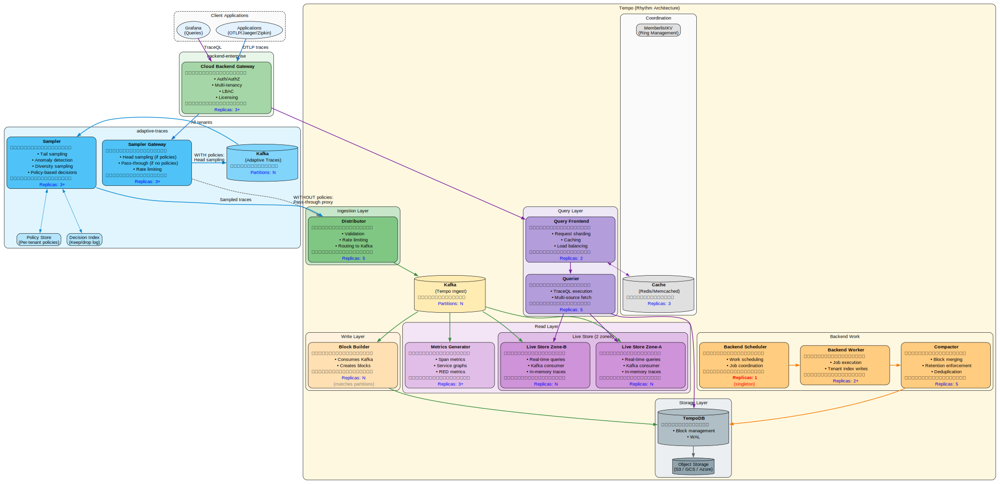
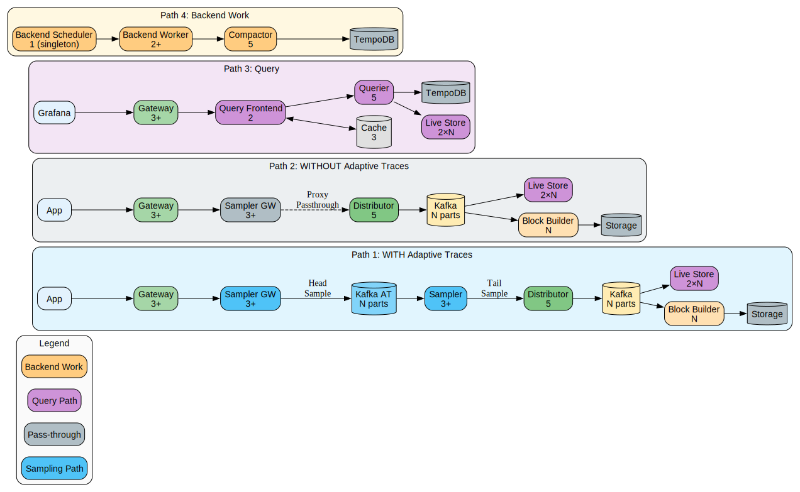

# Tempo Complete Architecture - Graphviz

## Complete System Diagram



## Simplified Path Diagram



## Component Replica Summary

| Component | Replicas | Type | Scaling Notes |
|-----------|----------|------|---------------|
| **Gateway** | 3+ | Deployment | Scales with request volume |
| **Sampler Gateway** | 3+ | Deployment | Scales with ingestion rate |
| **Sampler** | 3+ | StatefulSet | Scales with Kafka partitions |
| **Distributor** | 5 | Deployment | Scales with ingestion rate |
| **Block Builder** | N | StatefulSet | Matches Kafka partition count |
| **Live Store Zone-A** | N | StatefulSet | Scales with query load + partitions |
| **Live Store Zone-B** | N | StatefulSet | Scales with query load + partitions |
| **Metrics Generator** | 3+ | StatefulSet | Scales with trace volume |
| **Query Frontend** | 2 | Deployment | Usually 2 for HA |
| **Querier** | 5 | Deployment | Scales with query load |
| **Backend Scheduler** | **1** | StatefulSet | **Always singleton** |
| **Backend Worker** | 2+ | StatefulSet | Scales with compaction work |
| **Compactor** | 5 | Deployment | Scales with block count |
| **Cache (Memcached)** | 3 | StatefulSet | Scales with cache needs |

## Path Legend

| Path | Color | Description |
|------|-------|-------------|
| **Write (with sampling)** | Blue | Traces flow through Sampler Gateway → Kafka AT → Sampler → Distributor |
| **Write (pass-through)** | Gray dashed | Traces bypass sampling, proxy directly to Distributor |
| **Query** | Purple | Grafana → Gateway → Query Frontend → Querier → Live Store / TempoDB |
| **Backend Work** | Orange | Backend Scheduler → Backend Worker → Compactor → TempoDB |

## Source Files

The SVG diagrams were generated from these DOT files:

- [tempo-architecture-complete.dot](tempo-architecture-complete.dot) - Complete system diagram
- [tempo-architecture-paths.dot](tempo-architecture-paths.dot) - Simplified path diagram

### Regenerate SVGs

```bash
cd docs
dot -Tsvg tempo-architecture-complete.dot -o tempo-architecture-complete.svg
dot -Tsvg tempo-architecture-paths.dot -o tempo-architecture-paths.svg
```

### Generate PNG (high DPI)

```bash
dot -Tpng -Gdpi=300 tempo-architecture-complete.dot -o tempo-architecture-complete.png
dot -Tpng -Gdpi=300 tempo-architecture-paths.dot -o tempo-architecture-paths.png
```
