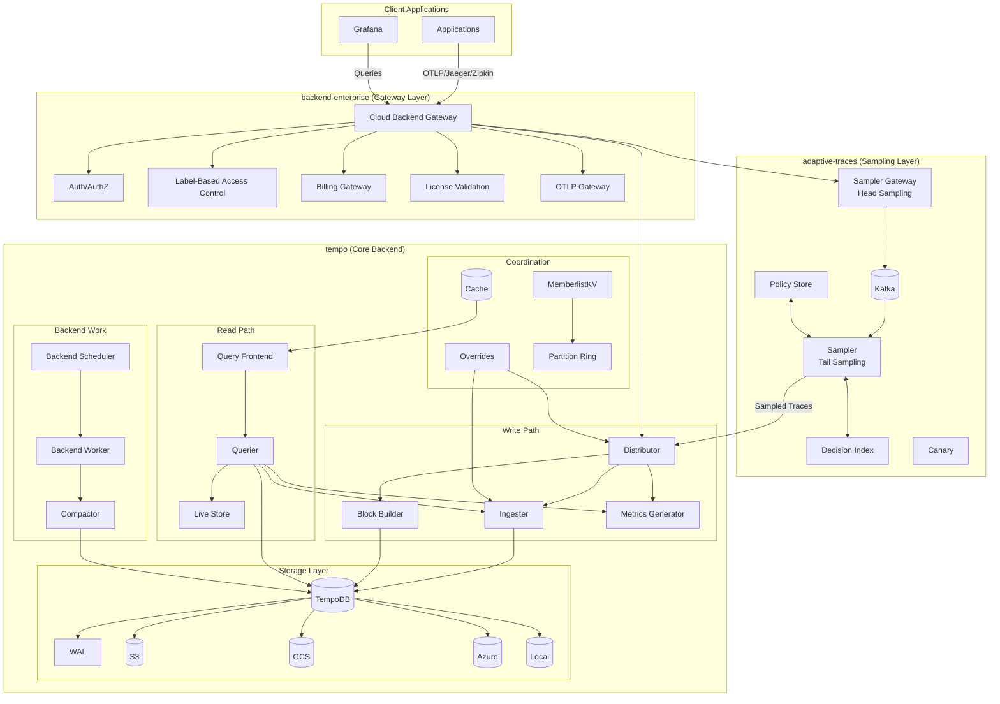
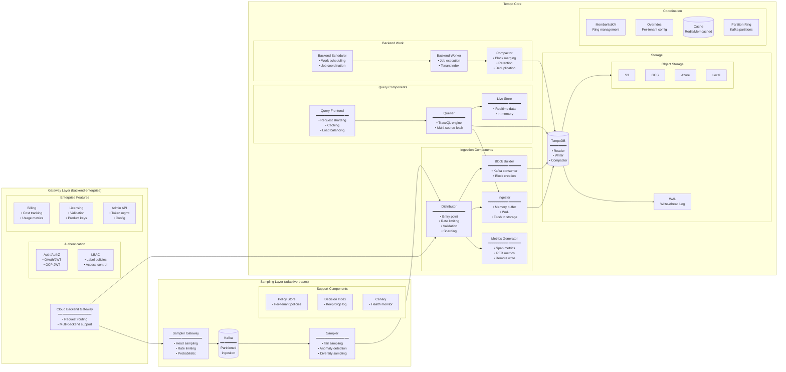
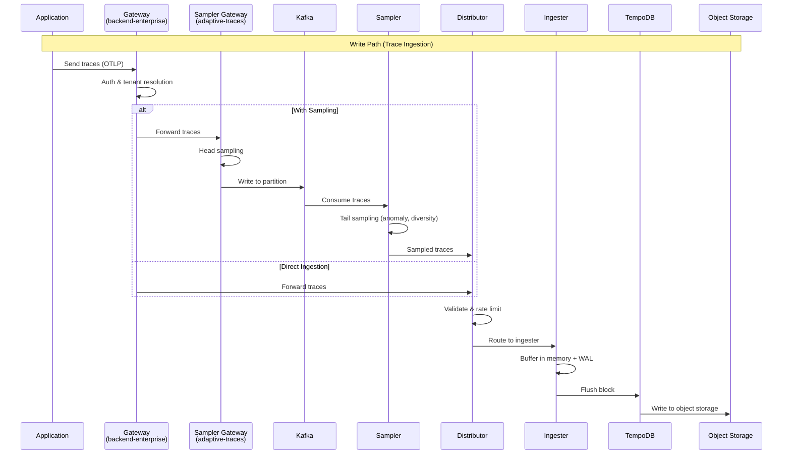
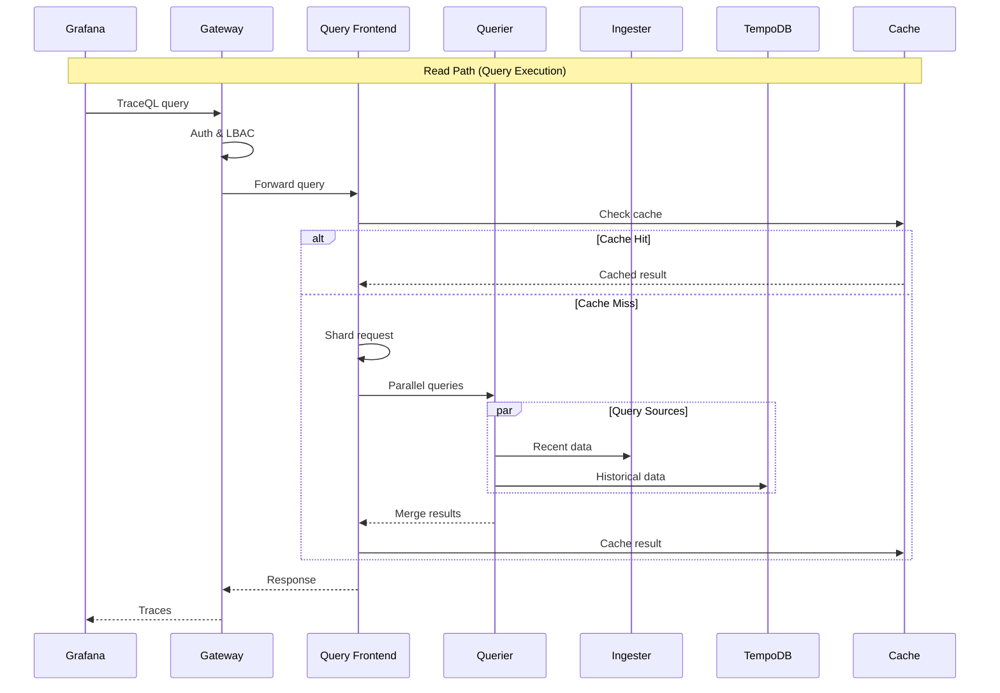
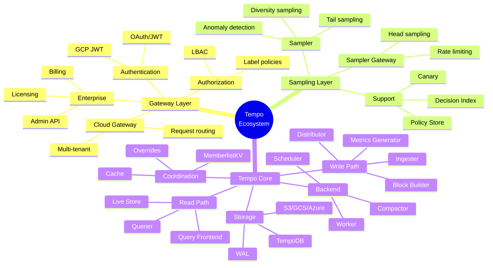
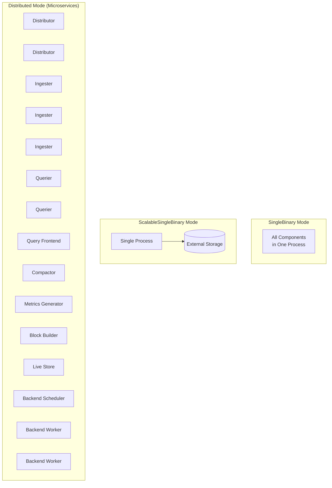
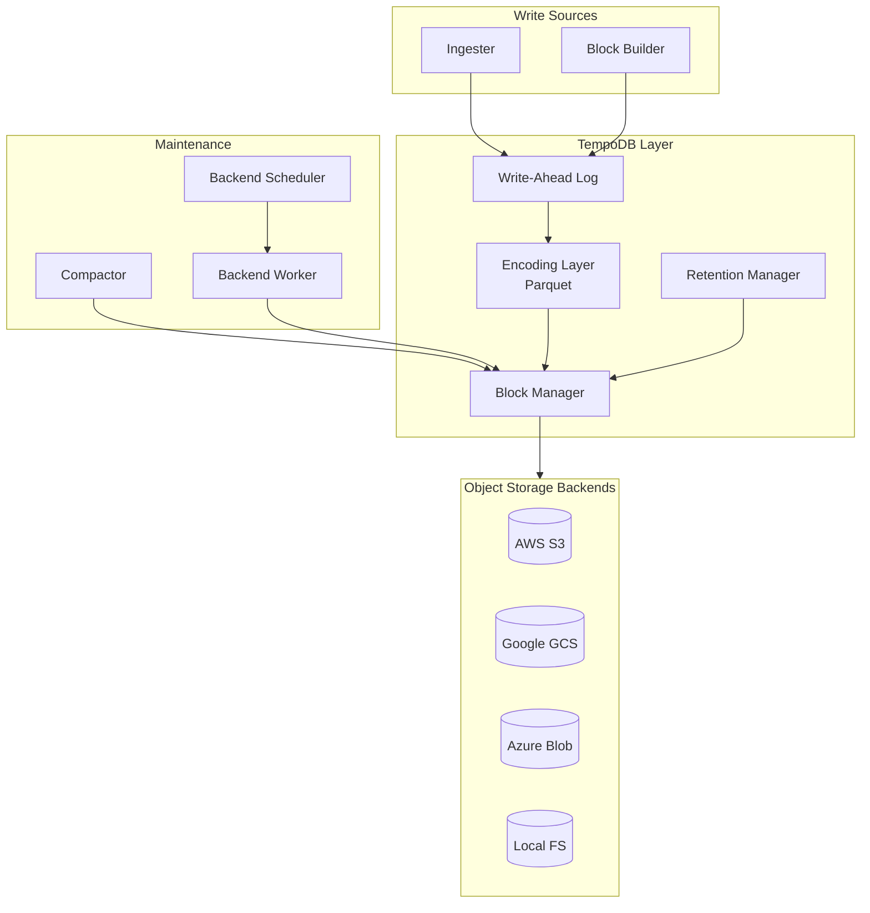

# Tempo Architecture Overview

This document provides a comprehensive view of Tempo components across three repositories:
- **tempo** (main): Core tracing backend
- **adaptive-traces**: Intelligent sampling layer
- **backend-enterprise**: Gateway and enterprise features

## High-Level Architecture

## Detailed Component Diagram

## Data Flow Diagram

## Component Responsibilities

## Deployment Modes

## Storage Architecture

## Component Summary

| Layer | Repository | Component | Purpose |
|-------|------------|-----------|---------|
| **Gateway** | backend-enterprise | Cloud Backend Gateway | Multi-tenant request routing |
| | | Auth/AuthZ | Authentication and authorization |
| | | LBAC | Label-based access control |
| | | Billing Gateway | Cost tracking and usage |
| | | License Validation | Enterprise license management |
| **Sampling** | adaptive-traces | Sampler Gateway | Head sampling, rate limiting |
| | | Sampler | Tail sampling with policies |
| | | Policy Store | Per-tenant sampling policies |
| | | Decision Index | Sampling decision log |
| **Ingestion** | tempo | Distributor | Entry point, validation, routing |
| | | Ingester | Memory buffer, WAL, flush |
| | | Block Builder | Kafka-based block creation |
| | | Metrics Generator | Span-derived metrics |
| **Query** | tempo | Query Frontend | Sharding, caching, load balancing |
| | | Querier | TraceQL execution, multi-source |
| | | Live Store | Real-time in-memory data |
| **Storage** | tempo | TempoDB | Core storage abstraction |
| | | WAL | Write-ahead log |
| | | S3/GCS/Azure/Local | Object storage backends |
| **Backend** | tempo | Backend Scheduler | Work scheduling |
| | | Backend Worker | Job execution |
| | | Compactor | Block optimization, retention |
| **Coordination** | tempo | MemberlistKV | Distributed ring management |
| | | Overrides | Per-tenant configuration |
| | | Cache | Redis/Memcached caching |
| | | Partition Ring | Kafka partition management |
