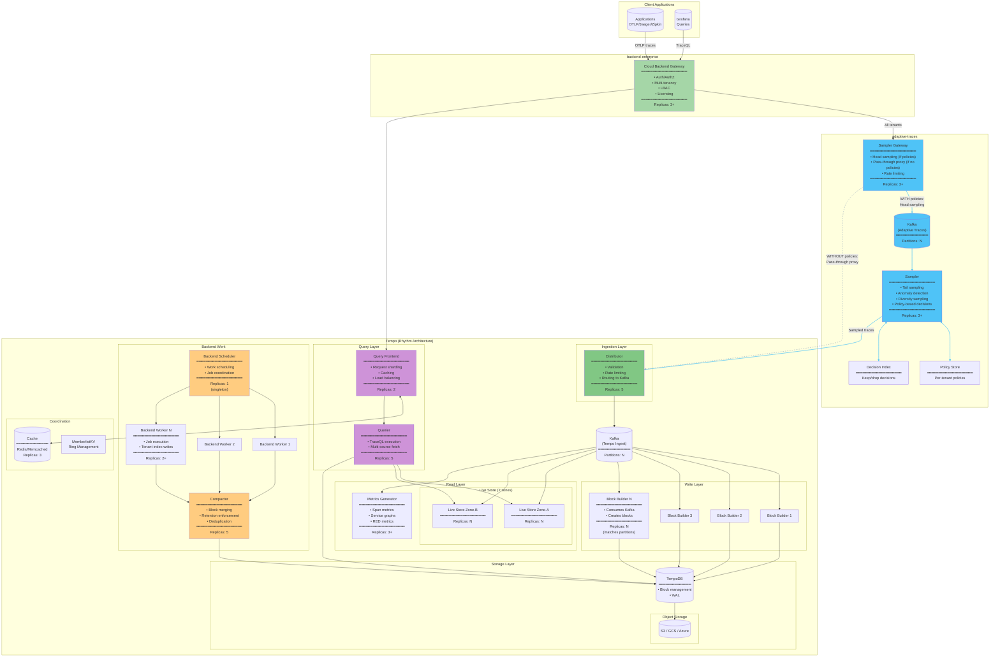
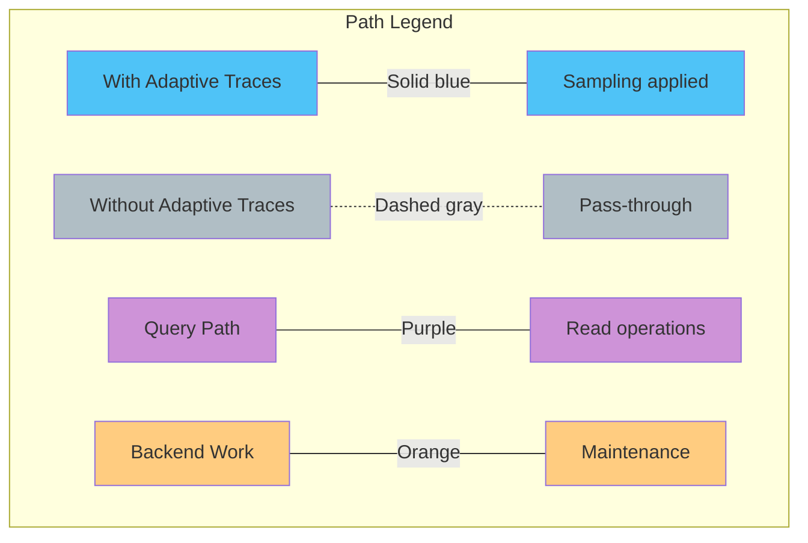
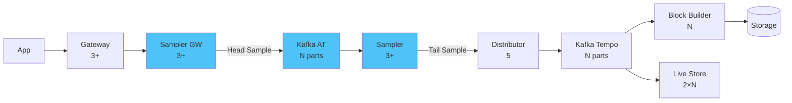
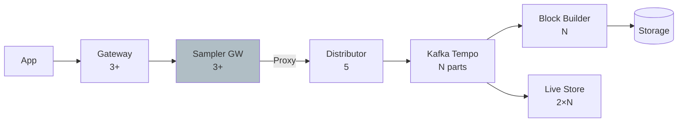
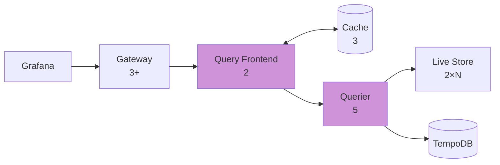
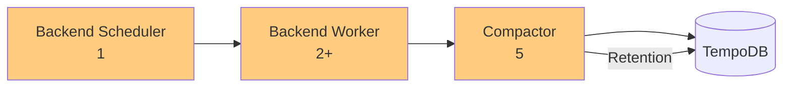
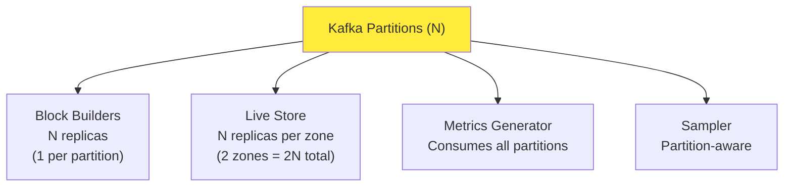

# Tempo Complete Architecture - All Components & Paths

This diagram shows all Tempo Rhythm components with typical replica counts and all possible data paths.

## Complete System Diagram

## Data Paths Legend

## Component Replica Summary

| Component | Replicas | Type | Scaling Notes |
|-----------|----------|------|---------------|
| **Gateway** | 3+ | Deployment | Scales with request volume |
| **Sampler Gateway** | 3+ | Deployment | Scales with ingestion rate |
| **Sampler** | 3+ | StatefulSet | Scales with Kafka partitions |
| **Distributor** | 5 | Deployment | Scales with ingestion rate |
| **Block Builder** | N | StatefulSet | Matches Kafka partition count |
| **Live Store Zone-A** | N | StatefulSet | Scales with query load + partitions |
| **Live Store Zone-B** | N | StatefulSet | Scales with query load + partitions |
| **Metrics Generator** | 3+ | StatefulSet | Scales with trace volume |
| **Query Frontend** | 2 | Deployment | Usually 2 for HA |
| **Querier** | 5 | Deployment | Scales with query load |
| **Backend Scheduler** | **1** | StatefulSet | **Always singleton** |
| **Backend Worker** | 2+ | StatefulSet | Scales with compaction work |
| **Compactor** | 5 | Deployment | Scales with block count |
| **Cache (Memcached)** | 3 | StatefulSet | Scales with cache needs |

## Detailed Path Flows

### Path 1: Write with Adaptive Traces (Sampling Enabled)

### Path 2: Write without Adaptive Traces (Pass-through)

### Path 3: Query

### Path 4: Backend Work

## Kafka Partitions & Scaling

The number of Kafka partitions (N) determines scaling for several components:

## High Availability Notes

- **Live Store**: 2 zones (zone-a, zone-b) for HA, anti-affinity ensures replicas on different nodes
- **Backend Scheduler**: Singleton - only 1 replica, uses leader election
- **Query Frontend**: Minimum 2 for HA
- **All StatefulSets**: Use persistent volumes for durability
