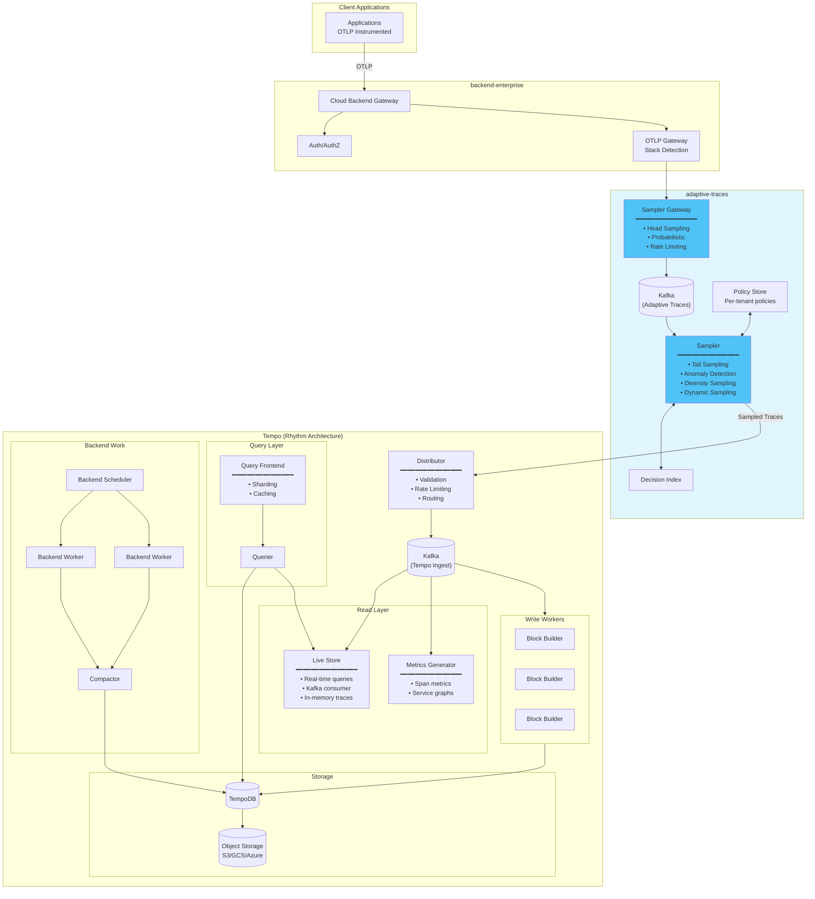
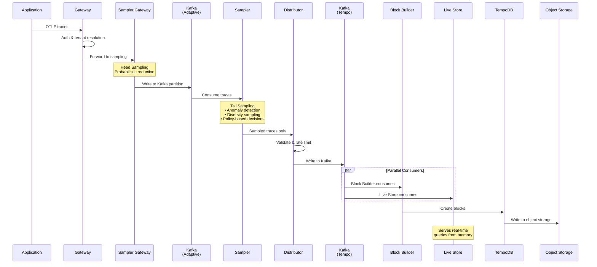
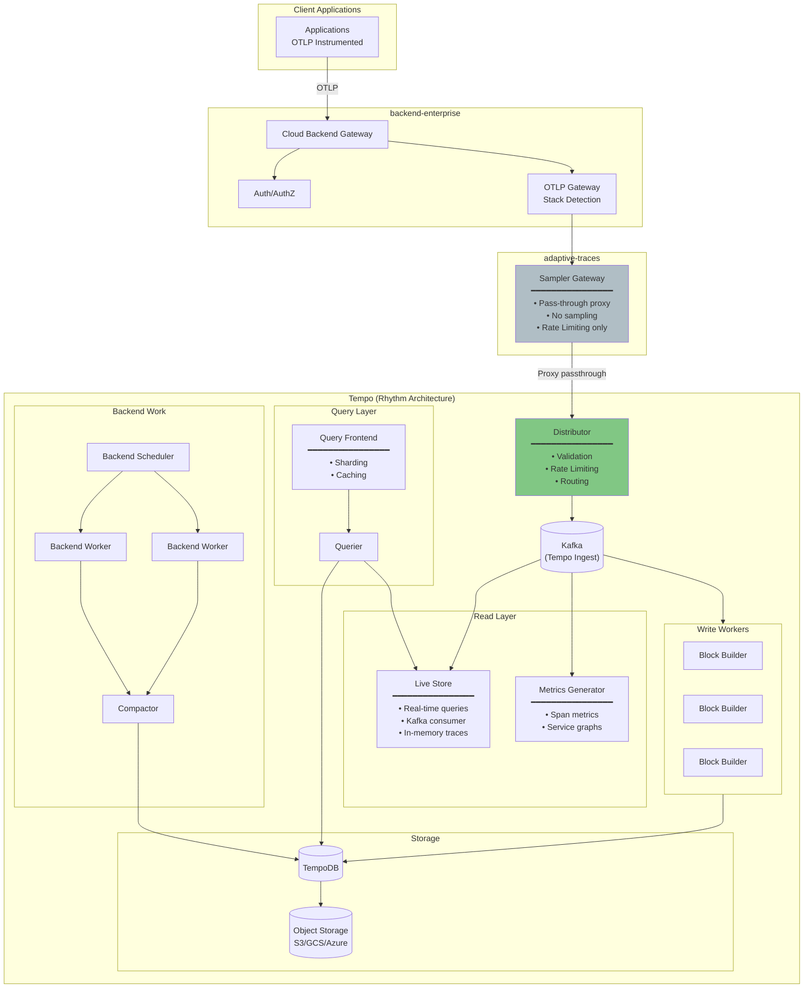
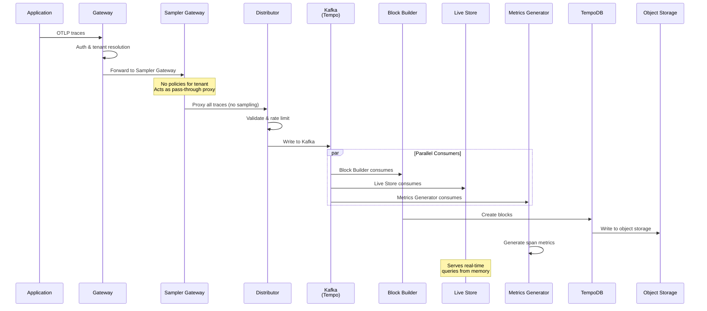
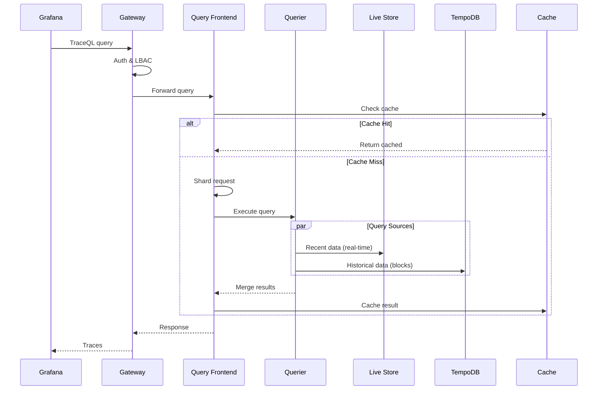
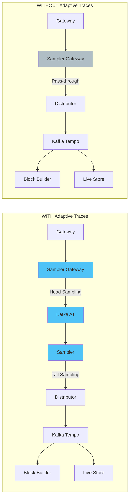

# Tempo Rhythm Architecture

This document describes the Tempo Rhythm (new) architecture for two tenant configurations:
1. **With Adaptive Traces** - Intelligent sampling enabled
2. **Without Adaptive Traces** - Direct ingestion

## Architecture: Tenant WITH Adaptive Traces

### Data Flow (With Adaptive Traces)

---

## Architecture: Tenant WITHOUT Adaptive Traces

Tenants without adaptive traces still route through the Sampler Gateway, but it acts as a **pass-through proxy** directly to the Distributor (no sampling applied).

### Data Flow (Without Adaptive Traces)

---

## Query Path (Same for Both)

---

## Side-by-Side Comparison

## Component Summary (Rhythm Architecture)

| Component | Role | Notes |
|-----------|------|-------|
| **Gateway** | Entry point | Auth, tenant resolution, routing |
| **Sampler Gateway** | Head sampling / proxy | All tenants route through; pass-through if no policies |
| **Sampler** | Tail sampling | Only with Adaptive Traces |
| **Distributor** | Validation & routing | Writes to Kafka |
| **Kafka** | Message queue | Central to Rhythm architecture |
| **Block Builder** | Block creation | Consumes from Kafka, writes blocks |
| **Live Store** | Real-time queries | In-memory, serves recent data (2 zones) |
| **Metrics Generator** | Span metrics | RED metrics, service graphs |
| **Query Frontend** | Query optimization | Sharding, caching |
| **Querier** | Query execution | Reads from Live Store + TempoDB |
| **Backend Scheduler** | Work coordination | Schedules compaction jobs (singleton) |
| **Backend Worker** | Job execution | Runs compaction tasks |
| **Compactor** | Block optimization | Merges blocks, enforces retention |
| **TempoDB** | Storage abstraction | Manages blocks and WAL |
