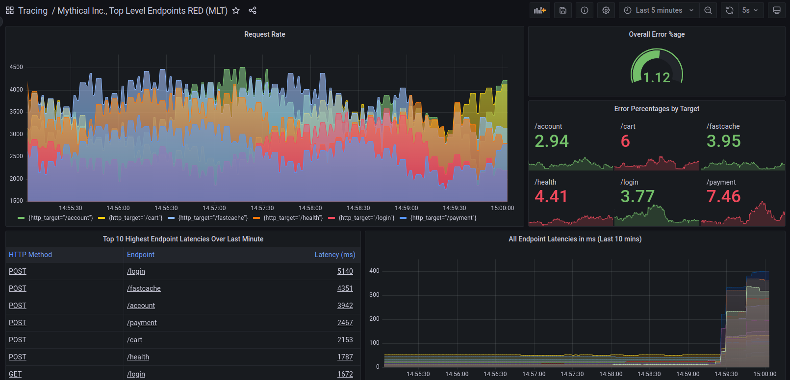

# Tempo documentation

Grafana Tempo is an open source, easy-to-use, and high-volume distributed tracing backend. Tempo is cost-efficient, requiring only object storage to operate, and is deeply integrated with Grafana, Mimir, Prometheus, and Loki. You can use Tempo with any of the open-source tracing protocols, including Jaeger, Zipkin, and OpenTelemetry.

Tempo has strong integrations with a number of existing open source tools, including: 

- **Grafana**. Grafana ships with native support for Tempo using the built-in [Tempo data source](https://grafana.com/docs/grafana/latest/datasources/tempo/).
- **Grafana Loki**. Loki, with its powerful query language [LogQL v2](https://grafana.com/blog/2020/10/28/loki-2.0-released-transform-logs-as-youre-querying-them-and-set-up-alerts-within-loki/) allows us to filter down on requests that we care about, and jump to traces using the [Derived fields support in Grafana](https://grafana.com/docs/grafana/latest/datasources/loki/#derived-fields).
- **Prometheus exemplars**. Exemplars let you jump from Prometheus metrics to Tempo traces by clicking on recorded exemplars. Read more about this integration in this [blog post](https://grafana.com/blog/2021/03/31/intro-to-exemplars-which-enable-grafana-tempos-distributed-tracing-at-massive-scale/).

Grafana Tempo builds an index on the high-cardinality trace-id field. Using an object store as backend lets Tempo query many blocks at once, so queries are highly parallelized. 
Read more about this [architecture](https://grafana.com/docs/tempo/latest/operations/architecture/) documentation.

## Learn more about Tempo


