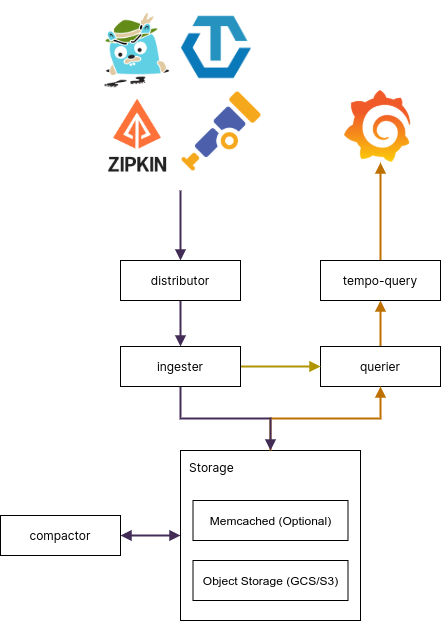

A collection of documents that detail Tempo architectural decisions and operational implications.

# Architecture

This topic provides an overview of the major components of Tempo.  Refer to the [examples] (https://github.com/grafana/tempo/tree/main/example) topic for deployment options.

<p align="center"></p>

## Tempo
Tempo comprises of the following components.

### Distributor

The distributor accepts spans in multiple formats including Jaeger, OpenTelemetry, Zipkin. It routes spans to ingesters by hashing the `traceID` and using a [distributed consistent hash ring]().

The distributor uses the receiver layer from the [OpenTelemetry Collector](https://github.com/open-telemetry/opentelemetry-collector).
For best performance it is recommended to ingest [OTel Proto](https://github.com/open-telemetry/opentelemetry-proto).  For this reason
the [Grafana Agent](https://github.com/grafana/agent) uses the otlp exporter/receiver to send spans to Tempo.

### Ingester

The Ingester batches trace into blocks, blooms, indexes, and flushes to the backend.  Blocks in the backend are generated in the following layout.

```
<bucketname> / <tenantID> / <blockID> / <meta.json>
.                                     / <bloom>
.                                     / <index>
.                                     / <data>
```

### Query Frontend

The Query Frontend is responsible for sharding the search space for an incoming query.

Traces are exposed via a simple HTTP endpoint:
`GET /api/traces/<traceID>`

Internally, the Query Frontend splits the blockID space into a configurable number of shards and queues these requests.
Queriers connect to the Query Frontend via a streaming gRPC connection to process these sharded queries.

### Querier

The querier is responsible for finding the requested trace id in either the ingesters or the backend storage.  It begins by querying the ingesters to see if the id is currently stored there, if not it proceeds to use the bloom and indexes to find the trace in the storage backend.

The querier exposes an HTTP endpoint at:
`GET /querier/api/traces/<traceID>`, but its not expected to be used directly.

Queries should be sent to the Query Frontend.

### Compactor

The Compactors stream blocks to and from the backend storage to reduce the total number of blocks.

### Using older versions of Grafana ```

When using older versions of Grafana (7.4.x), you must also use `tempo-query` in order to visualize traces. The 
`tempo-query` is [Jaeger Query](https://www.jaegertracing.io/docs/1.19/deployment/#query-service--ui) with a [GRPC Plugin](https://github.com/jaegertracing/jaeger/tree/master/plugin/storage/grpc) that allows it to query Tempo.
For more information, refer to [these example](https://github.com/grafana/tempo/tree/main/example/docker-compose#grafana-74x) and [these docs](../../configuration/querying).
