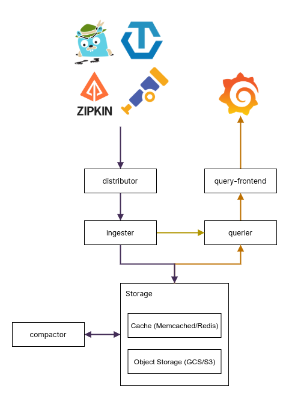

## Architecture

<p align="center"></p>


## Distributor

Accepts spans in multiple formats including Jaeger, OpenTelemetry, Zipkin.
Routes spans to ingesters sharding by `traceID`.
Also applies (per-tenant) limits.

## Ingester

Creates per tenant blocks, blooms, indexes and flushes to backend. 
Blocks in the backend are generated in the following layout

```
<bucketname> / <tenantID> / <blockID> / <meta.json> 
.                                     / <bloom> 
.                                     / <index> 
.                                     / <data> 
```

## Querier

Responds by connecting to backend, querying the bloom & index. 
Also queries ingester for live traces (traces that have not been flushed).  
Accepts queries in the format `querier-endpoint/api/traces/<traceID>`

## Compactor

Combines blocks to reduce the size of blocklist.
Uses constant memory.