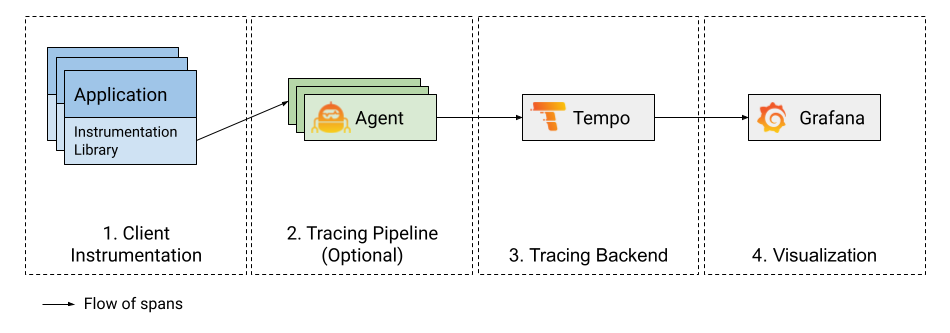

---
aliases:
- /docs/tempo/v1.2.1/getting-started/
title: Getting started
weight: 150
---

# Getting started with Tempo

Distributed tracing visualizes the lifecycle of a request as it passes through
a set of applications. There are a few components that must be configured in order to get a
working distributed tracing visualization.

This document discusses the four major pieces necessary to build out a tracing system:
Instrumentation, Pipeline, Backend and Visualization. If one were to build a diagram laying
out these pieces it may look something like this:

> **Note:** You can use [Grafana Cloud](https://grafana.com/products/cloud/features/#cloud-dashboards-grafana) to avoid installing, maintaining, and scaling your own instance of Grafana Tempo. The free forever plan includes 50GB of free traces. [Create an account to get started](https://grafana.com/auth/sign-up/create-user?pg=docs-tempo&plcmt=in-text).

## 1. Instrumentation

#### Instrumentation SDKs

The first building block to a functioning distributed tracing visualization pipeline
is client instrumentation, which is the process of adding instrumentation points in the application that
creates and offloads spans.

Below is a list of the most popular frameworks used for client instrumentation. Each of these have SDKs
in most commonly used programming languages and you should pick one according to your application needs.

* [OpenTracing/Jaeger](https://www.jaegertracing.io/docs/latest/client-libraries/)
* [Zipkin](https://zipkin.io/pages/tracers_instrumentation)
* [OpenTelemetry](https://opentelemetry.io/docs/concepts/instrumenting/)

#### OpenTelemetry Auto Instrumentation

Some languages have support for auto-instrumentation. These libraries capture telemetry
information from a client application with minimal manual instrumentation of the codebase.

* [OpenTelemetry Java Autoinstrumentation](https://github.com/open-telemetry/opentelemetry-java-instrumentation)
* [OpenTelemetry .NET Autoinstrumentation](https://github.com/open-telemetry/opentelemetry-dotnet-instrumentation)
* [OpenTelemetry Python Autoinstrumentation](https://github.com/open-telemetry/opentelemetry-python-contrib)

> Note: Check out our [instrumentation examples]() to learn how to instrument your
> favourite language for distributed tracing.

## 2. Pipeline (Grafana Agent)

Once your application is instrumented for tracing, the next step is to send these traces
to a backend for storage and visualization. It is common to build a tracing pipeline that
offloads spans from your application, buffers them and eventually forwards them to a backend. Tracing
pipelines are optional (most clients can send directly to Tempo), but you will find that
they become more critical the larger and more robust your tracing system is.

The Grafana Agent is a service that is deployed close to the application, either on the same node or
within the same cluster (in kubernetes) to quickly offload traces from the application and forward them to
a storage backend. It also abstracts features like trace batching and backend routing away from the client.

To learn more about the Grafana Agent and how to set it up for tracing with Tempo,
refer to [this blog post](https://grafana.com/blog/2020/11/17/tracing-with-the-grafana-cloud-agent-and-grafana-tempo/).

> **Note**: The [OpenTelemetry Collector](https://github.com/open-telemetry/opentelemetry-collector) / [Jaeger Agent](https://www.jaegertracing.io/docs/latest/deployment/) can also be used at the agent layer.
> Refer to [this blog post](https://grafana.com/blog/2021/04/13/how-to-send-traces-to-grafana-clouds-tempo-service-with-opentelemetry-collector/)
> to see how the OpenTelemetry Collector can be used with Grafana Cloud Tempo.

## 3. Backend (Tempo)

Grafana Tempo is an easy-to-use and high-scale distributed tracing backend used to store and query traces. The purpose of
the tracing backend is to store and retrieve traces on demand.

Getting started with Tempo is easy.

- If you're looking for examples of how to get started with Tempo, check out the [examples]() topic.
- For production workloads, refer to the [deployment]() section.

> **Note:** The Grafana Agent is already set up to use Tempo. Refer to the [configuration](https://github.com/grafana/agent/blob/main/docs/configuration/tempo-config.md) and [example](https://github.com/grafana/agent/blob/main/example/docker-compose/agent/config/agent.yaml) for details.

## 4. Visualization (Grafana)

Grafana has a built in Tempo datasource that can be used to query Tempo and visualize traces.
For more information refer to the [Tempo data source](https://grafana.com/docs/grafana/latest/datasources/tempo/), and the [Tempo in Grafana](tempo-in-grafana) topics.

See [here]() for details about Grafana configuration.
