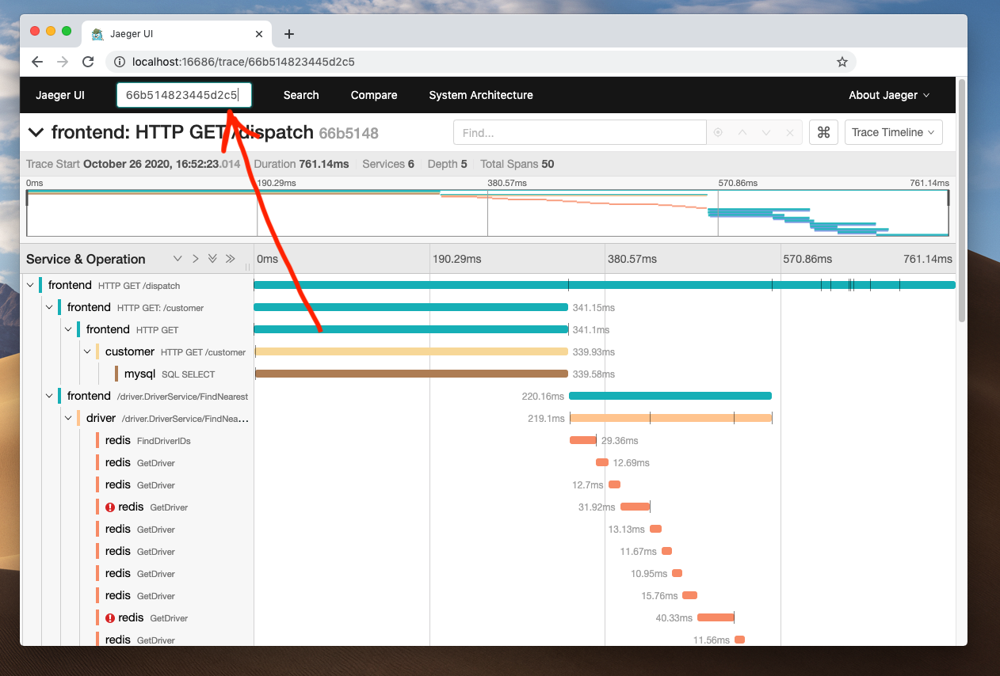

# Getting started with Tempo

Getting started with Tempo is easy.  For an application already instrumented for tracing, this guide can help quickly set it up with Tempo. If you're looking for a demo application to play around with Tempo, skip to the [examples with demo app]() topic.

> **Note:** The Grafana Cloud Agent is already set up to use Tempo. Refer to the [configuration](https://github.com/grafana/agent/blob/master/docs/configuration-reference.md#tempo_config) and [example](https://github.com/grafana/agent/blob/master/example/docker-compose/agent/config/agent.yaml) for details.
### Step 1: Spin up Tempo backend

First, set up a docker network as shown -

```
docker network create docker-tempo
```

Next, download the [configuration file](https://github.com/grafana/tempo/blob/master/example/docker-compose/etc/tempo-local.yaml) using the following command -

```
curl -o tempo-local.yaml https://raw.githubusercontent.com/grafana/tempo/master/example/docker-compose/etc/tempo-local.yaml
```

The config file above configures Tempo to listen on default ports for a number of protocols.
List of protocols and their default ports:

|  Protocol    |   Port  |
|  ---         |   ---   |
|  OpenTelemetry  | 55680 |  # Grafana Agent uses this.
|  Jaeger - Thrift Compact | 6831 |  # Jaeger Golang client uses this when used with JAEGER_AGENT_HOST & JAEGER_AGENT_PORT
|  Jaeger - Thrift Binary |  6832  |
|  Jaeger - Thrift HTTP |  14268 |  # Jaeger Golang client uses this when used with JAEGER_ENDPOINT
|  Jaeger - GRPC |  14250  | # Jaeger Agent uses this.
|  Zipkin  | 9411 |

Choose the port corresponding to the protocol you wish to use to send traces to Tempo. For this example we have used Jaeger - Thrift
Compact format (port 6831).

```
docker run -d --rm -p 6831:6831/udp --name tempo -v $(pwd)/tempo-local.yaml:/etc/tempo-local.yaml \
    --network docker-tempo \
    grafana/tempo:latest \
    -config.file=/etc/tempo-local.yaml
```

## Step 2: Spin up Tempo Query container

Download the [configuration file](https://github.com/grafana/tempo/blob/master/example/docker-compose/etc/tempo-query.yaml) using the following command -

```
curl -o tempo-query.yaml https://raw.githubusercontent.com/grafana/tempo/master/example/docker-compose/etc/tempo-query.yaml
```

Use this config file to fire up the Tempo Query container -

```
docker run -d --rm -p 16686:16686 -v $(pwd)/tempo-query.yaml:/etc/tempo-query.yaml \
    --network docker-tempo \
    grafana/tempo-query:latest \
    --grpc-storage-plugin.configuration-file=/etc/tempo-query.yaml
```

Make sure the UI is accessible at http://localhost:16686. If the UI looks similar to the Jaeger Query UI, that's because it is! Tempo Query uses the Jaeger Query framework together with a hashicorp go-grpc plugin to query the Tempo backend.

## Step 3: Send traces from the application to Tempo

Depending on the client SDK used for instrumentation, the parameters to configure might be different. The following example shows configuration parameters for applications instrumented with the [Jaeger Golang Client](https://github.com/jaegertracing/jaeger-client-go).

Set the following environment variables for the application -

```
JAEGER_AGENT_HOST=localhost              # or 'tempo' if running the application with docker
JAEGER_AGENT_PORT=6831
```

For a complete list of SDKs, visit the [OpenTelemetry Registry](https://opentelemetry.io/registry/?s=sdk).

## Step 4: Query for traces

You're all set to use Tempo! Make sure you're logging trace ids in your application logs, because Tempo can only retrieve a trace when queried with its ID.

View the logs of the application, copy a traceID and paste it in the Query UI at http://localhost:16686 ("Search by Trace ID" - In the navbar at the top). Happy tracing!

<p align="center"></p>
