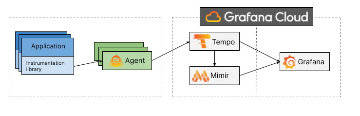

---
aliases:
- /docs/tempo/latest/server_side_metrics/
title: Metrics-generator
weight: 400
---

# Metrics-generator

Metrics-generator is an optional Tempo component that derives metrics from ingested traces. 
If present, the distributor will write received spans to both the ingester and the metrics-generator.
The metrics-generator processes spans and writes metrics to a Prometheus data source using the Prometheus remote write protocol.

## Overview

Metrics-generator leverages the data available in Tempo's ingest path to provide additional value by generating metrics from traces.

The metrics-generator internally runs a set of **processors**.
Each processor ingests spans and produces metrics.
Every processor derives different metrics. Currently the following processors are available:
- Service graphs
- Span metrics

### Service graphs

Service graphs are the representations of the relationships between services within a distributed system.

This service graphs processor builds a map of services by analysing traces, with the objective to find _edges_.
Edges are spans with a parent-child relationship, that represent a jump (e.g. a request) between two services.
The amount of request and their duration are recorded as metrics, which are used to represent the graph.

To read more about this processor, go to its [section]().

### Span metrics

The span metrics processor derives RED (Request, Error and Duration) metrics from spans.

The span metrics processor will compute the total count and the duration of spans for every unique combination of dimensions.
Dimensions can be the service name, the operation, the span kind, the status code and any tag or attribute present in the span.
The more dimensions are enabled, the higher the cardinality of the generated metrics.

To read more about this processor, navigate to its [section]().

