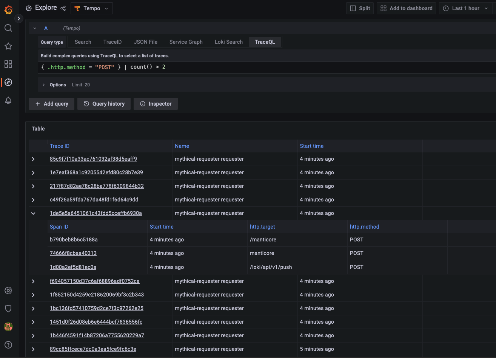

# TraceQL

Inspired by PromQL and LogQL, TraceQL is a query language designed for selecting traces in Tempo. Currently, TraceQL query can select traces based on the following:

- Span and resource attributes, timing, and duration
- Basic aggregates: `count()` and `avg()`

For information on where the language is headed, see [future work](architecture).
The TraceQL language uses similar syntax and semantics as [PromQL](https://grafana.com/blog/2020/02/04/introduction-to-promql-the-prometheus-query-language/) and [LogQL](https://grafana.com/docs/loki/latest/logql/), where possible. TraceQL recognizes two types of data: intrinsics, which are fundamental to spans, and attributes, which are customizable key-value pairs.

TraceQL requires Tempo’s Parquet columnar format to be enabled. For information on enabling Parquet, refer to the [Apache Parquet backend](https://grafana.com/docs/tempo/latest/configuration/parquet/) Tempo documentation.

## TraceQL query editor

With Tempo 2.0, you can use the TraceQL query editor in the Tempo data source to build queries and drill-down into result sets. The editor is available in Grafana’s Explore interface. For more information, refer to [TraceQL query editor](query-editor.md).

<p align="center"></p>

## Construct a TraceQL query

In TraceQL, a query is an expression that is evaluated on one trace at a time. The query is structured as a set of chained expressions (a pipeline). Each expression in the pipeline selects or discards spansets from being included in the results set. For example:

```
{ span.http.status_code >= 200 && span.http.status_code < 300 } | count() > 2
```

<!--  jpe finish ... -->
In this case, the search reduces traces to those spans that match the criteria `http.status_code` is in the range of `200` to `300`.  The returned spansets contain more than 2.

Queries select sets of spans and filter them through a pipeline of aggregators and conditions. If a spanset is produced after evaluation on a trace, then this spanset (and by extension the trace) is included in the result set of the query.


## Selecting spans

TraceQL recognizes two types of data: intrinsics, which are fundamental to spans, and attributes, which are customizable key-value pairs. You can use intrinsics and attributes to refine queries.

In TraceQL, curly brackets `{}` always select a set of spans from the current trace. They are commonly paired with a condition to reduce the spans being passed in.

This simple query will be evaluated on every span of every trace, one at a time.
```
{ .http.status = 200 }
```

If the trace being evaluated contains no spans with an attribute `http.status` with the value `200`, then no spans will be selected and this trace will not appear in the result set.

If the trace does contain spans with an attribute `http.status` with the value `200`, then only those spans will be returned. The trace is reduced to only the set of spans that match the condition inside the `{}`. The result set will contain only this subset of spans matching the condition.

### Intrinsic fields

Intrinsic fields are fundamental to spans. These fields can be referenced when selecting spans. Note that custom attributes are prefixed with `.`, `span.` or `resource.` whereas intrinsics can be typed directly.


| **Operation** | **Type** | **Definition**                        | **Example**            |
|---------------|----------|---------------------------------------|------------------------|
| status        | string   | status values are error, ok, or unset | { status = ok }        |
| duration      | duration | end - start time of the span          | { duration > 100ms }   |
| name          | string   | operation or span name                | { name = "HTTP POST" } |

### Attribute fields

Attribute fields are derived from the span and can be customized. Process and span attribute types are [defined by the attribute itself](https://github.com/open-telemetry/opentelemetry-proto/blob/b43e9b18b76abf3ee040164b55b9c355217151f3/opentelemetry/proto/common/v1/common.proto#L30-L38), whereas intrinsic fields have a built-in type. You can refer to dynamic attributes (also known as tags) on the span or the span's resource.

Attributes in a query start with a scope (see Scoped attribute fields section below). To find traces with the `GET HTTP` method, your query could look like this:

```
{ .http.method = "GET" }
```

Or like this:
```
{ .http.method ="GET"}
```

#### Examples

Find traces that passed through the prod namespace:
```
{ .namespace = "prod" }
```

Find any database connection string that goes to a Postgres or MySQL database:
```
{ .db.system =~ "postgresql|mysql" }
```

### Scoped attribute fields

Attributes can be specifically scoped to either "span" or "resource". Specifying "span" or "resource" can result in significant performance benefits because it reduces the amount of data that Tempo has to retrieve to answer your query.

For example, to find traces with a span attribute of `http.status` set to `200`:
```
{ span.http.status = 200 }
```

To find traces where a the resource `namespace` is set to `prod`:
```
{ resource.namespace = "prod" }
```

<p align="center"></p>


### Comparison operators

Comparison operators are used to test values within an expression.

The implemented comparison operators are:

- `=` (equality)
- `!=` (inequality)
- `>` (greater than)
- `>=` (greater than or equal to)
- `<` (less than)
- `<=` (less than or equal to)
- `=~` (regular expression)

For example, to find all traces where an `http.status` attribute in a span are greater than `400` but less than equal to `500`:

```
{ .http.status >= 400 && .http.status < 500 }
```

Find all traces where the `http.method` attribute is either `GET` or `DELETE`:

```
{ .http.method =~ “DELETE|GET” }
```

### Field expressions

Fields can also be combined in various ways to allow more flexible search criteria. A field expression is a composite of multiple fields that define all of the criteria that must be matched to return results.

#### Examples

Find traces with "success" http status codes:

```
{ .http.status >= 200 && .http.status < 300 }
```

Find traces where a `DELETE` HTTP method was used and the instrinsic span status was not OK:

```
{ .http.method = "DELETE" && status != ok }
```

Both expressions require all conditions to be true on the same span. The entire expression inside of a pair of `{}` must be evaluated as true on a single span for it to be included in the result set.

In the above example, if a span includes an `.http.method` attribute set to `DELETE` where the span also includes a `status` attribute set to `ok`, the trace would not be included in the returned results.

## Combining spansets

Spanset operators let you combine two sets of spans using and (`&&`) as well as union (`||`).

- `{condA} && {condB}`
- `{condA} || {condB}`


For example, if you want to find a trace that went through two specific regions:

```
{ .region = "eu-west-0" } && { .region = "eu-west-1" }
```

Note the difference between the above and the following:

```
{ .region = "eu-west-0" && .region = "eu-west-1" }
```

The second expression returns no traces because it's impossible for a single span to have a `.region` attribute that is set to both region values at the same time.

## Aggregators

So far, all of the example queries expressions have been about individual spans. You can use aggregate functions to ask questions about a set of spans. These currently consist of:

- `count` - The total count across a given intrinsic or items.
- `avg` - The average across a given intrinsic or items.

Aggregate functions allow you to carry out operations on matching results to further refine the traces returned. <jpe> More aggregations are planned in the future <jpe link to future doc>

For example, to find traces where the total number of spans is greater than `10`:

```
count() > 10
```

Find traces where the average duration of the spans in a trace is greater than `20ms`:

```
avg(duration) > 20ms
```

For example, find traces that have more than 3 spans with an attribute `http.status` with a value of `200`:

```
{ .http.status = 200 } | count() > 3
```

## Examples

Find any trace with a span attribute or resource attribute `namespace` set to `prod`:

```
{ .namespace = "prod" }
```

Find any trace with a span attribute `namespace` set to `prod`:

```
{ span.namespace = "prod" }
```

Find any trace with a `namespace` attribute set to `prod` and `http.status` attribute set to `200`:

```
{ .namespace = "prod" && .http.status = 200 }
```

Find any trace where spans within it have a `namespace` attribute set to `prod` and an `http.status` attribute set to `200`. In previous examples, all conditions had to be true on one span. These conditions can be true on either different spans or the same spans.

```
{ .namespace = "prod" } && { .http.status = 200 }
```

Find any trace where any span has an `http.method` attribute set to `GET` as well as a `status` attribute set to `ok`, where any other span also exists that has an `http.method` attribute set to `DELETE`, but does not have a `status` attribute set to `ok`:

```
{ .http.method = "GET" && status = ok } && { .http.method = "DELETE" && status != ok }
```

Find any trace where the average client-span duration in a trace exceeds a threshold of one second:

```
{ span.kind = "client" } | avg(duration) > 1s
```
