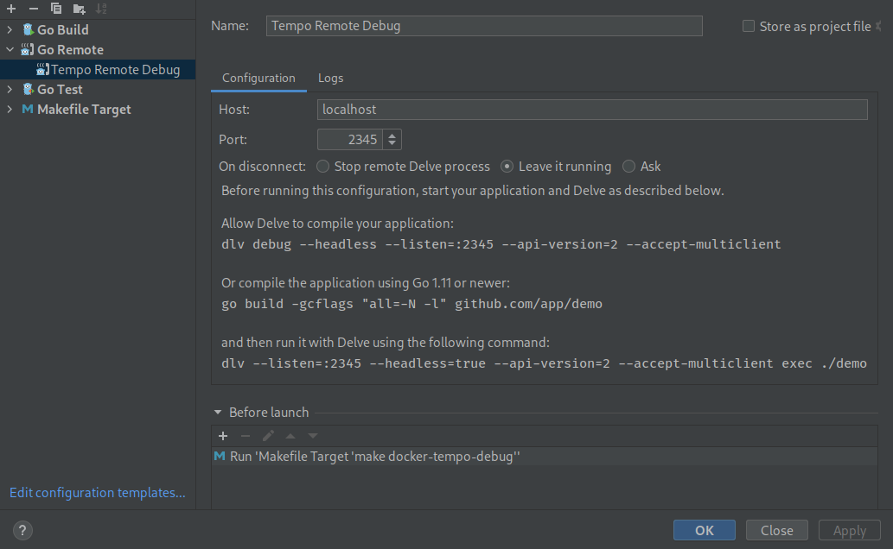

## Remote debugging

Although it's possible to debug Tempo with [`dlv debug`](https://github.com/go-delve/delve/blob/master/Documentation/usage/dlv_debug.md),
this approach also has disadvantages in scenarios where it is desirable to run Tempo inside a container.
This example demonstrates how to debug Tempo running in docker compose.

The make target `docker-tempo-debug` compiles tempo without optimizations and creates a docker
image that runs Tempo using [`dlv exec`](https://github.com/go-delve/delve/blob/master/Documentation/usage/dlv_exec.md).

1. Build the Tempo debug image in the root directory of the project:

```console
make docker-tempo-debug
```

To distinguish the debug image from the conventional Tempo image, it's tagged with `grafana/tempo-debug`. To check if the image is present:

```console
docker images | grep grafana/tempo-debug
```
```
grafana/tempo-debug                            latest                         3d6789d20dc3   2 days ago      112MB
```

2. Take a look at tempo service in the [docker-compose.yaml](./docker-compose.yaml). The environment
variable `DEBUG_BLOCK` controls whether delve halts the execution of Tempo until a debugger is connected.
Setting this option to `1` is helpful to debug errors during the start-up phase.

3. Now, start up the stack from this directory.

```console
docker compose up -d
```

4. The Tempo container exposes delves debugging server at port `2345` and it's now possible to
connect to it and debug the program. If you prefer to operate delve from the command line, you can connect to it via:

```console
dlv connect localhost:2345
```

Goland users can connect with the [Go Remote](https://www.jetbrains.com/help/go/go-remote.html) run
configuration:



5. To stop the setup, use:

```console
docker compose down -v
```
