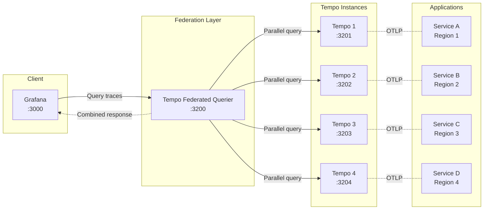

# Federated Tempo Example

This example demonstrates how to use the Tempo Federated Querier to query multiple Tempo instances at once.

## Architecture



## Overview

This setup includes:

- **4 Tempo instances**: Simulating a distributed deployment (e.g., multi-region)
- **Tempo Federated Querier**: Queries all instances and combines results
- **Grafana**: Pre-configured with the federated querier as the default data source

## Quick start

1. Start the stack:

   ```bash
   docker-compose up -d
   ```

1. Access Grafana at http://localhost:3000

1. Use the **Tempo (Federated)** data source to query traces across all instances

## Sending test traces

You can send traces to any of the individual Tempo instances. The federated querier combines them all.

Send traces to different instances using OTLP:

- Tempo 1: `localhost:4317` (gRPC) or `localhost:4318` (HTTP)
- Tempo 2: Port 4319/4320
- Tempo 3: Port 4321/4322
- Tempo 4: Port 4323/4324

## Example: distributed trace

When services span multiple Tempo instances (e.g., a request that crosses regions), the federated querier automatically combines the spans into a single trace view.

For example:
- Service A in region 1 → traces go to Tempo 1
- Service B in region 2 → traces go to Tempo 2
- Service C in region 3 → traces go to Tempo 3

When querying for a trace ID through the federated querier, you see all spans from all services combined.

## Endpoints

| Service | URL |
|---------|-----|
| Federated Querier | http://localhost:3200 |
| Tempo 1 | http://localhost:3201 |
| Tempo 2 | http://localhost:3202 |
| Tempo 3 | http://localhost:3203 |
| Tempo 4 | http://localhost:3204 |
| Grafana | http://localhost:3000 |

## API examples

Query a trace through the federated querier:

```bash
curl http://localhost:3200/api/traces/{traceID}
```

Check which instances are configured:

```bash
curl http://localhost:3200/api/status/instances
```

Search for traces:

```bash
curl "http://localhost:3200/api/search?q={duration>1s}"
```

## Cleanup

```bash
docker-compose down -v
```
