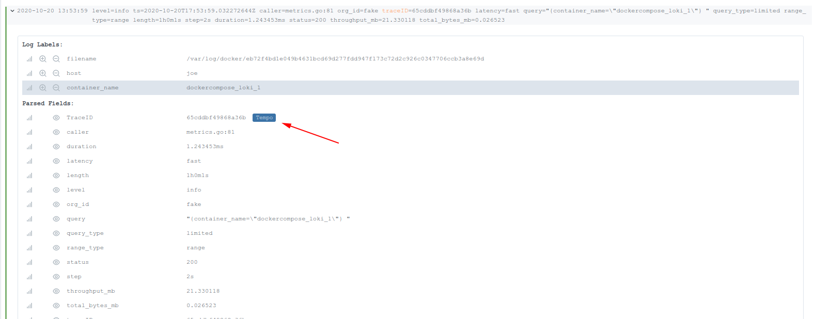

## Loki Derived Fields
This example presents a complete setup using Loki to process all container logs, and linking between the extracted traceIDs and tempo.

1. First we have to install the Loki docker driver.  This allows applications in our docker-compose to ship their logs
to Loki.

```console
docker plugin install grafana/loki-docker-driver:latest --alias loki --grant-all-permissions
```

2. Next start up the Loki stack.

```console
docker-compose up -d
```

At this point, the following containers should be spun up -  
Note: if docker-compose shows a column "Name" like "loki-loki-1", you will need to modify the "container_name" correspondingly in step 3.

```console
docker-compose ps
```
```
            Name                          Command               State            Ports
------------------------------------------------------------------------------------------------
loki_grafana_1       /run.sh                          Up      0.0.0.0:3000->3000/tcp
loki_loki_1          /usr/bin/loki -config.file ...   Up      0.0.0.0:3100->3100/tcp
loki_prometheus_1    /bin/prometheus --config.f ...   Up      0.0.0.0:9090->9090/tcp
loki_tempo_1         /tempo -storage.trace.back ...   Up      0.0.0.0:32774->14268/tcp
```

3. Navigate to [Grafana](http://localhost:3000/explore?orgId=1&left=%5B%22now-1h%22,%22now%22,%22Loki%22,%7B%7D%5D) and **query Loki a few times to generate some traces** (this setup does not use the synthetic load generator and all traces are generated from Loki).
Something like the below works, but feel free to explore other options!

```
{container_name="loki_loki_1"}
```

4. Now let's execute a query specifically looking for some trace ids.  In an operational scenario you would normally be using Loki to search for things like
query path, or status code, but we're just going to do this for the example:

```
{container_name="loki_loki_1"} |= "traceID"
```

5. Drop down the log line and click the Tempo link to jump directly from logs to traces!



6. To stop the setup use -

```console
docker-compose down -v
```
