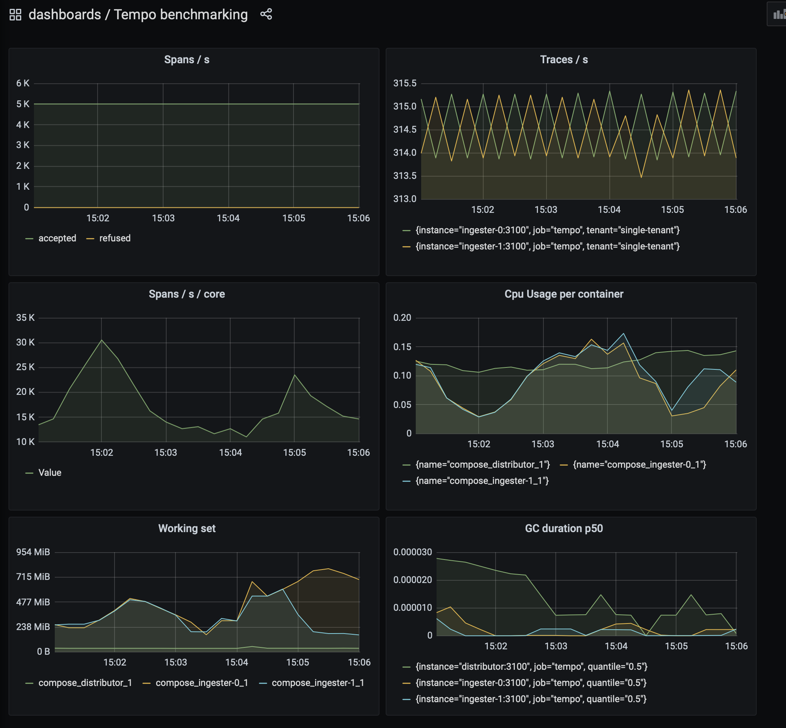

# tempo-load-test

This example aims to make it easier to measure and analyze Tempo performance in
micro-services mode.  There are already many examples for running Tempo under
load, but they use the single-binary approach and are not representative of
what is occurring in larger installations.  Here Tempo is run with separate
containers for distributor and ingesters, and replication factor = 3, meaning
that the distributor will mirror all incoming traces to 3 ingesters.



# What this example contains

1. Tempo in micro-services mode
   1. 1x distributor
   1. 3x ingesters
   1. `ReplicationFactor=3` meaning that the distributor mirrors incoming traces
1. S3/Min.IO virtual storage
1. Dashboard and metrics using
   1. Prometheus
   1. Grafana
   1. cadvisor - to gather container CPU usage and other metrics

# Instructions

This example is expected to be used in conjunction with tempo development in a
rapid feedback loop. It is assumed you have a working Go installation and a
copy of tempo already cloned somewhere.

1. Build the tempo container
   1. Run `make docker-tempo`
   1. This tags a local image `tempo:latest`
1. Run this repo with `docker compose`
   1. `docker compose up -d`
   1. Browse to dashboard at http://localhost:3000/d/iaJI4FxMk/tempo-benchmarking
   1. When finished run `docker compose down`

_Repeat steps 1-2 to see how code changes affect performance._

## Controlling load

The synthetic-load-generator is included and configured to issue 1000 spans/s per instance.
To increase load, use the `--scale` flag as shown below:

```
docker-compose up -d --scale synthetic-load-generator=4
```

# Key Metrics

As Tempo is designed to be very horizontally scalable, the key metrics are _per volume unit_, i.e. spans / s / cpu core.
