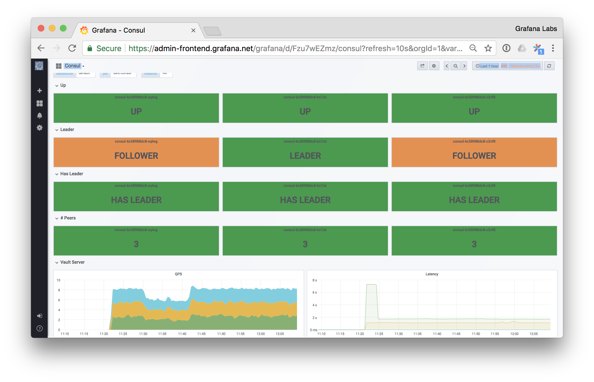

# Consul Monitoring Mixin



Grafana dashboards and Prometheus alerts for operating Consul, in the form
of a monitoring mixin. They are easiest to use with the [prometheus-ksonnet](https://github.com/grafana/jsonnet-libs/tree/master/prometheus-ksonnet)
package.

To use this mixin, install [Tanka](https://tanka.dev/) and [Jsonnet Bundler](https://tanka.dev/install#jsonnet-bundler).

Then you can install the mixin with:

```
jb install github.com/grafana/jsonnet-libs/consul-mixin
```

To use, in your Tanka environment's `main.jsonnet` file:

```jsonnet
local prometheus = (import "prometheus-ksonnet/prometheus-ksonnet.libsonnet");
local consul_mixin = (import "consul-mixin/mixin.libsonnet");

prometheus + consul_mixin {
  _config+:: {
    namespace: "default",
  },
}
```
