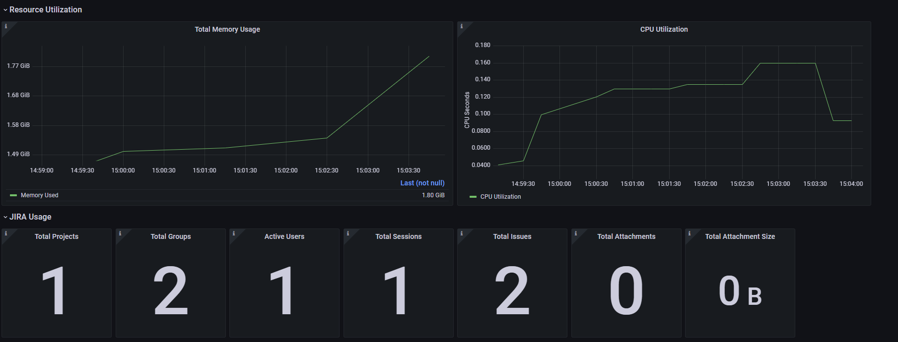

# JIRA Mixin

## Overview

The JIRA Mixin is a set of reusable and extensible alerts and dashboards to help monitor the health of a JIRA server. It is based on the metrics exported by the JIRA Prometheus Exporter. The mixin creates alerting rules for Prometheus and suitable dashboard descriptions for Grafana.

## Exporter

This Mixin relies on the usage of the [JIRA prometheus exporter](https://github.com/AndreyVMarkelov/jira-prometheus-exporter). 

On the Atlassian Marketplace, there is a [free version of the exporter](https://marketplace.atlassian.com/apps/1222502/prometheus-exporter-for-jira?hosting=server&tab=overview) if you are running a JIRA Server instance and a [pro version](https://marketplace.atlassian.com/apps/1217960/prometheus-exporter-pro-for-jira?tab=overview&hosting=datacenter) if you are running a JIRA Data Center instance. This exporter (and thus the mixin) will not work for JIRA Cloud instances. 

## Alerts

The Mixin includes 4 pre-configured alerts:
- `LicenseExpired`: Alerts when the JIRA license has expired
- `LicenseWarning`: Warns when there are 7 days left until the JIRA license expires
- `NoUserCapacity`: Alerts if there are no more user accounts available on the server
- `EmailErrorsHigh`: Alerts if more than 1% of emails fail to send

## Dashboard

The Mixin comes with preconfigured Grafana dashboard. The dashboard looks like this:




## Using the Mixin

To use the Mixin, you need to have mixtool and jsonnetfmt installed. If you have a working Go development environment, it's easiest to run the following:

```
$ go get github.com/monitoring-mixins/mixtool/cmd/mixtool
$ go get github.com/google/go-jsonnet/cmd/jsonnetfmt
```

You can then build the Prometheus rules files alerts.yaml and rules.yaml and a directory dashboard_out with the JSON dashboard files for Grafana:

```
$ make build
```
