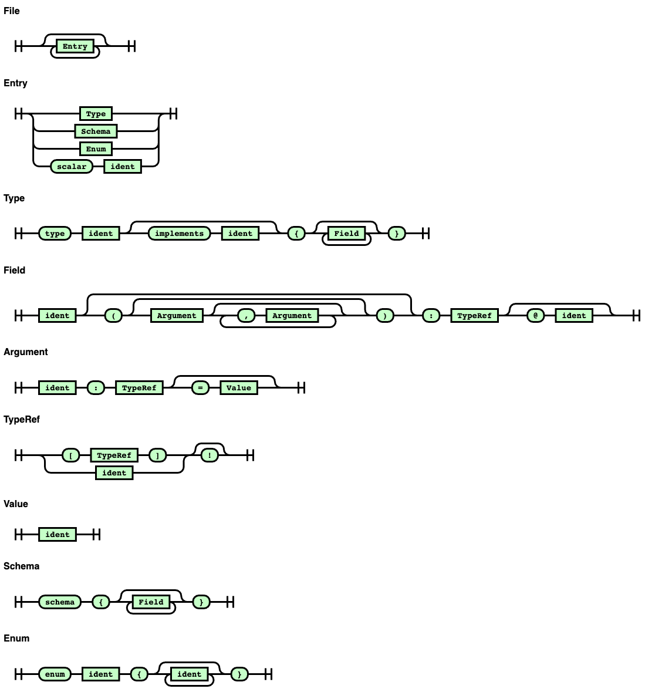

# A dead simple parser package for Go
<a id="markdown-a-dead-simple-parser-package-for-go" name="a-dead-simple-parser-package-for-go"></a>

[](https://pkg.go.dev/github.com/alecthomas/participle/v2) [](https://github.com/alecthomas/participle/actions)
 [](https://goreportcard.com/report/github.com/alecthomas/participle/v2) [](https://gophers.slack.com/messages/CN9DS8YF3)

<!-- MarkdownTOC autolink="true" lowercase="only_ascii" -->

- [V2](#v2)
- [Introduction](#introduction)
- [Tutorial](#tutorial)
- [Tag syntax](#tag-syntax)
- [Overview](#overview)
- [Grammar syntax](#grammar-syntax)
- [Capturing](#capturing)
	- [Capturing boolean value](#capturing-boolean-value)
- ["Union" types](#union-types)
- [Custom parsing](#custom-parsing)
- [Lexing](#lexing)
	- [Stateful lexer](#stateful-lexer)
	- [Example stateful lexer](#example-stateful-lexer)
	- [Example simple/non-stateful lexer](#example-simplenon-stateful-lexer)
	- [Experimental - code generation](#experimental---code-generation)
- [Options](#options)
- [Examples](#examples)
- [Performance](#performance)
- [Concurrency](#concurrency)
- [Error reporting](#error-reporting)
- [Comments](#comments)
- [Limitations](#limitations)
- [EBNF](#ebnf)
- [Syntax/Railroad Diagrams](#syntaxrailroad-diagrams)

<!-- /MarkdownTOC -->

## V2

This is a beta version of version 2 of Participle. It is still subject to change but should be mostly stable at this point.

See the [Change Log](CHANGES.md) for details.

> **Note:** semantic versioning API guarantees do not apply to the [experimental](https://pkg.go.dev/github.com/alecthomas/participle/v2/experimental) packages - the API may break between minor point releases.

It can be installed with:

```shell
$ go get github.com/alecthomas/participle/v2@latest
```

The latest version from v0 can be installed via:

```shell
$ go get github.com/alecthomas/participle@latest
```

## <a name='Introduction'></a>Introduction

The goal of this package is to provide a simple, idiomatic and elegant way of
defining parsers in Go.

Participle's method of defining grammars should be familiar to any Go
programmer who has used the `encoding/json` package: struct field tags define
what and how input is mapped to those same fields. This is not unusual for Go
encoders, but is unusual for a parser.

## Tutorial

A [tutorial](TUTORIAL.md) is available, walking through the creation of an .ini parser.

## Tag syntax

Participle supports two forms of struct tag grammar syntax.

The easiest to read is when the grammar uses the entire struct tag content, eg.

```go
Field string `@Ident @("," Ident)*`
```

However, this does not coexist well with other tags such as JSON, etc. and
may cause issues with linters. If this is an issue then you can use the
`parser:""` tag format. In this case single quotes can be used to quote
literals making the tags somewhat easier to write, eg.

```go
Field string `parser:"@ident (',' Ident)*" json:"field"`
```


## Overview

A grammar is an annotated Go structure used to both define the parser grammar,
and be the AST output by the parser. As an example, following is the final INI
parser from the tutorial.

 ```go
 type INI struct {
   Properties []*Property `@@*`
   Sections   []*Section  `@@*`
 }

 type Section struct {
   Identifier string      `"[" @Ident "]"`
   Properties []*Property `@@*`
 }

 type Property struct {
   Key   string `@Ident "="`
   Value *Value `@@`
 }

 type Value struct {
   String *string  `  @String`
   Float *float64  `| @Float`
   Int    *int     `| @Int`
 }
 ```

> **Note:** Participle also supports named struct tags (eg. <code>Hello string &#96;parser:"@Ident"&#96;</code>).

A parser is constructed from a grammar and a lexer:

```go
parser, err := participle.Build[INI]()
```

Once constructed, the parser is applied to input to produce an AST:

```go
ast, err := parser.ParseString("", "size = 10")
// ast == &INI{
//   Properties: []*Property{
//     {Key: "size", Value: &Value{Int: &10}},
//   },
// }
```

## Grammar syntax

Participle grammars are defined as tagged Go structures. Participle will
first look for tags in the form `parser:"..."`. It will then fall back to
using the entire tag body.

The grammar format is:

- `@<expr>` Capture expression into the field.
- `@@` Recursively capture using the fields own type.
- `<identifier>` Match named lexer token.
- `( ... )` Group.
- `"..."` or `'...'` Match the literal (note that the lexer must emit tokens matching this literal exactly).
- `"...":<identifier>` Match the literal, specifying the exact lexer token type to match.
- `<expr> <expr> ...` Match expressions.
- `<expr> | <expr> | ...` Match one of the alternatives. Each alternative is tried in order, with backtracking.
- `~<expr>` Match any token that is _not_ the start of the expression (eg: `@~";"` matches anything but the `;` character into the field).
- `(?= ... )` Positive lookahead group - requires the contents to match further input, without consuming it.
- `(?! ... )` Negative lookahead group - requires the contents not to match further input, without consuming it.

The following modifiers can be used after any expression:

- `*` Expression can match zero or more times.
- `+` Expression must match one or more times.
- `?` Expression can match zero or once.
- `!` Require a non-empty match (this is useful with a sequence of optional matches eg. `("a"? "b"? "c"?)!`).

Notes:

- Each struct is a single production, with each field applied in sequence.
- `@<expr>` is the mechanism for capturing matches into the field.
- if a struct field is not keyed with "parser", the entire struct tag
  will be used as the grammar fragment. This allows the grammar syntax to remain
  clear and simple to maintain.

## Capturing

Prefixing any expression in the grammar with `@` will capture matching values
for that expression into the corresponding field.

For example:

```go
// The grammar definition.
type Grammar struct {
  Hello string `@Ident`
}

// The source text to parse.
source := "world"

// After parsing, the resulting AST.
result == &Grammar{
  Hello: "world",
}
```

For slice and string fields, each instance of `@` will accumulate into the
field (including repeated patterns). Accumulation into other types is not
supported.

For integer and floating point types, a successful capture will be parsed
with `strconv.ParseInt()` and `strconv.ParseFloat()` respectively.

A successful capture match into a `bool` field will set the field to true.

Tokens can also be captured directly into fields of type `lexer.Token` and
`[]lexer.Token`.

Custom control of how values are captured into fields can be achieved by a
field type implementing the `Capture` interface (`Capture(values []string)
error`).

Additionally, any field implementing the `encoding.TextUnmarshaler` interface
will be capturable too. One caveat is that `UnmarshalText()` will be called once
for each captured token, so eg. `@(Ident Ident Ident)` will be called three times.

### Capturing boolean value

By default, a boolean field is used to indicate that a match occurred, which
turns out to be much more useful and common in Participle than parsing true
or false literals. For example, parsing a variable declaration with a
trailing optional syntax:

```go
type Var struct {
  Name string `"var" @Ident`
  Type string `":" @Ident`
  Optional bool `@"?"?`
}
```

In practice this gives more useful ASTs. If bool were to be parsed literally
then you'd need to have some alternate type for Optional such as string or a
custom type.

To capture literal boolean values such as `true` or `false`, implement the
Capture interface like so:

```go
type Boolean bool

func (b *Boolean) Capture(values []string) error {
	*b = values[0] == "true"
	return nil
}

type Value struct {
	Float  *float64 `  @Float`
	Int    *int     `| @Int`
	String *string  `| @String`
	Bool   *Boolean `| @("true" | "false")`
}
```

## "Union" types

A very common pattern in parsers is "union" types, an example of which is
shown above in the `Value` type. A common way of expressing this in Go is via
a sealed interface, with each member of the union implementing this
interface.

eg. this is how the `Value` type could be expressed in this way:

```go
type Value interface { value() }

type Float struct { Value float64 `@Float` }
func (f Float) value() {}

type Int struct { Value int `@Int` }
func (f Int) value() {}

type String struct { Value string `@String` }
func (f String) value() {}

type Bool struct { Value Boolean `@("true" | "false")` }
func (f Bool) value() {}
```

Thanks to the efforts of [Jacob Ryan McCollum](https://github.com/mccolljr), Participle
now supports this pattern. Simply construct your parser with the `Union[T](member...T)`
option, eg.

```go
parser := participle.MustBuild[AST](participle.Union[Value](Float{}, Int{}, String{}, Bool{}))
```

Custom parsers may also be defined for union types with the [ParseTypeWith](https://pkg.go.dev/github.com/alecthomas/participle/v2#ParseTypeWith) option.

## Custom parsing

There are three ways of defining custom parsers for nodes in the grammar:

1. Implement the [Capture](https://pkg.go.dev/github.com/alecthomas/participle/v2#Capture) interface.
2. Implement the [Parseable](https://pkg.go.dev/github.com/alecthomas/participle/v2#Parseable) interface.
3. Use the [ParseTypeWith](https://pkg.go.dev/github.com/alecthomas/participle/v2#ParseTypeWith) option to specify a custom parser for union interface types.


## Lexing

Participle relies on distinct lexing and parsing phases. The lexer takes raw
bytes and produces tokens which the parser consumes. The parser transforms
these tokens into Go values.

The default lexer, if one is not explicitly configured, is based on the Go
`text/scanner` package and thus produces tokens for C/Go-like source code. This
is surprisingly useful, but if you do require more control over lexing the
included stateful [`participle/lexer`](#markdown-stateful-lexer) lexer should
cover most other cases. If that in turn is not flexible enough, you can
implement your own lexer.

Configure your parser with a lexer using the `participle.Lexer()` option.

To use your own Lexer you will need to implement two interfaces:
[Definition](https://pkg.go.dev/github.com/alecthomas/participle/v2/lexer#Definition)
(and optionally [StringsDefinition](https://pkg.go.dev/github.com/alecthomas/participle/v2/lexer#StringDefinition) and [BytesDefinition](https://pkg.go.dev/github.com/alecthomas/participle/v2/lexer#BytesDefinition)) and [Lexer](https://pkg.go.dev/github.com/alecthomas/participle/v2/lexer#Lexer).

### Stateful lexer

In addition to the default lexer, Participle includes an optional
stateful/modal lexer which provides powerful yet convenient
construction of most lexers.  (Notably, indentation based lexers cannot
be expressed using the `stateful` lexer -- for discussion of how these
lexers can be implemented, see [#20](https://github.com/alecthomas/participle/issues/20)).

It is sometimes the case that a simple lexer cannot fully express the tokens
required by a parser. The canonical example of this is interpolated strings
within a larger language. eg.

```go
let a = "hello ${name + ", ${last + "!"}"}"
```

This is impossible to tokenise with a normal lexer due to the arbitrarily
deep nesting of expressions. To support this case Participle's lexer is now
stateful by default.

The lexer is a state machine defined by a map of rules keyed by the state
name. Each rule within the state includes the name of the produced token, the
regex to match, and an optional operation to apply when the rule matches.

As a convenience, any `Rule` starting with a lowercase letter will be elided
from output, though it is recommended to use `participle.Elide()` instead, as it
better integrates with the parser.

Lexing starts in the `Root` group. Each rule is matched in order, with the first
successful match producing a lexeme. If the matching rule has an associated Action
it will be executed.

A state change can be introduced with the Action `Push(state)`. `Pop()` will
return to the previous state.

To reuse rules from another state, use `Include(state)`.

A special named rule `Return()` can also be used as the final rule in a state
to always return to the previous state.

As a special case, regexes containing backrefs in the form `\N` (where `N` is
a digit) will match the corresponding capture group from the immediate parent
group. This can be used to parse, among other things, heredocs. See the
[tests](https://github.com/alecthomas/participle/blob/master/lexer/stateful/stateful_test.go#L59)
for an example of this, among others.

### Example stateful lexer

Here's a cut down example of the string interpolation described above. Refer to
the [stateful example](https://github.com/alecthomas/participle/tree/master/_examples/stateful)
for the corresponding parser.

```go
var lexer = lexer.Must(Rules{
	"Root": {
		{`String`, `"`, Push("String")},
	},
	"String": {
		{"Escaped", `\\.`, nil},
		{"StringEnd", `"`, Pop()},
		{"Expr", `\${`, Push("Expr")},
		{"Char", `[^$"\\]+`, nil},
	},
	"Expr": {
		Include("Root"),
		{`whitespace`, `\s+`, nil},
		{`Oper`, `[-+/*%]`, nil},
		{"Ident", `\w+`, nil},
		{"ExprEnd", `}`, Pop()},
	},
})
```

### Example simple/non-stateful lexer

Other than the default and stateful lexers, it's easy to define your
own _stateless_ lexer using the `lexer.MustSimple()` and
`lexer.NewSimple()` functions.  These functions accept a slice of
`lexer.SimpleRule{}` objects consisting of a key and a regex-style pattern.

> **Note:** The stateful lexer replaces the old regex lexer.

For example, the lexer for a form of BASIC:

```go
var basicLexer = stateful.MustSimple([]stateful.SimpleRule{
    {"Comment", `(?i)rem[^\n]*`},
    {"String", `"(\\"|[^"])*"`},
    {"Number", `[-+]?(\d*\.)?\d+`},
    {"Ident", `[a-zA-Z_]\w*`},
    {"Punct", `[-[!@#$%^&*()+_={}\|:;"'<,>.?/]|]`},
    {"EOL", `[\n\r]+`},
    {"whitespace", `[ \t]+`},
})
```

### Experimental - code generation

Participle v2 now has experimental support for generating code to perform
lexing.

This will generally provide around a 10x improvement in lexing performance
while producing O(1) garbage.

To use:
1. Serialize the `stateful` lexer definition to a JSON file (pass to `json.Marshal`).
2. Run the `participle` command (see `scripts/participle`) to generate go code from the lexer JSON definition. For example:
```
participle gen lexer <package name> [--name SomeCustomName] < mylexer.json | gofmt > mypackage/mylexer.go
```
(see `genLexer` in `conformance_test.go` for a more detailed example)

3. When constructing your parser, use the generated lexer for your lexer definition, such as:
```
var ParserDef = participle.MustBuild[someGrammer](participle.Lexer(mylexer.SomeCustomnameLexer))
```

Consider contributing to the tests in `conformance_test.go` if they do not
appear to cover the types of expressions you are using the generated
lexer.

**Known limitations of the code generated lexer:**

* The lexer is always greedy. e.g., the regex `"[A-Z][A-Z][A-Z]?T"` will not match `"EST"` in the generated lexer because the quest operator is a greedy match and does not "give back" to try other possibilities; you can overcome by using `|` if you have a non-greedy match, e.g., `"[A-Z][A-Z]|(?:[A-Z]T|T)"` will produce correct results in both lexers (see [#276](https://github.com/alecthomas/participle/issues/276) for more detail); this limitation allows the generated lexer to be very fast and memory efficient
* Backreferences in regular expressions are not currently supported

## Options

The Parser's behaviour can be configured via [Options](https://pkg.go.dev/github.com/alecthomas/participle/v2#Option).

## Examples

There are several [examples included](https://github.com/alecthomas/participle/tree/master/_examples),
some of which are linked directly here. These examples should be run from the
`_examples` subdirectory within a cloned copy of this repository.

Example | Description
--------|---------------
[BASIC](https://github.com/alecthomas/participle/tree/master/_examples/basic) | A lexer, parser and interpreter for a [rudimentary dialect](https://caml.inria.fr/pub/docs/oreilly-book/html/book-ora058.html) of BASIC.
[EBNF](https://github.com/alecthomas/participle/tree/master/_examples/ebnf) | Parser for the form of EBNF used by Go.
[Expr](https://github.com/alecthomas/participle/tree/master/_examples/expr) | A basic mathematical expression parser and evaluator.
[GraphQL](https://github.com/alecthomas/participle/tree/master/_examples/graphql) | Lexer+parser for GraphQL schemas
[HCL](https://github.com/alecthomas/participle/tree/master/_examples/hcl) | A parser for the [HashiCorp Configuration Language](https://github.com/hashicorp/hcl).
[INI](https://github.com/alecthomas/participle/tree/master/_examples/ini) | An INI file parser.
[Protobuf](https://github.com/alecthomas/participle/tree/master/_examples/protobuf) | A full [Protobuf](https://developers.google.com/protocol-buffers/) version 2 and 3 parser.
[SQL](https://github.com/alecthomas/participle/tree/master/_examples/sql) | A *very* rudimentary SQL SELECT parser.
[Stateful](https://github.com/alecthomas/participle/tree/master/_examples/stateful) | A basic example of a stateful lexer and corresponding parser.
[Thrift](https://github.com/alecthomas/participle/tree/master/_examples/thrift) | A full [Thrift](https://thrift.apache.org/docs/idl) parser.
[TOML](https://github.com/alecthomas/participle/tree/master/_examples/toml) | A [TOML](https://github.com/toml-lang/toml) parser.

Included below is a full GraphQL lexer and parser:

```go
package main

import (
	"fmt"
	"os"

	"github.com/alecthomas/kong"
	"github.com/alecthomas/repr"

	"github.com/alecthomas/participle/v2"
	"github.com/alecthomas/participle/v2/lexer"
)

type File struct {
	Entries []*Entry `@@*`
}

type Entry struct {
	Type   *Type   `  @@`
	Schema *Schema `| @@`
	Enum   *Enum   `| @@`
	Scalar string  `| "scalar" @Ident`
}

type Enum struct {
	Name  string   `"enum" @Ident`
	Cases []string `"{" @Ident* "}"`
}

type Schema struct {
	Fields []*Field `"schema" "{" @@* "}"`
}

type Type struct {
	Name       string   `"type" @Ident`
	Implements string   `( "implements" @Ident )?`
	Fields     []*Field `"{" @@* "}"`
}

type Field struct {
	Name       string      `@Ident`
	Arguments  []*Argument `( "(" ( @@ ( "," @@ )* )? ")" )?`
	Type       *TypeRef    `":" @@`
	Annotation string      `( "@" @Ident )?`
}

type Argument struct {
	Name    string   `@Ident`
	Type    *TypeRef `":" @@`
	Default *Value   `( "=" @@ )`
}

type TypeRef struct {
	Array       *TypeRef `(   "[" @@ "]"`
	Type        string   `  | @Ident )`
	NonNullable bool     `( @"!" )?`
}

type Value struct {
	Symbol string `@Ident`
}

var (
	graphQLLexer = lexer.MustSimple([]lexer.Rule{
		{"Comment", `(?:#|//)[^\n]*\n?`, nil},
		{"Ident", `[a-zA-Z]\w*`, nil},
		{"Number", `(?:\d*\.)?\d+`, nil},
		{"Punct", `[-[!@#$%^&*()+_={}\|:;"'<,>.?/]|]`, nil},
		{"Whitespace", `[ \t\n\r]+`, nil},
	})
	parser = participle.MustBuild[File](
		participle.Lexer(graphQLLexer),
		participle.Elide("Comment", "Whitespace"),
		participle.UseLookahead(2),
	)
)

var cli struct {
	EBNF  bool     `help"Dump EBNF."`
	Files []string `arg:"" optional:"" type:"existingfile" help:"GraphQL schema files to parse."`
}

func main() {
	ctx := kong.Parse(&cli)
	if cli.EBNF {
		fmt.Println(parser.String())
		ctx.Exit(0)
	}
	for _, file := range cli.Files {
		r, err := os.Open(file)
		ctx.FatalIfErrorf(err)
		ast, err := parser.Parse(file, r)
		r.Close()
		repr.Println(ast)
		ctx.FatalIfErrorf(err)
	}
}
```

## Performance

One of the included examples is a complete Thrift parser
(shell-style comments are not supported). This gives
a convenient baseline for comparing to the PEG based
[pigeon](https://github.com/PuerkitoBio/pigeon), which is the parser used by
[go-thrift](https://github.com/samuel/go-thrift). Additionally, the pigeon
parser is utilising a generated parser, while the participle parser is built at
run time.

You can run the benchmarks yourself, but here's the output on my machine:

    BenchmarkParticipleThrift-12    	   5941	   201242 ns/op	 178088 B/op	   2390 allocs/op
    BenchmarkGoThriftParser-12      	   3196	   379226 ns/op	 157560 B/op	   2644 allocs/op

On a real life codebase of 47K lines of Thrift, Participle takes 200ms and go-
thrift takes 630ms, which aligns quite closely with the benchmarks.

## Concurrency

A compiled `Parser` instance can be used concurrently. A `LexerDefinition` can be used concurrently. A `Lexer` instance cannot be used concurrently.

## Error reporting

There are a few areas where Participle can provide useful feedback to users of your parser.

1. Errors returned by [Parser.Parse*()](https://pkg.go.dev/github.com/alecthomas/participle/v2#Parser.Parse) will be:
	1. Of type [Error](https://pkg.go.dev/github.com/alecthomas/participle/v2#Error). This will contain positional information where available.
	2. May either be [ParseError](https://pkg.go.dev/github.com/alecthomas/participle/v2#ParseError) or [lexer.Error](https://pkg.go.dev/github.com/alecthomas/participle/v2/lexer#Error)
2. Participle will make a best effort to return as much of the AST up to the error location as possible.
3. Any node in the AST containing a field `Pos lexer.Position` [^1] will be automatically
   populated from the nearest matching token.
4. Any node in the AST containing a field `EndPos lexer.Position` [^1] will be
   automatically populated from the token at the end of the node.
5. Any node in the AST containing a field `Tokens []lexer.Token` [^1] will be automatically
   populated with _all_ tokens captured by the node, _including_ elided tokens.

[^1]: Either the concrete type or a type convertible to it, allowing user defined types to be used.

These related pieces of information can be combined to provide fairly comprehensive error reporting.

## Comments

Comments can be difficult to capture as in most languages they may appear almost
anywhere. There are three ways of capturing comments, with decreasing fidelity.

The first is to elide tokens in the parser, then add `Tokens []lexer.Token` as a
field to each AST node. Comments will be included. This has the downside that
there's no straightforward way to know where the comments are relative to
non-comment tokens in that node.

The second way is to _not_ elide comment tokens, and explicitly capture them at
every location in the AST where they might occur. This has the downside that
unless you place these captures in every possible valid location, users might
insert valid comments that then fail to parse.

The third way is to elide comment tokens and capture them where they're
semantically meaningful, such as for documentation comments. Participle supports
explicitly matching elided tokens for this purpose.

## Limitations

Internally, Participle is a recursive descent parser with backtracking (see
`UseLookahead(K)`).

Among other things, this means that Participle grammars do not support left
recursion. Left recursion must be eliminated by restructuring your grammar.

## EBNF

The old `EBNF` lexer was removed in a major refactoring at
[362b26](https://github.com/alecthomas/participle/commit/362b26640fa3dc406aa60960f7d9a5b9a909414e)
-- if you have an EBNF grammar you need to implement, you can either translate
it into regex-style `lexer.Rule{}` syntax or implement your own EBNF lexer
you might be able to use [the old EBNF lexer](https://github.com/alecthomas/participle/blob/2403858c8b2068b4b0cf96a6b36dd7069674039b/lexer/ebnf/ebnf.go)
-- as a starting point.

Participle supports outputting an EBNF grammar from a Participle parser. Once
the parser is constructed simply call `String()`.

Participle also [includes a parser](https://pkg.go.dev/github.com/alecthomas/participle/v2/ebnf) for this form of EBNF (naturally).

eg. The [GraphQL example](https://github.com/alecthomas/participle/blob/master/_examples/graphql/main.go#L15-L62)
gives in the following EBNF:

```ebnf
File = Entry* .
Entry = Type | Schema | Enum | "scalar" ident .
Type = "type" ident ("implements" ident)? "{" Field* "}" .
Field = ident ("(" (Argument ("," Argument)*)? ")")? ":" TypeRef ("@" ident)? .
Argument = ident ":" TypeRef ("=" Value)? .
TypeRef = "[" TypeRef "]" | ident "!"? .
Value = ident .
Schema = "schema" "{" Field* "}" .
Enum = "enum" ident "{" ident* "}" .
```

## Syntax/Railroad Diagrams

Participle includes a [command-line utility]() to take an EBNF representation of a Participle grammar
(as returned by `Parser.String()`) and produce a Railroad Diagram using
[tabatkins/railroad-diagrams](https://github.com/tabatkins/railroad-diagrams).

Here's what the GraphQL grammar looks like:


